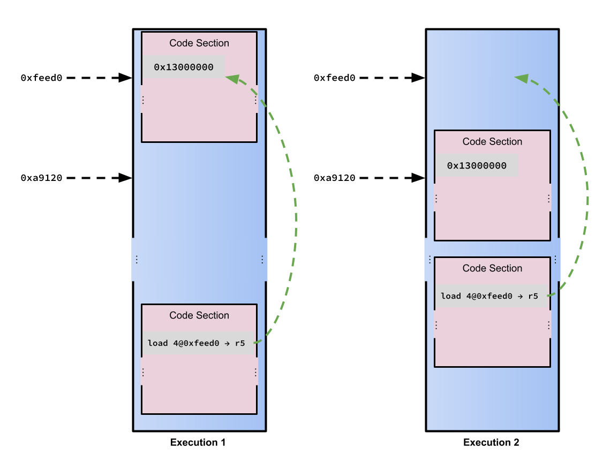
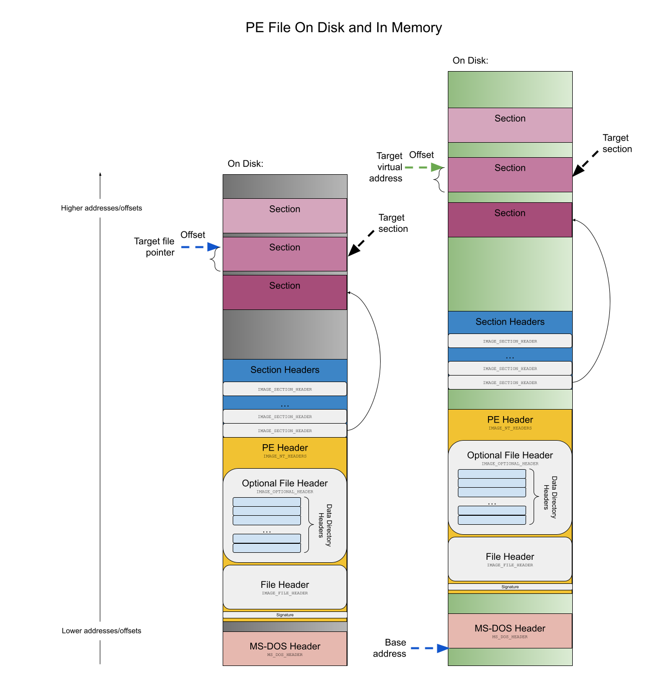

# vapid: Virtual Address Pointer In Disk

In this assignment you are going to build yourselves a program that, I hope, you will find useful enough to keep by your side at all times as you become master malware analyzers. To complete this assignment and build this magic malware wand, you will need sharp skills in deciphering file formats and decoding data in files stored on disk.

The goal of the assignment is to build a tool that will automate the conversion of the so-called Relative Virtual Address (RVA) of a piece of data in a Windows to the location of that data when the executable file is sitting idle on the disk.

This assignment is due by 11:59pm on Friday, February 10th, 2023. 

As you work through the assigment, please feel free to use the `#assignment1` channel in the class' Discord server to post questions and help your peers.

## I'm A Thespian ... What's My Motivation? 

Executable and Linkable Format (ELF), Portable Executable (PE) and the Mach object file format (Mach-O) are all designed to store a program's data (i.e., its executable code and pieces of the data it uses for its computation) and metadata on disk in a standardized format. The standardization is necessary to facilitate communication between the entity creating the program (i.e., the compiler and linker) and the entity that will eventually shepherd that program to the CPU for execution (i.e., the operating system). The operating system needs to know a tremendous amount about the executable in addition to just what code it will execute on the CPU when it is running. We have seen how these file formats hold information about a program's required external libraries, the permissions on data and so on. 

A CPU does not execute the code directly in one of the files. A CPU can only execute code that exists in memory. As a program executes in memory, the CPU executes its instructions and in many cases those instructions may reference pieces of memory that are at far away addresses. 

For all the reasons that we discussed in class, it is next-to impossible for a compiler/linker to know a priori where that program will be loaded in memory when it executes. As a result, the operating system needs to know about code in the program that references particular addresses so that those addresses can be rewritten before the program executes once the *actual* location are known.

Consider the following snippet of C/C++ code:

```C
const int ALPHA = 19;

int main() {
    int beta = 0;
    ...
    beta = ALPHA;
    ...
    return 0;
}
```

`0x13000000` (what endianess is that?) will appear at some address $x$ somewhere in the program's bytes and the `beta = alpha;` statement will cause the compiler to emit code that loads 4 bytes from $x$ (the size of an `int` is 4 in this example), stores the value in a register (say `r5`) and, eventually, puts it somewhere else in memory. As we learned in class, these executable formats often separate the program's data and code into sections (or blocks, or units, or ...). The original reason why a) this mechanism was added to the format and b) operating systems load sections in different places (1) so that there did not need to a central repository of which addresses which programs "owned", 2) separate permissions for different swaths of bytes, etc) is still a valid reason for having that flexiblity. However, it is by no means the *only* one -- today the flexibility is used primarily for security in a technique known as address-space layout randomization.

If the compiler generated an instruction for loading the data from `ALPHA` with a fixed address, then there would be ... *trouble*. See the image below.




That's the bad news! The good news is that each of the executable file formats in wide use today have largely solved this problem. How do they do it? Well, here's how. For an instruction that references either an instruction or chunk of data using an absolute address (we could call the address the *target address* ... and we will), the compiler will generate an instruction that uses the *offset* of the data relative to the start of the file on disk instead. Again, the offset (or what is sometimes called the physical address) is that address of data being targeted *as it exists on disk*. 

At runtime, then, when the operating system loads the program from disk to memory, all the addresses that are written using this technique are *relocated* (a.k.a. *fixed up*) based on the place where the data they target is loaded during that particular execution. No matter where the data being targeted ends up in memory on each run, the instruction accessing it gets the proper address.

How cool is that?

## Addresses on Disk Or Addresses in Memory

Even though we now know *why* these executable formats work the way they do, are we in any better position to perform static analysis on an executable file? 

Not really. 

As analysts, we have to keep track of the significant difference between a value that specifies the address of some bytes in the code/data as it exists on disk and a value that specifies the address of some bytes in the code/data once the contents of the file are loaded in memory during execution. 

The tool you will write is specific to PE files (and 32-bit ones at that), so the remainder of our discussion will be specific to that format. Remember, however, that the difference between the two types of addresses and the problem that you are solving in this assignment exists in ELF and Mach-o file formats as well. In other words, you are building a solution for a specific instance of a general, common problem.

In a PE file, a value that specifies the address of some bytes in the code/data as it exists on disk is called a _file pointer_ and a value that specifies the address of some bytes in the code/data once the contents of the file are loaded in memory at runtime is called a _virtual address_. [1](https://docs.microsoft.com/en-us/windows/win32/debug/pe-format#general-concepts)

During static analysis, you can easily follow any pointer in a PE file that is specified as a file pointer by simply seeking to that address in the file on disk! However, you cannot so easily follow any pointer in a PE file that is specified as a virtual address before executing the program.

Unfortunately, there are many reasons you would like to be able to follow virtual address pointers statically. That is the whole point of static analysis, after all. What you want, then, is a way to convert between virtual addresses and file pointers. Such a conversion must be possible -- after all, the whole point of the PE file format is to describe completely how to load a file on disk into memory (and PPEE can do it!)! 

Possible does not always mean easy. In fact, doing this conversion is time-consuming and error prone. Malware analysts are busy and tedious calculations waste valuable time. 

Enter vapid, a tool for converting *v*irtual *a*ddresses to *p*ointers *i*nto *d*isk.

## The Vapid Algorithm

The source code for all the data structures referenced in the vapid algorithm are available in [`winnt.h`](./winnt.h). 



### Sections
The mapping of virtual addresses to file pointers is done by analyzing the *sections* of a PE file. Sections are [[t]he basic unit of code or data within a PE or COFF file.](https://docs.microsoft.com/en-us/windows/win32/debug/pe-format#general-concepts) Each section in a PE file is loaded into memory when the user executes the program described by that PE file. Some of the sections contain the program's code and some of the sections contain data that the program uses for computation. Some other parts of the code contain the data used to create visual elements that the program displays on the screen. 

Associated with each section is a section header. The array of section headers in a PE-32 file is located immediately after the PE-32 file's PE Header (`IMAGE_NT_HEADER`). The location of the PE-32 file's PE Header on disk can be found by looking at the `e_lfanew` file pointer field in the PE-32 file's `IMAGE_DOS_HEADER` that is located at the very beginning of the file. The `IMAGE_DOS_HEADER`, being located in a fixed spot (the beginning of the executable file), gives the operating system (and more importantly *us*) a way to "break in" to the header -- we can use this data structure to pull ourselves up by the bootsraps. The `IMAGE_NT_HEADER` contains a signature, an `IMAGE_FILE_HEADER` and an `IMAGE_OPTIONAL_HEADER32`. The size of the signature and the `IMAGE_FILE_HEADER` are fixed -- 4 and 20 bytes, respectively. The size of the `IMAGE_OPTIONAL_HEADER32` is variable but can be found in the `SizeOfOptionalHeader` field of the `IMAGE_FILE_HEADER`. 

There are a variable number of sections (and therefore section headers) in a PE-32 file. The number of sections and section headers in any PE-32 file can be found in the `NumberOfSections` field in the `IMAGE_FILE_HEADER`. 

A section header (`IMAGE_SECTION_HEADER`) contains metadata about a section. The most crucial elements of that metadata are the location and size of the contents of that section _on disk_ and the location to place the contents of the section _in memory_ when the program is loaded by the operating system.

It just so happens that those two fields are also important for converting between virtual addresses and file pointers, and vice versa. 

1. `PointerToRawData`: This is the address of beginning of the contents of the section on disk. It is a file pointer.
2. `VirtualAddress`: This is the address of the beginning of the contents of the section when the program is loaded in memory. It is a virtual address formatted as a *relative virtual address* ... see below!

### Virtual addresses or relative virtual addresses? Do you feel lucky? ... do you?
First things first ... virtual addresses stored in the PE file are *usually* relative to some base address. Virtual addresses that are stored on the disk relative to the base address are known as *relative virtual addresses*: [In an image (_ed_: also known as a PE file), this is the address of an item after it is loaded into memory, with the base address of the image file subtracted from it.](https://docs.microsoft.com/en-us/windows/win32/debug/pe-format#general-concepts). 

You can find the image's base address by looking for the field `ImageBase` in the `IMAGE_OPTIONAL_HEADER` (see above for information about the location of this structure in a PE-32 file). To convert a relative virtual address to a(n) "absolute" virtual address, add the value of the virtual address to the value of the field `ImageBase` in the `IMAGE_OPTIONAL_HEADER`. Note: Unless qualified with the word "relative", assume that "virtual address" means "absolute virtual address."

### Let's Take a Breather
When you are deep in the weeds, it's easy to forget your ultimate goal. Take a step back and remind yourself what you are doing: 

> You want to convert a relative virtual address (we'll call the the virtual address you are trying to convert the *target virtual address*) to a file pointer (we'll call this address the *target file pointer*). 

Time to dig back in!

### Finding the target section

Let's figure out the section of code/data in which the target address exists. Let's call that the *target section*.

To find the *target section*, enumerate all the sections and calculate their initial and terminal address. Each section's starting relative virtual address is in the `IMAGE_SECTION_HEADER` data structure as the `VirtualAddress` (remember that the value is specified as an RVA). Calculating each section's terminal address is a function of its initial address and its size: add the section's size to the address you calculated above. 

With the bounds of every section calculated, you can determine the target section by finding the section whose initial address is less than the target virtual address (`VirtualSize` in the section header data structure) and whose terminal address is greater than target virtual address. 

Whew. I'm breaking a sweat!

### The Home Stretch

After finding the target section, we can calculate the offset of the data being targeted from the start of the section. 

To accomplish that, subtract the initial address of the target data section from the target virtual address. The result of that calculation is an offset into that section from its beginning. *If* (and I cannot emphasize the *if* enough) you had a file pointer to the beginning of the target section, you could add this offset to that value and the conversion would be complete.

But do you have such a value? In fact you do! It's the value of `PointerToRawData` in the target section's header data structure!

Upon adding the offset to the address of the beginning of the target section on disk, you will have a target file pointer equivalent to our target virtual address.

I know! I'm tired just thinking about all those steps. That's why a tool that does the conversion is so valuable. 

Instead of letting such a tedious set of steps take the wind out of our sails while we are doing malware analysis, we could just invoke ...

### The vapid interface

`vapid` will be a command-line tool that you can implement in a language of your choosing. Any implementation language is perfectly okay, as long `vapid` implements the interface described in this section. 

`vapid` will take two parameters:

1. The name/path of a 32-bit PE file. 
2. The target virtual address. 

`vapid` will allow for specification of the target virtual address in either decimal or hexadecimal form. `vapid` assumes that the user specifies a hexadecimal-formatted target virtual address by prefixing the value with `0x`. All hexadecimal digits between `a` and `f` used in input/output with the `vapid` user must be written in lowercase (as shown here). A target virtual address specified in decimal format contains no such prefix.

Should the `vapid` user specify a name/path of a 32-bit PE file that does not exist, `vapid` may print anything to the screen (obviously a nicely formatted error message would be ideal) but _it must_ exit with a status code of 1. Should the `vapid` user specify a target virtual address that cannot be parsed into a number (e.g., 0xg00dg4@d3), `vapid` may print anything to the screen (again, a nicely formatted error message would be good) but _it must_ exit with a status code of 1.

Should the user give `vapid` a valid file/path of a 32-bit PE file and a valid target virtual address, `vapid` will produce one of two types of output to the screen:

1. If the target virtual address can be found in one of the 32-bit PE file's sections, `vapid` will print

`<target virtual address in hexadecimal format preceded by 0x> -> <target file pointer in hexadecimal format preceded by 0x>`

For example:

```
hawkinsw@borderland:~$ ./vapid sample.exe 0x4c5002
0x4c5002 -> 0xc0602
``` 

2. If the target virtual address _cannot_ be found in one of the 32-bit PE file's sections, `vapid` will print

`<target virtual address in hexadecimal format preceded by 0x> -> ??`

For example:

```
hawkinsw@borderland:~$ ./vapid sample.exe 0x400050
0x400050 -> ??
```

## Submitting

Your `vapid` tool will be assessed using Gradescope. In order for Gradescope grading to work smoothly, it is necessary that your submission adhere to the following guidelines. 

1. Your entire submission must be contained in a single zip file named `vapid.zip`. Gradescope is picky -- capitalization and spelling count!
2. In `vapid.zip` you may include a file named `build.sh` that Gradescope will execute (in a Linux-based container with root privileges and internet access) before grading your submission. If you build `vapid` using a compiled language, you may want to include steps for compilation in this file. If you build `vapid` in an interpreted language and rely on 3rd-party dependencies, you may want to include steps for downloading those dependencies in this file.
3. Either as a result of executing your `build.sh` _or_ simply because you included such a program in your `vapid.zip` file, there must ultimately be an executable file named `vapid`. Again, Gradescope is picky -- capitalization and spelling matter.

If you are submitting a binary-only solution and not relying on the `build.sh` mechanism to compile your code on Gradescope, please include your source code in a directory in `vapid.zip` named `source/`. 

All submissions will be done through Gradescope but you must access Gradescope through Canvas. Find `Assignments` on the left-hand side of the site's Canvas page, then find `Assignment 1: vapid` and, finally, click `Load Assignment 1: vapid in a new window` and you will be directed to Gradescope where you can make your submission.

### Assessment

This assignment is worth a total of 100 points. 

Gradescope will test your program using several test cases. For each test case that your code passes you will be awarded a set of points. The automatic assessment is worth 90 points.

As mentioned previously, Gradescope is fickle. Please contact me if you have any trouble making Gradescope happy. 

You are allowed an _unlimited_ number of submissions to Gradescope prior to the deadline. Submit early and often to get a sense of your progress. 

You will earn the final ten points based upon the quality and readability of your code. I will be looking for the hallmarks of *decent* software engineering:

1. All magic numbers are abstracted behind named constants (5 points)
2. Modular design with well documented functions and data structures (3 points)
3. Etc (2 points). 

### Tips and tricks

You may use any resource to build `vapid`. Please feel free take code from a) another library, b) a 3rd party, c) stack overflow, d) Wikipedia, e) npm, f) pip, etc, as long as 

1. You follow the license of the code's original author, and
2. You document the code's provenance properly. 

Evidence that you included code from someone else without giving proper credit is grounds for severe penalties. 

Further, you may work with one another and collaborate. Again, the only caveat is that you give credit to your classmates where credit is due. Learning how to work with your peers is a skill that you will need in industry and one that I intend to foster throughout this course. 
