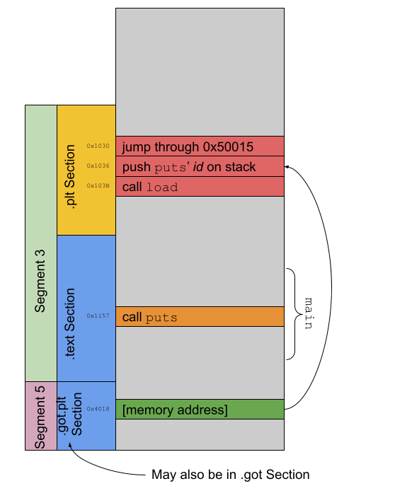

## Malware Mini Assignment -- Practice Using Tools for ELF Manipulation and Inspection

In this Mini Assignment you will gain practice with the commonly used tools for analyzing object and executable files in the Executable and Linking Format (ELF) format. _Note_: Saying "ELF format" is akin to saying "PIN number". Forgive me for the redundancy, but I think it reads better and it is common to see it written this way. 

In this Mini Assignment you will be directed to add bits of information in the `submission.txt` file. To complete the assignment, 

1. post your `submission.txt` using Canvas to the appropriate Assignment; and
2. post your `binary.hex` and `binary.obj` files using Canvas to the appropriate Assignment (there are instructions for generating these files, don't worry!).

### Get Set Up

Throughout the Mini Assignment we are going to use the GDB debugger. Unfortunately, GDB may not be installed on your Kali virtual machine. Don't worry, it's easy to install! We will use APT, the Advanced Package Tool, for installation. First, we will update the system's metadata about installable packages. Do that with the `apt-get update` command:

```
┌──(kali㉿kali)-[~]
└─$ sudo apt-get update
[sudo] password for kali: 
```

The "sudo password for kali" is just the `kali` user's password -- `kali`. 

Once we have used `apt-get update` to make sure that all our metadata is up to date, we can use `apt-get install` to actually install GDB:

```
┌──(kali㉿kali)-[~]
└─$ sudo apt-get install gdb
```

Installation complete!

### An ASLR Digression

Attackers are creative and they realized that they could rely on the location of certain instructions or data being constant in a program no matter how many times that program was executed. This aided their attacks, especially on Internet-facing software. The attackers could write exploits using hard-coded addresses of memory or vulnerable functions and they could rely on the fact that those locations would never change, even if the server was rebooted. What's more, the addresses of these points of weakness would be the same no matter whether the vulnerable software was running on Host A or Host B. 

Defenders got wise to this attack and they designed a scheme known as address space layout randomization (ASLR) that would move code/data around to different locations in memory every time that the program was executed. With this, the attacker would potentially have to learn the addresses of vulnerable data/functions anew with every exploitation attempt. ASLR solved the second problem, too -- with ASLR, the address of a vulnerable function in, say, Apache running on Host A would be in a different place than the same vulnerable function in Apache running on Host B even if the Apache binary were bit-for-bit identical. 

How does this affect malware analysis? Many of the static ELF inspection utilities will print out virtual addresses, or addresses that are used at runtime. Before ASLR, if `readelf` said that we could find a byte in memory at, for example, 0x4501, we could run the program in GDB and be able to find that byte at 0x4501. With ASLR that is no longer the case. Now, when the program is executing, that byte will be found at `O + 0x4501	` where `O` ("oh") is some random offset chosen by the operating system at the time that the program is executed. 

Again, this is good for security but bad for debugging. 

Fortunately for us, GDB disables ASLR on programs it is debugging by using the same value of `O` every time. Calculating that `O` is one of the tasks that we will have to complete during this lab. You will practice doing that later. For now, just realize the importance but also the pain of ASLR.

## Our Goal

We are going to walk through exploring an unknown program given to us by our threat-intelligence team. (Don't worry, the binary we are dissecting is not actually malicious. There is a sticker available to the first person who emails me and correctly identifies the software in question.)

We want to use our cadre of tools to explore two things:

1. The properties of a certain string used by the program, and
2. The mechanism by which this program (and many others) use shared code. 

But, most importantly, we want to figure out the exact nature of this potentially malicious (again, it's only "potentially malicious" in the scenario, not in real life).

To match the name of the artifact given to us by our teammates, I will refer to the program we are inspecting as `binary` for the remainder of the lab.

### Gathering Data

We are going to end up looking at the "objdump" and the "hexdump" of `binary` many times. Instead of generating those outputs every time that we need them, let's collect them once and save them to disk. 

```
┌──(kali㉿kali)-[~/CS5138/MiniAssignmentExplore]
└─$ hexdump -C binary > binary.hex   
```

This command will redirect the output from the `hexdump` command to the file `binary.hex`. The so-called "hexdump" is now in `binary.hex`. Throughout the assignment, when I refer to "the hexdump", I am referring to the contents of `binary.hex`. `hexdump` takes parameters that will format its output. I like `-C` but there are several options. `-C` arranges its output like

```
00000000  7f 45 4c 46 02 01 01 00  00 00 00 00 00 00 00 00  |.ELF............|
```
where the first column represents the _file offset_ of the first byte in the next column (what I will refer to as the _physical address_ of the bytes), the middle 16 columns represent the 16 bytes (in hex) and everything between the `|` and `|` are the ASCII representations of those bytes, if they are printable. In the example above, `7f` is the byte at physical address `0x00000000`, `45` is the byte at `0x00000001` (and is an `E`), and so on. 

```
┌──(kali㉿kali)-[~/CS5138/MiniAssignmentExplore]
└─$ objdump -D binary > binary.obj
```

This command will redirect the output from the `objdump` command to the file `binary.obj`. The so-called "objdump" is now in `binary.obj`. Throughout the assignment, when I refer to "the objdump", I am referring to the contents of `binary.obj`. `objdump` takes *many* parameters. We will learn more about them when we get into disassembly later in the course. For now, just know that `-D` is a reasonable default option. 

The contents of the objdump are formatted like this:

```
    ba10:       31 ed                   xor    %ebp,%ebp
```

which means that the `xor` instruction has the physical address of `ba10` (and the actual bytes that the CPU interprets as an  `xor` are `31 ed`). Again, don't worry about what `xor` means right now -- we will get to that later in the course. Just understand the format of the output.

### Let's Get Started

The most important thing we can find out about a program is where it starts! Not only is it important to know, it's also easy to discover. 

```
┌──(kali㉿kali)-[~/CS5138/MiniAssignmentExplore]
└─$ readelf -h binary
```

The result of the command is information from the ELF file's header. One of the fields is the program's entry point. Record in `submission.txt` the address of the program's entry point. I don't want to spoil the fun so I will refer to the program's entry point as `ENTRY_POINT` in the remainder of the lab. 

Remember (above) how we discussed that ASLR randomizes the location that code is loaded in memory? And that GDB disables ASLR and always loads the code at a fixed offset? We have enough information now to be able to calculate that offset! How cool!

We'll use GDB itself to perform that calculation. First, though, we need to take care of one more item of housekeeping. The *NIX operating systems have a primitive, but powerful, means for configuring access control to files. If you are interested in details about such things, feel free to read more at [Wikipedia](https://en.wikipedia.org/wiki/File-system_permissions#Traditional_Unix_permissions). For our purposes, we simply need to make sure that `binary` has the appropriate permissions to support debugging. GDB will not debug a program unless you (the owner of the file) have permission to execute it. To make sure that this is the case, we will change the file's "mode" using `chmod`:

```
┌──(kali㉿kali)-[~/CS5138/MiniAssignmentExplore]
└─$ chmod u+x binary    
```

Great! Now we can use GDB to study `binary`.

```
┌──(kali㉿kali)-[~/CS5138/MiniAssignmentExplore]
└─$ gdb binary  
```

will launch GDB, the debugger. 

First, enter the command `starti`:

```
(gdb) starti
Starting program: /home/kali/CS5138/MiniAssignmentExplore/binary 

Program stopped.
0x00007ffff7fcd050 in _start () from /lib64/ld-linux-x86-64.so.2
```

`starti` tells GDB to load the ELF file into memory and then _break_ at the earliest possible point. Being able to pause program execution at this point _before the dynamic linker has run_ will help us do analysis (more later!). 

Now, enter the command `info file`:

```
(gdb) info file
Symbols from "/home/kali/CS5138/MiniAssignmentExplore/binary".
Native process:
        Using the running image of child process 152565.
        While running this, GDB does not access memory from...
Local exec file:
        `/home/kali/CS5138/MiniAssignmentExplore/binary', file type elf64-x86-64.
        Entry point: 0x55555555fa10
```

The output continues, but we have what we need. According to our earlier research the entry point is `ENTRY_POINT` -- `0x55555555fa10` looks nothing like that. Or does it? 

If we subtract `ENTRY_POINT` from `0x55555555fa10` then we will get the offset that `gdb` uses when it load programs! There are two ways to do this calculation _like a pro_:

1. Use GDB: Use the `p/x` command (`(gdb) p/x 0x55555555fa10 - ENTRY_POINT`) (be sure that you actually use the entry point value you discovered!). `p/x` tells `gdb` to `p`rint the value in he`x`adecimal format. You *should* learn this command -- you will use it time and again as an analyst. 
2. Use `bc`: (_Note_: You will have to install `bc` [`$ sudo apt-get install bc`] because it is inexplicably omitted from the base Kali distribution.) From the shell, use the `echo "obase=16;ibase=16;55555555FA10 - ENTRY_POINT;" | bc` command. Make sure that your hexadecimal numbers are all capitalized! 

No matter whether you follow Step (1) or (2) for calculating the offset, record the result in `submission.txt`. Again, I will refer to this as `BASE_ADDRESS` to keep the secret alive!

### Strings, strings, strings

To get an early indication about the nature of `binary`, we will take a look at the output from `strings` and see if we can see anything interesting.

`strings` "print[s] the sequences of printable characters in files". `strings` will print "printable character sequences that are at least 4 characters long ... and are followed by an unprintable character."

```
┌──(kali㉿kali)-[~/CS5138/MiniAssignmentExplore]
└─$ strings binary > binary.strings
```

This command redirects the output from the `strings` command to the `binary.strings` file. Whenever I refer to "the strings file" throughout the lab, I will be referring to the contents of `binary.strings`. 

Most programs written for the command line and execution on *NIX operating systems (OSs) contain a nice set of output they print when the program is run and either a) no parameters to control its execution are given, b) those parameters are invalid or c) the program is run with the `--help` parameter. These blocks of output are usually called "usage". Perhaps if we can find the strings that comprise `binary`'s "usage" we can make some sense of this binary.

Open the strings file and do a case-insensitive search for "usage". In `submission.txt` record the line numbers where you find matches. 

We know, then, that there is a string in the binary whose contents are "Usage". 

### Using `hexdump` and `readelf` to Find "Usage" In The ELF File

Open the hexdump and look for "Usage". Based on the explanation of the format of the hexdump (above), record in `submission.txt` the physical address of the string "Usage". 

In order not to give away any answers, I will refer to the physical address of "Usage" as `PA_USAGE`. 

Let's find out in which _section_ of the ELF file "Usage" exists. In order to do that, we'll need to use `readelf` to list the information about `binary`'s sections:

```
┌──(kali㉿kali)-[~/CS5138/MiniAssignmentExplore]
└─$ readelf -S binary
```

```
Section Headers:
  [Nr] Name              Type             Address           Offset
       Size              EntSize          Flags  Link  Info  Align
...
  [11] .init             PROGBITS         000000000000b000  0000b000
       0000000000000017  0000000000000000  AX       0     0     4
```
`readelf -S` output is sometimes hard to read. Let's dissect this output. `readelf -S` is telling us that a section named `.init` is filled with `PROGBITS`. `PROGBITS` are "information defined by the program, whose format and meaning are determined solely by the program." Helpful, so helpful. `000000000000b000` (in hexadecimal) is the location of the section in virtual memory (`Address`) and `0000b000` is the section's physical address (`Offset`). The `.init` section is `0x17` bytes in virtual memory at runtime (`Size`) and takes up `0x17` bytes in the ELF file. The `.init` section has flags `AX` which means that the section takes up space in memory during program execution (`A`) and the contents are executable (`X`). You can get all the details about these values in Chapter 4 of the [System V Application Binary Interface](https://refspecs.linuxfoundation.org/elf/gabi41.pdf) -- the official specification of the ELF format.

Use your understanding of the output of `readelf -S` to determine which section contains the "Usage" string. _Hint_: Determine which section's expanse, [`Address`, `Address + Size`],  encompasses `PA_USAGE`. 

Record in `submission.txt` the name of the section that contains the "Usage" string. Again, in order not to give away any answers, I will refer to the section that contains `PA_USAGE` as `SECTION_USAGE`.

Every section is contained in a _segment_. To list information about the segments, we will again use `readelf`:

```
┌──(kali㉿kali)-[~/CS5138/MiniAssignmentExplore]
└─$ readelf -l binary   
```

```
Program Headers:
  Type           Offset             VirtAddr           PhysAddr
                 FileSiz            MemSiz              Flags  Align
...
  LOAD           0x000000000003c6f0 0x000000000003d6f0 0x000000000003d6f0
                 0x0000000000004920 0x0000000000004bf8  RW     0x1000
```
This output format can also be tricky to interpret. We'll dissect. The segment shown in the sample output is of type `LOAD` which specifies it is a segment whose contents will be loaded into memory from the file on disk. The segment's physical address is `0x000000000003c6f0` and its virtual address is `0x000000000003d6f0`. The data in the `PhysAddr` column is unspecified for ELF files destined to be run on Linux. On disk, this segment takes up `0x0000000000004920` bytes but in memory at runtime it takes up `0x0000000000004bf8` bytes. `RW` specifies the permissions of this segment in memory at runtime and indicates that it is readable and writable, but not executable. Finally, the `Align` indicates that the beginning of this segment in memory at runtime must be a multiple of `1000`. 

Other output from `readelf -l` looks different but is easier to interpret. It tells us which sections are in which segments. Record in `submission.txt` the name of the segment that contains `SECTION_USAGE`. I will refer to the segment that contains `SECTION_USAGE` as `SEGMENT_USAGE`.

The final part of our analysis of the "Usage" string is to find out where and how it is used by the program when it is executing. `objdump` is really helpful in this respect. Open up the objdump and search for `PA_USAGE`. There might be a few places that the address occurs, but look for the one that looks like

```
   1456a:       48 8d 3d ff f9 00 00    lea    0xf9ff(%rip),%rdi        # XXXXXXX <__cxa_finalize@plt+0x18770>

```

Because I do not expect you to know yet what an `lea` instruction does, I'll tell you: It stores the address calculated by adding `%rip` to `0xf9ff` into the register `%rdi`. `objdump` is helpfully telling us here that the result of the calculation (`0xf9ff + %rip`) is the address of our "Usage". 

Using the description earlier of the format of the `objdump` output, please record in `submission.txt` the address of this instruction. I will call this address `LEA_ADDRESS`. 

Let's try to execute `binary` under GDB and stop the program's execution when the address of "Usage" is loaded into memory!

```
┌──(kali㉿kali)-[~/CS5138/MiniAssignmentExplore]
└─$ gdb binary
```

Although we could try to insert a breakpoint at the address you just discovered, it would fail. Why? Because that address is only valid at runtime when `binary` is executed on computers that do not include support for ASLR. Ours does. GDB helps by disabling it (remember?) and adjusts every address by `BASE_ADDRESS`. So, our breakpoint really goes at address `BASE_ADDRESS + LEA_ADDRESS`:

In `gdb`, issue the command:

```
(gdb) break *(BASE_ADDRESS + LEA_ADDRESS)
Breakpoint 1 at XXXXXXXX
```

Now, let's run the program and see what happens:

```
(gdb) run --help
```

We are doing something sneaky here. We are telling GDB to run the program as if we invoked it with the `--help` command line argument (`./binary --help`). This argument will make sure that we hit our breakpoint -- trust me!

GDB should pause the program when it hits the breakpoint:

```
Starting program: /home/kali/CS5138/MiniAssignmentExplore/binary --help
[Thread debugging using libthread_db enabled]
Using host libthread_db library "/lib/x86_64-linux-gnu/libthread_db.so.1".

Breakpoint 1, XXXXXXX in ?? ()
```

Now, let's ask GDB to show us the contents of memory where we have deduced "Usage" must be loaded. We will have to take ASLR into account. Issue the `x` command to `gdb`:

```
(gdb) x/8bc BASE_ADDRESS + PA_USAGE
```

The `x` command in `gdb` tells the debugger to e`x`amine the memory at a particular address. The `b` parameter tells `x` to format the output byte-by-byte. The `8` tells `x` to print 8 bytes. The `c` tells `x` to format each byte as a character. Copy and paste the output from the command into `submission.txt`. 

### We're Off And Running

In order to print a string to the screen, we guess that the program is going to call `puts`. `puts` is implemented in a shared library called `libc.so` which contains all the functions that are guaranteed to exist by the C standard. In other words, if our hypothesis is correct that `puts` is used to print "Usage" to the screen, the dynamic linker is going to have to _resolve_ the indirection the compiler generated to make it possible to call `puts`.  

In the second part of the Mini Assignment we will trace how that happens!

Conceptually, the compiler builds up an indirection pattern like the own shown below:



The compiler cannot know a priori where the dynamic linker is going to put `puts` in memory (pun _not_ intended) when the program is executed. The compiler instead generates an indirection point for `puts` and _pretends_ that's where `puts` actually exists (shown in red in the figure above). Then, when it generates code for invocations of the `puts` function (shown in orange in the figure above), the code the compiler generates transfers program control to the indirection point. The indirection point consults a place in memory (shown in green in the figure above) that itself holds a pointer. Ultimately that green pointer will point directly to `puts`. At first, however, the green pointer targets the second half of the indirection point. The second half of the indirection point contains code to invoke the dynamic loader which will bring `puts` in to memory. Along the way, the dynamic loader also updates the green pointer so that future calls to `puts` go directly to its implementation. This process is known as resolution. Pretty cool!


Here, unfortunately, there is a slight wrinkle. Most modern linkers include information in their output binary that directs the dynamic linker to _eagerly_ do this resolution process when the program starts rather than wait for the first invocation of the function. `binary` uses exactly this optimization. So, we will have to very cleverly use GDB to observe this resolution process because it happens so early. Remember (above) where I said that the `starti` command in `gdb` will stop the program _before_ the dynamic linker gets its first crack at execution? Now you should be able to see why this functionality is helpful!

When the linker stitches together the intermediate files that the compiler generated into a final executable, it leverages functionality of the ELF format to embed a _relocation_ that instructs the dynamic linker how to change to the green pointer. 

`readelf -r` will show us a program's relocations:

```
┌──(kali㉿kali)-[~/CS5138/MiniAssignmentExplore]
└─$ readelf -r binary
```

Skip the first section and look at the values under the heading

```
Relocation section '.rela.plt' at offset 0x94b0 contains 125 entries:
  Offset          Info           Type           Sym. Value    Sym. Name + Addend
```

One of the lines of output you will see looks like

```
000000041bf8  000900000007 R_X86_64_JUMP_SLO 0000000000000000 getc@GLIBC_2.2.5 + 0
```

This line of output indicates that for the indirection point for a call to `getc` in `glibc`, the green pointer will exist in virtual memory at `000000041bf8`. 

Find the line of output describing the relocation for `puts` and record the address of the green pointer in `submission.txt`. I will call this `PUTS_GREEN`. 

Open the hexdump and find the bytes that will exist at `PUTS_GREEN` when the program is loaded. _Note_: `PUTS_GREEN` is a virtual address -- you will have to use information about the sections to convert that into a physical address. _Hint_: The section containing `PUTS_GREEN` is `.got`. Convert those from Little Endian format into Big Endian format and record that in `submission.txt`. 

As we discussed, those bytes should compose a pointer to the second half of the indirection pointer for `puts`. We will confirm that now by finding the address of the indirection point for `puts`. Open the objdump and search for `puts@plt`. You should see output that looks like

```
000000000000b620 <puts@plt>:
    b620:       ff 25 8a 68 03 00       jmp    *0x3688a(%rip)        # XXXX <__cxa_finalize@plt+0x366b0>
    b626:       68 5f 00 00 00          push   $0x5f
    b62b:       e9 f0 f9 ff ff          jmp    b020 <ftell@plt-0x10>
```

The output which I obscured with XXXX should confirm your previous calculations (i.e., it should match `PUTS_GREEN`). `0xb626` should also look familiar -- hint, hint! 

Mark down `0xb620` -- we will need it later. There's no need to record this address in your `submission.txt` file.

Now, let's observe the dynamic linker in action using GDB.

```
┌──(kali㉿kali)-[~/CS5138/MiniAssignmentExplore]
└─$ gdb binary 
```

We will tell `gdb` to load the program in memory, start execution and pause as quickly as possible:

```
(gdb) starti --help
Starting program: /home/kali/CS5138/MiniAssignmentExplore/binary --help

Program stopped.
0x00007ffff7fcd050 in _start () from /lib64/ld-linux-x86-64.so.2
```

Note, again, that we are using `--help`. What we will do now is set a _watchpoint_. A watchpoint will tell GDB to pause program execution when the contents of memory at a certain location are changed. It's pretty cool functionality! We will use the `watch` command in `gdb`:

```
(gdb) watch (*(uint64_t*)(BASE_ADDRESS + PUTS_GREEN))
Hardware watchpoint 1: (*(uint64_t*)(XXXXX))
```

The parameters to `watch` here tell `gdb` to pause execution at the moment any of the 8 bytes (`sizeof(uint64_t)`) starting at address `(BASE_ADDRESS + PUTS_GREEN)` change. 

With a watchpoint set, we'll let `gdb` continue executing the program using the `cont` command:

```
(gdb) cont
Continuing.

Hardware watchpoint 2: (*(uint64_t*)(XXXX + XXXXX))

Old value = 46630
New value = 140737351515616

Hardware watchpoint 3: (*(uint64_t*)(XXXX + XXXXX))

Old value = 46630
New value = 140737351515616
elf_machine_rela (skip_ifunc=<optimized out>, reloc_addr_arg=<optimized out>, version=<optimized out>, sym=<optimized out>, 
    reloc=<optimized out>, map=<optimized out>) at ../sysdeps/x86_64/dl-machine.h:463
463     ../sysdeps/x86_64/dl-machine.h: No such file or directory.
```

`gdb` stopped -- the memory changed. The old value (46630) was replaced with the new value (140737351515616). _Note_: Your "new value" will likely be different than the one listed here -- the loading process is dynamic, after all! Unhelpfully, `gdb` prints those values as decimals. If we convert 46630 to hexadecimal we should see something familiar! Use the knowledge that you built through this lab to print 46630 in hexadecimal (_Hint_: Remember the `p` command and the `x` parameter that we learned earlier!). 

For our last trick, let's watch the program use this updated value (140737351515616 = 0x7ffff7d7fde0) to direct program control to the actual implementation of `puts`. 

Reach deep in your memory and set a breakpoint in GDB at the instruction where the address of "Usage" is loaded in memory. 

Once you have done that, tell `gdb` to continue (again, using `cont`):

```
(gdb) cont
Continuing.
[Thread debugging using libthread_db enabled]
Using host libthread_db library "/lib/x86_64-linux-gnu/libthread_db.so.1".

Breakpoint 4, XXXXXXX in ?? ()
```

Next, to make it easier to watch `gdb`'s progress, we will turn on a _display_:

```
(gdb) display/i $rip
1: x/i $rip
=> XXXXX:      lea    0xf9ff(%rip),%rdi        # 0x555555577f70
```

Enabling a display using the `display` command tells `gdb` to print some user-specified output every time it pauses program execution. Here we are directing `gdb` to print the memory at `$rip` (the instruction pointer -- i.e., the address of the instruction that the CPU is currently executing) as if it were an instruction (the `i` parameter to `display`). 

Issue a series of `stepi` commands until the `$rip` points to `0x7ffff7d7fde0` (again, your value may differ!). `stepi` tells `gdb` to run the program for a single machine instruction and then stop! In `submission.txt`, record your interaction with `gdb` as you slowly progress toward your specific value of `0x7ffff7d7fde0`. _Hint_: It shouldn't take too many invocations of `stepi`. 

## Conclusion

You learned a tremendous amount in this lab and got some amazing hands-on experience. Congratulations! Submit your work to Canvas and wait for the points to roll in!

