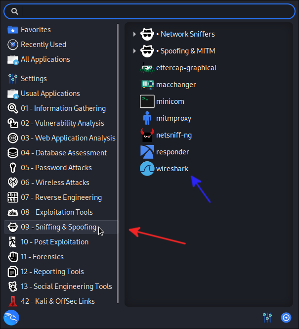
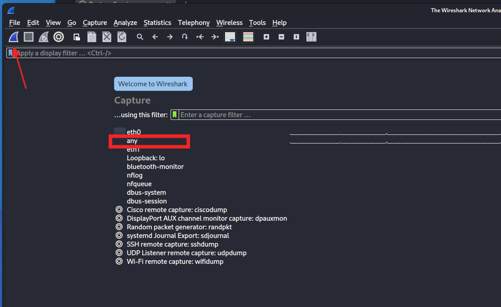
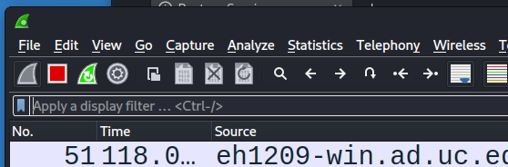
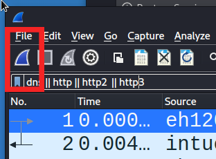
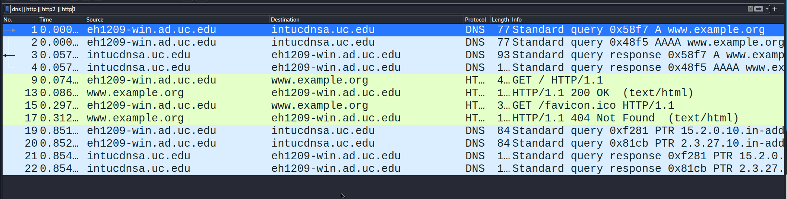
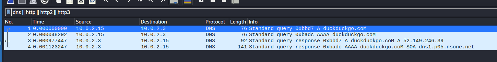
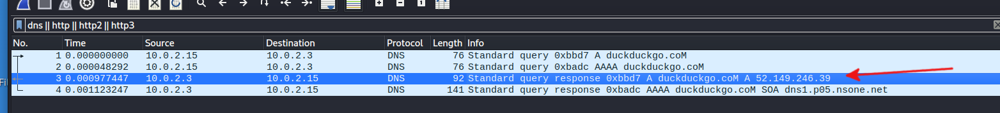
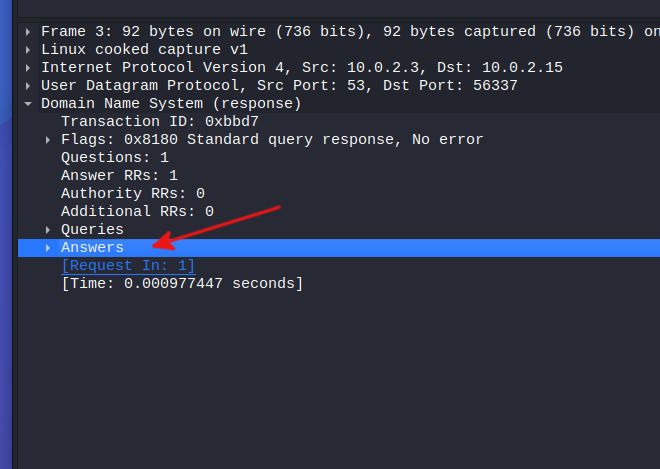
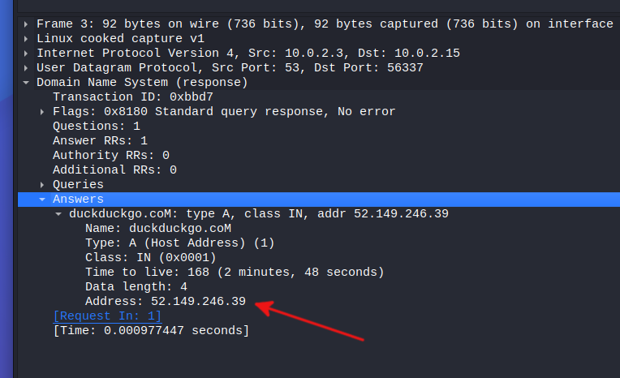

# The HaUCk Bank Malware

Sometimes users' desire to follow best practices backfires on them. In our case, a user has submitted a program that they believe has lead to a compromise of their system. The user received a phone call from their bank, HaUCk Bank, and the operator needed to do some routine account checkups. The user, the bank's client, received an email with information on how to download software that would help them generate a one-time password that they could use to verify their identity with the bank and protect themselves from fraud. The operator asked them to use the HaUCk Bank Multifactor Authenticator (HBMA) to generate such a token so that the user would have peace of mind that they were talking to a legitimate bank representative. 

When our user ran the password-generator software, everything seemed normal ...

```console
$ hauck-mfa
HaUCk Bank: Securing financial freedom since 1982.
Your one-time token/MFA key is 1902. Please provide it to the customer service representative.
```

After completing the call with the bank representative, things started to get a little, well, crazy. 

As our company's premiere cybersecurity analyst, we have been given the task of determining whether or not the password generator was legitimate or malicious.

## Using External Libraries
Software developers don't write their code in a vacuum -- they rely on software from others! Malware writers are no different than other software engineers. Malicious hackers want to write code as easily and quickly as possible and that often requires a reliance on other people's work.

One of the first things to do when coming in contact with a piece of suspicious code is to determine whether the libraries that it uses are consistent with the job that the software purports to do. In the case of our password-generating application, it seems reasonable to expect that a random-number generator might be needed or even a piece of supporting code to perform encryption.

Just how is it possible to determine what external libraries a program uses? `ldd` is how!

### Description

`ldd` is a tool that understands the format of a executable Linux program and can determine which external libraries that program relies on to execute. In its default mode, `ldd` will list all the required external libraries for the particular program whose path is provided as the argument.

### Practice
To practice with `ldd`, let's investigate what external libraries `host` needs from the operating system to execute. 

`host` is a little command that will perform *DNS resolution* on a hostname. *DNS resolution* is the process of using the domain name system (DNS) to convert a hostname (e.g., `google.com`) into an IP address (e.g., `4.3.2.10` or `2607:f8b0:4009:803::200e`).

```console
$ ldd /usr/bin/host
```
Depending on the version of Linux operating system you are using, your output should look similar to:
```console
$ ldd /usr/bin/host
        linux-vdso.so.1 (0x00007fff4b1f8000)
        libisc-9.18.8-1-Debian.so => /lib/x86_64-linux-gnu/libisc-9.18.8-1-Debian.so (0x00007f481e800000)
        libdns-9.18.8-1-Debian.so => /lib/x86_64-linux-gnu/libdns-9.18.8-1-Debian.so (0x00007f481e400000)
        libisccfg-9.18.8-1-Debian.so => /lib/x86_64-linux-gnu/libisccfg-9.18.8-1-Debian.so (0x00007f481eea1000)
        libirs-9.18.8-1-Debian.so => /lib/x86_64-linux-gnu/libirs-9.18.8-1-Debian.so (0x00007f481ee9b000)
        libbind9-9.18.8-1-Debian.so => /lib/x86_64-linux-gnu/libbind9-9.18.8-1-Debian.so (0x00007f481ee83000)
        libidn2.so.0 => /lib/x86_64-linux-gnu/libidn2.so.0 (0x00007f481ee50000)
        libc.so.6 => /lib/x86_64-linux-gnu/libc.so.6 (0x00007f481e61f000)
        libuv.so.1 => /lib/x86_64-linux-gnu/libuv.so.1 (0x00007f481ee20000)
        libssl.so.3 => /lib/x86_64-linux-gnu/libssl.so.3 (0x00007f481e357000)
        libcrypto.so.3 => /lib/x86_64-linux-gnu/libcrypto.so.3 (0x00007f481de00000)
        libz.so.1 => /lib/x86_64-linux-gnu/libz.so.1 (0x00007f481ee03000)
        libjemalloc.so.2 => /lib/x86_64-linux-gnu/libjemalloc.so.2 (0x00007f481da00000)
        libjson-c.so.5 => /lib/x86_64-linux-gnu/libjson-c.so.5 (0x00007f481edee000)
        libnghttp2.so.14 => /lib/x86_64-linux-gnu/libnghttp2.so.14 (0x00007f481edbf000)
        libxml2.so.2 => /lib/x86_64-linux-gnu/libxml2.so.2 (0x00007f481d852000)
        /lib64/ld-linux-x86-64.so.2 (0x00007f481ef0c000)
        libgssapi_krb5.so.2 => /lib/x86_64-linux-gnu/libgssapi_krb5.so.2 (0x00007f481e305000)
        libkrb5.so.3 => /lib/x86_64-linux-gnu/libkrb5.so.3 (0x00007f481dd26000)
        libmaxminddb.so.0 => /lib/x86_64-linux-gnu/libmaxminddb.so.0 (0x00007f481edb6000)
        libfstrm.so.0 => /lib/x86_64-linux-gnu/libfstrm.so.0 (0x00007f481eda9000)
        libprotobuf-c.so.1 => /lib/x86_64-linux-gnu/libprotobuf-c.so.1 (0x00007f481ed9f000)
        liblmdb.so.0 => /lib/x86_64-linux-gnu/liblmdb.so.0 (0x00007f481e2ee000)
        libns-9.18.8-1-Debian.so => /lib/x86_64-linux-gnu/libns-9.18.8-1-Debian.so (0x00007f481e2a2000)
        libunistring.so.2 => /lib/x86_64-linux-gnu/libunistring.so.2 (0x00007f481d69c000)
        libpthread.so.0 => /lib/x86_64-linux-gnu/libpthread.so.0 (0x00007f481ed98000)
        libdl.so.2 => /lib/x86_64-linux-gnu/libdl.so.2 (0x00007f481ed93000)
        libm.so.6 => /lib/x86_64-linux-gnu/libm.so.6 (0x00007f481d5bd000)
        libstdc++.so.6 => /lib/x86_64-linux-gnu/libstdc++.so.6 (0x00007f481d200000)
        libgcc_s.so.1 => /lib/x86_64-linux-gnu/libgcc_s.so.1 (0x00007f481e282000)
        libicuuc.so.71 => /lib/x86_64-linux-gnu/libicuuc.so.71 (0x00007f481d004000)
        liblzma.so.5 => /lib/x86_64-linux-gnu/liblzma.so.5 (0x00007f481dcfe000)
        libk5crypto.so.3 => /lib/x86_64-linux-gnu/libk5crypto.so.3 (0x00007f481d590000)
        libcom_err.so.2 => /lib/x86_64-linux-gnu/libcom_err.so.2 (0x00007f481e617000)
        libkrb5support.so.0 => /lib/x86_64-linux-gnu/libkrb5support.so.0 (0x00007f481dcf0000)
        libkeyutils.so.1 => /lib/x86_64-linux-gnu/libkeyutils.so.1 (0x00007f481e60e000)
        libresolv.so.2 => /lib/x86_64-linux-gnu/libresolv.so.2 (0x00007f481dcdf000)
        libicudata.so.71 => /lib/x86_64-linux-gnu/libicudata.so.71 (0x00007f481b200000)
```

Part of being a good malware analyst is an expertise with Google. Take some time and use your Google-fu to research one of the libraries above. Try to determine what kinds of functionality the library provides to software that uses it. Is the library open source? Where can you find the source code? Have there ever been vulnerabilities in that library? If so, what does that mean for software that relies on it?

### Do

Investigate what external libraries the HBMA uses and determine the functionality provided by those libraries.

<details>

```console
$ ldd hauck-mfa
```

```console
$ ldd hauck-mfa
        linux-vdso.so.1 (0x00007ffe09163000)
        libcurl.so.4 => /lib64/libcurl.so.4 (0x00007ff820170000)
        libstdc++.so.6 => /lib64/libstdc++.so.6 (0x00007ff81fe00000)
        libm.so.6 => /lib64/libm.so.6 (0x00007ff820090000)
        libgcc_s.so.1 => /lib64/libgcc_s.so.1 (0x00007ff820070000)
        libc.so.6 => /lib64/libc.so.6 (0x00007ff81fc23000)
        libnghttp2.so.14 => /lib64/libnghttp2.so.14 (0x00007ff820043000)
        libidn2.so.0 => /lib64/libidn2.so.0 (0x00007ff81fbd6000)
        libssl.so.3 => /lib64/libssl.so.3 (0x00007ff81fb33000)
        libcrypto.so.3 => /lib64/libcrypto.so.3 (0x00007ff81f600000)
        libgssapi_krb5.so.2 => /lib64/libgssapi_krb5.so.2 (0x00007ff81fadc000)
        libz.so.1 => /lib64/libz.so.1 (0x00007ff81fac2000)
        /lib64/ld-linux-x86-64.so.2 (0x00007ff82020c000)
        libunistring.so.2 => /lib64/libunistring.so.2 (0x00007ff81f448000)
        libkrb5.so.3 => /lib64/libkrb5.so.3 (0x00007ff81f36b000)
        libk5crypto.so.3 => /lib64/libk5crypto.so.3 (0x00007ff81faa9000)
        libcom_err.so.2 => /lib64/libcom_err.so.2 (0x00007ff82003a000)
        libkrb5support.so.0 => /lib64/libkrb5support.so.0 (0x00007ff81fa98000)
        libkeyutils.so.1 => /lib64/libkeyutils.so.1 (0x00007ff81fa91000)
        libresolv.so.2 => /lib64/libresolv.so.2 (0x00007ff81fa7e000)
        libselinux.so.1 => /lib64/libselinux.so.1 (0x00007ff81fa51000)
        libpcre2-8.so.0 => /lib64/libpcre2-8.so.0 (0x00007ff81f2ce000)
```

The most fascinating of the libraries required by the HBMA is [`libcurl.so.4`](https://curl.se/libcurl/), a.k.a. `libcurl`. `libcurl` is an extremely popular open-source project (it was used in the [Mars Rover](https://daniel.haxx.se/blog/2021/12/03/why-curl-is-used-everywhere-even-on-mars/)!!) that makes it easy for developers to write programs that download data from the internet using the HTTP(S) protocol. Does it seem like there is a good reason for a simple program that generates a multifactor token to access the Internet? I agree ... something seems suspicious.
</details>

## System Calls

Operating systems are an amazing creation. Their power, fundamentally, is to orchestrate the execution of programs written by us so-called *application developers* and make sure that our programs are able to use all of a computer's resources. Many of the things that we want our programs to do requires access to hardware connected to a computer -- storing files requires access to a disk drive, displaying graphics on a screen requires access to a graphics card, and accessing the internet requires access to a network interface. The only problem is that there are a *ton* of different hardware resources and it would be immensely difficult if every application developer had to learn the intricacies of all those devices just to use them in their applications. The operating system is here to rescue us.

The operating system provides *abstractions* so that we can use the computer's hardware resources without having to learn the details. In order to do that, our programs need to request access to those resources in a standard way through an application programming interface (API). Application developers access this API through *system calls*. You can find a list of some of the system calls available to application developers in Windows at the [MSDN](https://learn.microsoft.com/en-us/windows/win32/api/winternl/).

As an example of how application developers use system calls, here is some code that opens a file named "myreport.docx":

```C
#include <fcntl.h>

int main() {
  int fd = open("myreport.docx", O_RDONLY);
  if (fd < 0) {
    // handle an error
    ...
  }
  // use the file.
  ...
}
```

If we had access to the source code for all the potentially malicious software that we want to investigate then we could easily determine what resources a piece of software is requesting from the operating system just like we can see that the hypothetical program above is accessing a file named "myreport.docx" on the computer's hard drive.

But that is most definitely not the case. Instead, we will have to rely on a tool that will allow us to snoop on executing programs and see what system calls they are making. 

The tool is named `strace`.

### Description

`strace` lets the analyst start the execution of a program and watch what system calls it makes. It takes a single command-line parameter -- the path to the program to monitor -- in its simplest mode of execution.

```console
$ strace /path/to/program
```

### Practice

First, open the provided file named `whereami.txt` in the `samples` directory by using a text editor (say, `mousepad`, for example). Make sure that you can see that it has the following contents:

```
At the best summer camp in all of Cincinnati!
```

`cat` is a program that will allow you to display the contents of text files on the screen. Let's say that you want to display the contents of the `whereami.txt` file on the screen, you could run

```console
$ cat samples/whereami.txt
```

and you would get the following output:

```console
$ cat samples/whereami.txt
CyberSecurity summer camp at UC is really fun!
```

In order to be able to produce that output, the `cat` program must access the computer's hard drive and therefore has to use a system call. Let's use `strace` to determine the system calls that it does make when attempting to display the contents of the `samples/whereami.txt` file:

```console
$ strace /usr/bin/cat samples/whereami.txt
```

will generate a ton of output:

```
$ strace /usr/bin/cat samples/whereami.txt
execve("/usr/bin/cat", ["/usr/bin/cat", "docs/samples/whereami.txt"], 0x7ffea95a77e8 /* 67 vars */) = 0
brk(NULL)                               = 0x562dd163e000
arch_prctl(0x3001 /* ARCH_??? */, 0x7ffd4964f410) = -1 EINVAL (Invalid argument)
mmap(NULL, 8192, PROT_READ|PROT_WRITE, MAP_PRIVATE|MAP_ANONYMOUS, -1, 0) = 0x7f33d0c5a000
access("/etc/ld.so.preload", R_OK)      = -1 ENOENT (No such file or directory)
openat(AT_FDCWD, "/etc/ld.so.cache", O_RDONLY|O_CLOEXEC) = 3
newfstatat(3, "", {st_mode=S_IFREG|0644, st_size=96323, ...}, AT_EMPTY_PATH) = 0
mmap(NULL, 96323, PROT_READ, MAP_PRIVATE, 3, 0) = 0x7f33d0c42000
close(3)                                = 0
openat(AT_FDCWD, "/lib64/libc.so.6", O_RDONLY|O_CLOEXEC) = 3
read(3, "\177ELF\2\1\1\3\0\0\0\0\0\0\0\0\3\0>\0\1\0\0\0\320v\2\0\0\0\0\0"..., 832) = 832
pread64(3, "\6\0\0\0\4\0\0\0@\0\0\0\0\0\0\0@\0\0\0\0\0\0\0@\0\0\0\0\0\0\0"..., 784, 64) = 784
newfstatat(3, "", {st_mode=S_IFREG|0755, st_size=2224288, ...}, AT_EMPTY_PATH) = 0
pread64(3, "\6\0\0\0\4\0\0\0@\0\0\0\0\0\0\0@\0\0\0\0\0\0\0@\0\0\0\0\0\0\0"..., 784, 64) = 784
mmap(NULL, 1953104, PROT_READ, MAP_PRIVATE|MAP_DENYWRITE, 3, 0) = 0x7f33d0a65000
mmap(0x7f33d0a8b000, 1400832, PROT_READ|PROT_EXEC, MAP_PRIVATE|MAP_FIXED|MAP_DENYWRITE, 3, 0x26000) = 0x7f33d0a8b000
mmap(0x7f33d0be1000, 339968, PROT_READ, MAP_PRIVATE|MAP_FIXED|MAP_DENYWRITE, 3, 0x17c000) = 0x7f33d0be1000
mmap(0x7f33d0c34000, 24576, PROT_READ|PROT_WRITE, MAP_PRIVATE|MAP_FIXED|MAP_DENYWRITE, 3, 0x1ce000) = 0x7f33d0c34000
mmap(0x7f33d0c3a000, 32080, PROT_READ|PROT_WRITE, MAP_PRIVATE|MAP_FIXED|MAP_ANONYMOUS, -1, 0) = 0x7f33d0c3a000
close(3)                                = 0
mmap(NULL, 12288, PROT_READ|PROT_WRITE, MAP_PRIVATE|MAP_ANONYMOUS, -1, 0) = 0x7f33d0a62000
arch_prctl(ARCH_SET_FS, 0x7f33d0a62740) = 0
set_tid_address(0x7f33d0a62a10)         = 1902312
set_robust_list(0x7f33d0a62a20, 24)     = 0
rseq(0x7f33d0a63060, 0x20, 0, 0x53053053) = 0
mprotect(0x7f33d0c34000, 16384, PROT_READ) = 0
mprotect(0x562dd03bd000, 4096, PROT_READ) = 0
mprotect(0x7f33d0c8f000, 8192, PROT_READ) = 0
prlimit64(0, RLIMIT_STACK, NULL, {rlim_cur=8192*1024, rlim_max=RLIM64_INFINITY}) = 0
munmap(0x7f33d0c42000, 96323)           = 0
getrandom("\x99\xca\x53\x12\x0b\x78\xee\x5f", 8, GRND_NONBLOCK) = 8
brk(NULL)                               = 0x562dd163e000
brk(0x562dd165f000)                     = 0x562dd165f000
openat(AT_FDCWD, "/usr/lib/locale/locale-archive", O_RDONLY|O_CLOEXEC) = 3
newfstatat(3, "", {st_mode=S_IFREG|0644, st_size=224104272, ...}, AT_EMPTY_PATH) = 0
mmap(NULL, 224104272, PROT_READ, MAP_PRIVATE, 3, 0) = 0x7f33c3400000
close(3)                                = 0
newfstatat(1, "", {st_mode=S_IFCHR|0620, st_rdev=makedev(0x88, 0x6), ...}, AT_EMPTY_PATH) = 0
openat(AT_FDCWD, "docs/samples/whereami.txt", O_RDONLY) = 3
newfstatat(3, "", {st_mode=S_IFREG|0644, st_size=46, ...}, AT_EMPTY_PATH) = 0
fadvise64(3, 0, 0, POSIX_FADV_SEQUENTIAL) = 0
mmap(NULL, 139264, PROT_READ|PROT_WRITE, MAP_PRIVATE|MAP_ANONYMOUS, -1, 0) = 0x7f33d0a40000
read(3, "At the best summer camp in all o"..., 131072) = 46
write(1, "At the best summer camp in all o"..., 46At the best summer camp in all of Cincinnati!
) = 46
read(3, "", 131072)                     = 0
munmap(0x7f33d0a40000, 139264)          = 0
close(3)                                = 0
close(1)                                = 0
close(2)                                = 0
exit_group(0)                           = ?
+++ exited with 0 +++
```

Let's focus in on two very interesting lines:

```
...
read(3, "At the best summer camp in all o"..., 131072) = 46
...
```

This line of output is describing how `strace` caught `cat` reading from a file on the hard drive using the `read` system call. The *file handle* that it is reading from is `3` and the data it read was `At the best summer camp in all ...` -- does that look familiar?

>Note: That `read` system call actually retrieved the entire contents of the file -- the output generated by `strace` cut it off to make sure that it fit nicely on the screen.

What is a file handle (a.k.a., a file descriptor) and how do we get one that we can use to access a particular file? Let's go back to the `open` system call that we saw earlier! The return value of the `open` system call is a file handle. So, that means that `strace` should have caught `cat` issuing an `open` system call and that should be logged somewhere in the output above ...

```
...
openat(AT_FDCWD, "docs/samples/whereami.txt", O_RDONLY) = 3
...
```

and there it is! First, do you see the path of the file? How awesome! 

Second, notice that the `3` in the `= 3` is the same as the `3` in the `read(3 ...)` -- that is no coincidence. The `3` file descriptor is used by system calls that want to manipulate the file opened by that particular call to the `open` system call. 

### Do

Run the HBMA using `strace` and determine if (and with that parameters does) the HBMA uses the [`connect`](https://linux.die.net/man/2/connect) system call.

<details>

```console
$ strace src/install/bin/hauck
execve("./src/install/bin/hauck-mfa", ["./src/install/bin/hauck-mfa"], 0x7ffd985defe0 /* 67 vars */) = 0
brk(NULL)                               = 0x81c000
arch_prctl(0x3001 /* ARCH_??? */, 0x7fff2724c670) = -1 EINVAL (Invalid argument)
mmap(NULL, 8192, PROT_READ|PROT_WRITE, MAP_PRIVATE|MAP_ANONYMOUS, -1, 0) = 0x7f9ee0b6e000
access("/etc/ld.so.preload", R_OK)      = -1 ENOENT (No such file or directory)
openat(AT_FDCWD, "/etc/ld.so.cache", O_RDONLY|O_CLOEXEC) = 3
newfstatat(3, "", {st_mode=S_IFREG|0644, st_size=96323, ...}, AT_EMPTY_PATH) = 0
mmap(NULL, 96323, PROT_READ, MAP_PRIVATE, 3, 0) = 0x7f9ee0b56000
close(3)                                = 0
openat(AT_FDCWD, "/lib64/libcurl.so.4", O_RDONLY|O_CLOEXEC) = 3
read(3, "\177ELF\2\1\1\0\0\0\0\0\0\0\0\0\3\0>\0\1\0\0\0\0\0\0\0\0\0\0\0"..., 832) = 832
newfstatat(3, "", {st_mode=S_IFREG|0755, st_size=534952, ...}, AT_EMPTY_PATH) = 0
mmap(NULL, 528784, PROT_READ, MAP_PRIVATE|MAP_DENYWRITE, 3, 0) = 0x7f9ee0ad4000
mprotect(0x7f9ee0adf000, 466944, PROT_NONE) = 0
mmap(0x7f9ee0adf000, 376832, PROT_READ|PROT_EXEC, MAP_PRIVATE|MAP_FIXED|MAP_DENYWRITE, 3, 0xb000) = 0x7f9ee0adf000
mmap(0x7f9ee0b3b000, 86016, PROT_READ, MAP_PRIVATE|MAP_FIXED|MAP_DENYWRITE, 3, 0x67000) = 0x7f9ee0b3b000
mmap(0x7f9ee0b51000, 16384, PROT_READ|PROT_WRITE, MAP_PRIVATE|MAP_FIXED|MAP_DENYWRITE, 3, 0x7c000) = 0x7f9ee0b51000
mmap(0x7f9ee0b55000, 400, PROT_READ|PROT_WRITE, MAP_PRIVATE|MAP_FIXED|MAP_ANONYMOUS, -1, 0) = 0x7f9ee0b55000
close(3)                                = 0
openat(AT_FDCWD, "/lib64/libstdc++.so.6", O_RDONLY|O_CLOEXEC) = 3
read(3, "\177ELF\2\1\1\3\0\0\0\0\0\0\0\0\3\0>\0\1\0\0\0\0\0\0\0\0\0\0\0"..., 832) = 832
newfstatat(3, "", {st_mode=S_IFREG|0755, st_size=2360128, ...}, AT_EMPTY_PATH) = 0
mmap(NULL, 2308096, PROT_READ, MAP_PRIVATE|MAP_DENYWRITE, 3, 0) = 0x7f9ee0800000
mprotect(0x7f9ee089a000, 1609728, PROT_NONE) = 0
mmap(0x7f9ee089a000, 1118208, PROT_READ|PROT_EXEC, MAP_PRIVATE|MAP_FIXED|MAP_DENYWRITE, 3, 0x9a000) = 0x7f9ee089a000
mmap(0x7f9ee09ab000, 487424, PROT_READ, MAP_PRIVATE|MAP_FIXED|MAP_DENYWRITE, 3, 0x1ab000) = 0x7f9ee09ab000
mmap(0x7f9ee0a23000, 57344, PROT_READ|PROT_WRITE, MAP_PRIVATE|MAP_FIXED|MAP_DENYWRITE, 3, 0x222000) = 0x7f9ee0a23000
mmap(0x7f9ee0a31000, 10240, PROT_READ|PROT_WRITE, MAP_PRIVATE|MAP_FIXED|MAP_ANONYMOUS, -1, 0) = 0x7f9ee0a31000
close(3)                                = 0
openat(AT_FDCWD, "/lib64/libm.so.6", O_RDONLY|O_CLOEXEC) = 3
read(3, "\177ELF\2\1\1\3\0\0\0\0\0\0\0\0\3\0>\0\1\0\0\0\0\0\0\0\0\0\0\0"..., 832) = 832
newfstatat(3, "", {st_mode=S_IFREG|0755, st_size=928216, ...}, AT_EMPTY_PATH) = 0
mmap(NULL, 913680, PROT_READ, MAP_PRIVATE|MAP_DENYWRITE, 3, 0) = 0x7f9ee0720000
mmap(0x7f9ee0730000, 475136, PROT_READ|PROT_EXEC, MAP_PRIVATE|MAP_FIXED|MAP_DENYWRITE, 3, 0x10000) = 0x7f9ee0730000
mmap(0x7f9ee07a4000, 368640, PROT_READ, MAP_PRIVATE|MAP_FIXED|MAP_DENYWRITE, 3, 0x84000) = 0x7f9ee07a4000
mmap(0x7f9ee07fe000, 8192, PROT_READ|PROT_WRITE, MAP_PRIVATE|MAP_FIXED|MAP_DENYWRITE, 3, 0xdd000) = 0x7f9ee07fe000
close(3)                                = 0
openat(AT_FDCWD, "/lib64/libgcc_s.so.1", O_RDONLY|O_CLOEXEC) = 3
read(3, "\177ELF\2\1\1\0\0\0\0\0\0\0\0\0\3\0>\0\1\0\0\0\0\0\0\0\0\0\0\0"..., 832) = 832
newfstatat(3, "", {st_mode=S_IFREG|0755, st_size=128536, ...}, AT_EMPTY_PATH) = 0
mmap(NULL, 127272, PROT_READ, MAP_PRIVATE|MAP_DENYWRITE, 3, 0) = 0x7f9ee0ab4000
mmap(0x7f9ee0ab7000, 94208, PROT_READ|PROT_EXEC, MAP_PRIVATE|MAP_FIXED|MAP_DENYWRITE, 3, 0x3000) = 0x7f9ee0ab7000
mmap(0x7f9ee0ace000, 16384, PROT_READ, MAP_PRIVATE|MAP_FIXED|MAP_DENYWRITE, 3, 0x1a000) = 0x7f9ee0ace000
mmap(0x7f9ee0ad2000, 4096, PROT_READ|PROT_WRITE, MAP_PRIVATE|MAP_FIXED|MAP_DENYWRITE, 3, 0x1d000) = 0x7f9ee0ad2000
mmap(0x7f9ee0ad3000, 296, PROT_READ|PROT_WRITE, MAP_PRIVATE|MAP_FIXED|MAP_ANONYMOUS, -1, 0) = 0x7f9ee0ad3000
close(3)                                = 0
openat(AT_FDCWD, "/lib64/libc.so.6", O_RDONLY|O_CLOEXEC) = 3
read(3, "\177ELF\2\1\1\3\0\0\0\0\0\0\0\0\3\0>\0\1\0\0\0\320v\2\0\0\0\0\0"..., 832) = 832
pread64(3, "\6\0\0\0\4\0\0\0@\0\0\0\0\0\0\0@\0\0\0\0\0\0\0@\0\0\0\0\0\0\0"..., 784, 64) = 784
newfstatat(3, "", {st_mode=S_IFREG|0755, st_size=2224288, ...}, AT_EMPTY_PATH) = 0
pread64(3, "\6\0\0\0\4\0\0\0@\0\0\0\0\0\0\0@\0\0\0\0\0\0\0@\0\0\0\0\0\0\0"..., 784, 64) = 784
mmap(NULL, 1953104, PROT_READ, MAP_PRIVATE|MAP_DENYWRITE, 3, 0) = 0x7f9ee0543000
mmap(0x7f9ee0569000, 1400832, PROT_READ|PROT_EXEC, MAP_PRIVATE|MAP_FIXED|MAP_DENYWRITE, 3, 0x26000) = 0x7f9ee0569000
mmap(0x7f9ee06bf000, 339968, PROT_READ, MAP_PRIVATE|MAP_FIXED|MAP_DENYWRITE, 3, 0x17c000) = 0x7f9ee06bf000
mmap(0x7f9ee0712000, 24576, PROT_READ|PROT_WRITE, MAP_PRIVATE|MAP_FIXED|MAP_DENYWRITE, 3, 0x1ce000) = 0x7f9ee0712000
mmap(0x7f9ee0718000, 32080, PROT_READ|PROT_WRITE, MAP_PRIVATE|MAP_FIXED|MAP_ANONYMOUS, -1, 0) = 0x7f9ee0718000
close(3)                                = 0
openat(AT_FDCWD, "/lib64/libnghttp2.so.14", O_RDONLY|O_CLOEXEC) = 3
read(3, "\177ELF\2\1\1\0\0\0\0\0\0\0\0\0\3\0>\0\1\0\0\0\0\0\0\0\0\0\0\0"..., 832) = 832
newfstatat(3, "", {st_mode=S_IFREG|0755, st_size=173696, ...}, AT_EMPTY_PATH) = 0
mmap(NULL, 172112, PROT_READ, MAP_PRIVATE|MAP_DENYWRITE, 3, 0) = 0x7f9ee0a89000
mmap(0x7f9ee0a8e000, 86016, PROT_READ|PROT_EXEC, MAP_PRIVATE|MAP_FIXED|MAP_DENYWRITE, 3, 0x5000) = 0x7f9ee0a8e000
mmap(0x7f9ee0aa3000, 53248, PROT_READ, MAP_PRIVATE|MAP_FIXED|MAP_DENYWRITE, 3, 0x1a000) = 0x7f9ee0aa3000
mmap(0x7f9ee0ab0000, 16384, PROT_READ|PROT_WRITE, MAP_PRIVATE|MAP_FIXED|MAP_DENYWRITE, 3, 0x26000) = 0x7f9ee0ab0000
close(3)                                = 0
openat(AT_FDCWD, "/lib64/libidn2.so.0", O_RDONLY|O_CLOEXEC) = 3
read(3, "\177ELF\2\1\1\0\0\0\0\0\0\0\0\0\3\0>\0\1\0\0\0\0\0\0\0\0\0\0\0"..., 832) = 832
newfstatat(3, "", {st_mode=S_IFREG|0755, st_size=311408, ...}, AT_EMPTY_PATH) = 0
mmap(NULL, 8192, PROT_READ|PROT_WRITE, MAP_PRIVATE|MAP_ANONYMOUS, -1, 0) = 0x7f9ee0a87000
mmap(NULL, 311304, PROT_READ, MAP_PRIVATE|MAP_DENYWRITE, 3, 0) = 0x7f9ee0a3a000
mmap(0x7f9ee0a3e000, 20480, PROT_READ|PROT_EXEC, MAP_PRIVATE|MAP_FIXED|MAP_DENYWRITE, 3, 0x4000) = 0x7f9ee0a3e000
mmap(0x7f9ee0a43000, 266240, PROT_READ, MAP_PRIVATE|MAP_FIXED|MAP_DENYWRITE, 3, 0x9000) = 0x7f9ee0a43000
mmap(0x7f9ee0a84000, 8192, PROT_READ|PROT_WRITE, MAP_PRIVATE|MAP_FIXED|MAP_DENYWRITE, 3, 0x49000) = 0x7f9ee0a84000
mmap(0x7f9ee0a86000, 8, PROT_READ|PROT_WRITE, MAP_PRIVATE|MAP_FIXED|MAP_ANONYMOUS, -1, 0) = 0x7f9ee0a86000
close(3)                                = 0
openat(AT_FDCWD, "/lib64/libssl.so.3", O_RDONLY|O_CLOEXEC) = 3
read(3, "\177ELF\2\1\1\0\0\0\0\0\0\0\0\0\3\0>\0\1\0\0\0\0\0\0\0\0\0\0\0"..., 832) = 832
newfstatat(3, "", {st_mode=S_IFREG|0755, st_size=677496, ...}, AT_EMPTY_PATH) = 0
mmap(NULL, 665584, PROT_READ, MAP_PRIVATE|MAP_DENYWRITE, 3, 0) = 0x7f9ee04a0000
mmap(0x7f9ee04be000, 372736, PROT_READ|PROT_EXEC, MAP_PRIVATE|MAP_FIXED|MAP_DENYWRITE, 3, 0x1e000) = 0x7f9ee04be000
mmap(0x7f9ee0519000, 114688, PROT_READ, MAP_PRIVATE|MAP_FIXED|MAP_DENYWRITE, 3, 0x79000) = 0x7f9ee0519000
mmap(0x7f9ee0535000, 57344, PROT_READ|PROT_WRITE, MAP_PRIVATE|MAP_FIXED|MAP_DENYWRITE, 3, 0x94000) = 0x7f9ee0535000
close(3)                                = 0
openat(AT_FDCWD, "/lib64/libcrypto.so.3", O_RDONLY|O_CLOEXEC) = 3
read(3, "\177ELF\2\1\1\0\0\0\0\0\0\0\0\0\3\0>\0\1\0\0\0\0\0\0\0\0\0\0\0"..., 832) = 832
newfstatat(3, "", {st_mode=S_IFREG|0755, st_size=4455088, ...}, AT_EMPTY_PATH) = 0
mmap(NULL, 4367384, PROT_READ, MAP_PRIVATE|MAP_DENYWRITE, 3, 0) = 0x7f9ee0000000
mprotect(0x7f9ee00ad000, 3284992, PROT_NONE) = 0
mmap(0x7f9ee00ad000, 2453504, PROT_READ|PROT_EXEC, MAP_PRIVATE|MAP_FIXED|MAP_DENYWRITE, 3, 0xad000) = 0x7f9ee00ad000
mmap(0x7f9ee0304000, 827392, PROT_READ, MAP_PRIVATE|MAP_FIXED|MAP_DENYWRITE, 3, 0x304000) = 0x7f9ee0304000
mmap(0x7f9ee03cf000, 364544, PROT_READ|PROT_WRITE, MAP_PRIVATE|MAP_FIXED|MAP_DENYWRITE, 3, 0x3ce000) = 0x7f9ee03cf000
mmap(0x7f9ee0428000, 9240, PROT_READ|PROT_WRITE, MAP_PRIVATE|MAP_FIXED|MAP_ANONYMOUS, -1, 0) = 0x7f9ee0428000
close(3)                                = 0
openat(AT_FDCWD, "/lib64/libgssapi_krb5.so.2", O_RDONLY|O_CLOEXEC) = 3
read(3, "\177ELF\2\1\1\0\0\0\0\0\0\0\0\0\3\0>\0\1\0\0\0\0\0\0\0\0\0\0\0"..., 832) = 832
newfstatat(3, "", {st_mode=S_IFREG|0755, st_size=359648, ...}, AT_EMPTY_PATH) = 0
mmap(NULL, 355096, PROT_READ, MAP_PRIVATE|MAP_DENYWRITE, 3, 0) = 0x7f9ee0449000
mprotect(0x7f9ee0455000, 294912, PROT_NONE) = 0
mmap(0x7f9ee0455000, 241664, PROT_READ|PROT_EXEC, MAP_PRIVATE|MAP_FIXED|MAP_DENYWRITE, 3, 0xc000) = 0x7f9ee0455000
mmap(0x7f9ee0490000, 49152, PROT_READ, MAP_PRIVATE|MAP_FIXED|MAP_DENYWRITE, 3, 0x47000) = 0x7f9ee0490000
mmap(0x7f9ee049d000, 12288, PROT_READ|PROT_WRITE, MAP_PRIVATE|MAP_FIXED|MAP_DENYWRITE, 3, 0x53000) = 0x7f9ee049d000
close(3)                                = 0
openat(AT_FDCWD, "/lib64/libz.so.1", O_RDONLY|O_CLOEXEC) = 3
read(3, "\177ELF\2\1\1\0\0\0\0\0\0\0\0\0\3\0>\0\1\0\0\0\0\0\0\0\0\0\0\0"..., 832) = 832
newfstatat(3, "", {st_mode=S_IFREG|0755, st_size=103296, ...}, AT_EMPTY_PATH) = 0
mmap(NULL, 102408, PROT_READ, MAP_PRIVATE|MAP_DENYWRITE, 3, 0) = 0x7f9ee042f000
mmap(0x7f9ee0432000, 57344, PROT_READ|PROT_EXEC, MAP_PRIVATE|MAP_FIXED|MAP_DENYWRITE, 3, 0x3000) = 0x7f9ee0432000
mmap(0x7f9ee0440000, 28672, PROT_READ, MAP_PRIVATE|MAP_FIXED|MAP_DENYWRITE, 3, 0x11000) = 0x7f9ee0440000
mmap(0x7f9ee0447000, 4096, PROT_READ|PROT_WRITE, MAP_PRIVATE|MAP_FIXED|MAP_DENYWRITE, 3, 0x17000) = 0x7f9ee0447000
mmap(0x7f9ee0448000, 8, PROT_READ|PROT_WRITE, MAP_PRIVATE|MAP_FIXED|MAP_ANONYMOUS, -1, 0) = 0x7f9ee0448000
close(3)                                = 0
openat(AT_FDCWD, "/lib64/libunistring.so.2", O_RDONLY|O_CLOEXEC) = 3
read(3, "\177ELF\2\1\1\0\0\0\0\0\0\0\0\0\3\0>\0\1\0\0\0\0\0\0\0\0\0\0\0"..., 832) = 832
newfstatat(3, "", {st_mode=S_IFREG|0755, st_size=1800976, ...}, AT_EMPTY_PATH) = 0
mmap(NULL, 8192, PROT_READ|PROT_WRITE, MAP_PRIVATE|MAP_ANONYMOUS, -1, 0) = 0x7f9ee0a38000
mmap(NULL, 1800392, PROT_READ, MAP_PRIVATE|MAP_DENYWRITE, 3, 0) = 0x7f9edfe48000
mprotect(0x7f9edfe5a000, 1708032, PROT_NONE) = 0
mmap(0x7f9edfe5a000, 270336, PROT_READ|PROT_EXEC, MAP_PRIVATE|MAP_FIXED|MAP_DENYWRITE, 3, 0x12000) = 0x7f9edfe5a000
mmap(0x7f9edfe9c000, 1433600, PROT_READ, MAP_PRIVATE|MAP_FIXED|MAP_DENYWRITE, 3, 0x54000) = 0x7f9edfe9c000
mmap(0x7f9edfffb000, 20480, PROT_READ|PROT_WRITE, MAP_PRIVATE|MAP_FIXED|MAP_DENYWRITE, 3, 0x1b2000) = 0x7f9edfffb000
close(3)                                = 0
openat(AT_FDCWD, "/lib64/libkrb5.so.3", O_RDONLY|O_CLOEXEC) = 3
read(3, "\177ELF\2\1\1\0\0\0\0\0\0\0\0\0\3\0>\0\1\0\0\0\0\0\0\0\0\0\0\0"..., 832) = 832
newfstatat(3, "", {st_mode=S_IFREG|0755, st_size=916064, ...}, AT_EMPTY_PATH) = 0
mmap(NULL, 902256, PROT_READ, MAP_PRIVATE|MAP_DENYWRITE, 3, 0) = 0x7f9edfd6b000
mprotect(0x7f9edfd8e000, 696320, PROT_NONE) = 0
mmap(0x7f9edfd8e000, 438272, PROT_READ|PROT_EXEC, MAP_PRIVATE|MAP_FIXED|MAP_DENYWRITE, 3, 0x23000) = 0x7f9edfd8e000
mmap(0x7f9edfdf9000, 253952, PROT_READ, MAP_PRIVATE|MAP_FIXED|MAP_DENYWRITE, 3, 0x8e000) = 0x7f9edfdf9000
mmap(0x7f9edfe38000, 65536, PROT_READ|PROT_WRITE, MAP_PRIVATE|MAP_FIXED|MAP_DENYWRITE, 3, 0xcc000) = 0x7f9edfe38000
close(3)                                = 0
openat(AT_FDCWD, "/lib64/libk5crypto.so.3", O_RDONLY|O_CLOEXEC) = 3
read(3, "\177ELF\2\1\1\0\0\0\0\0\0\0\0\0\3\0>\0\1\0\0\0\0\0\0\0\0\0\0\0"..., 832) = 832
newfstatat(3, "", {st_mode=S_IFREG|0755, st_size=99976, ...}, AT_EMPTY_PATH) = 0
mmap(NULL, 98416, PROT_READ, MAP_PRIVATE|MAP_DENYWRITE, 3, 0) = 0x7f9edfd52000
mmap(0x7f9edfd57000, 53248, PROT_READ|PROT_EXEC, MAP_PRIVATE|MAP_FIXED|MAP_DENYWRITE, 3, 0x5000) = 0x7f9edfd57000
mmap(0x7f9edfd64000, 16384, PROT_READ, MAP_PRIVATE|MAP_FIXED|MAP_DENYWRITE, 3, 0x12000) = 0x7f9edfd64000
mmap(0x7f9edfd68000, 12288, PROT_READ|PROT_WRITE, MAP_PRIVATE|MAP_FIXED|MAP_DENYWRITE, 3, 0x15000) = 0x7f9edfd68000
close(3)                                = 0
openat(AT_FDCWD, "/lib64/libcom_err.so.2", O_RDONLY|O_CLOEXEC) = 3
read(3, "\177ELF\2\1\1\0\0\0\0\0\0\0\0\0\3\0>\0\1\0\0\0\0\0\0\0\0\0\0\0"..., 832) = 832
newfstatat(3, "", {st_mode=S_IFREG|0755, st_size=24496, ...}, AT_EMPTY_PATH) = 0
mmap(NULL, 24640, PROT_READ, MAP_PRIVATE|MAP_DENYWRITE, 3, 0) = 0x7f9edfd4b000
mmap(0x7f9edfd4d000, 8192, PROT_READ|PROT_EXEC, MAP_PRIVATE|MAP_FIXED|MAP_DENYWRITE, 3, 0x2000) = 0x7f9edfd4d000
mmap(0x7f9edfd4f000, 4096, PROT_READ, MAP_PRIVATE|MAP_FIXED|MAP_DENYWRITE, 3, 0x4000) = 0x7f9edfd4f000
mmap(0x7f9edfd50000, 8192, PROT_READ|PROT_WRITE, MAP_PRIVATE|MAP_FIXED|MAP_DENYWRITE, 3, 0x4000) = 0x7f9edfd50000
close(3)                                = 0
openat(AT_FDCWD, "/lib64/libkrb5support.so.0", O_RDONLY|O_CLOEXEC) = 3
read(3, "\177ELF\2\1\1\0\0\0\0\0\0\0\0\0\3\0>\0\1\0\0\0\0\0\0\0\0\0\0\0"..., 832) = 832
newfstatat(3, "", {st_mode=S_IFREG|0755, st_size=67312, ...}, AT_EMPTY_PATH) = 0
mmap(NULL, 66192, PROT_READ, MAP_PRIVATE|MAP_DENYWRITE, 3, 0) = 0x7f9edfd3a000
mmap(0x7f9edfd3e000, 32768, PROT_READ|PROT_EXEC, MAP_PRIVATE|MAP_FIXED|MAP_DENYWRITE, 3, 0x4000) = 0x7f9edfd3e000
mmap(0x7f9edfd46000, 12288, PROT_READ, MAP_PRIVATE|MAP_FIXED|MAP_DENYWRITE, 3, 0xc000) = 0x7f9edfd46000
mmap(0x7f9edfd49000, 8192, PROT_READ|PROT_WRITE, MAP_PRIVATE|MAP_FIXED|MAP_DENYWRITE, 3, 0xe000) = 0x7f9edfd49000
close(3)                                = 0
openat(AT_FDCWD, "/lib64/libkeyutils.so.1", O_RDONLY|O_CLOEXEC) = 3
read(3, "\177ELF\2\1\1\0\0\0\0\0\0\0\0\0\3\0>\0\1\0\0\0\0\0\0\0\0\0\0\0"..., 832) = 832
newfstatat(3, "", {st_mode=S_IFREG|0755, st_size=24704, ...}, AT_EMPTY_PATH) = 0
mmap(NULL, 24584, PROT_READ, MAP_PRIVATE|MAP_DENYWRITE, 3, 0) = 0x7f9edfd33000
mmap(0x7f9edfd35000, 8192, PROT_READ|PROT_EXEC, MAP_PRIVATE|MAP_FIXED|MAP_DENYWRITE, 3, 0x2000) = 0x7f9edfd35000
mmap(0x7f9edfd37000, 4096, PROT_READ, MAP_PRIVATE|MAP_FIXED|MAP_DENYWRITE, 3, 0x4000) = 0x7f9edfd37000
mmap(0x7f9edfd38000, 4096, PROT_READ|PROT_WRITE, MAP_PRIVATE|MAP_FIXED|MAP_DENYWRITE, 3, 0x4000) = 0x7f9edfd38000
mmap(0x7f9edfd39000, 8, PROT_READ|PROT_WRITE, MAP_PRIVATE|MAP_FIXED|MAP_ANONYMOUS, -1, 0) = 0x7f9edfd39000
close(3)                                = 0
openat(AT_FDCWD, "/lib64/libresolv.so.2", O_RDONLY|O_CLOEXEC) = 3
read(3, "\177ELF\2\1\1\0\0\0\0\0\0\0\0\0\3\0>\0\1\0\0\0\0\0\0\0\0\0\0\0"..., 832) = 832
newfstatat(3, "", {st_mode=S_IFREG|0755, st_size=67824, ...}, AT_EMPTY_PATH) = 0
mmap(NULL, 76360, PROT_READ, MAP_PRIVATE|MAP_DENYWRITE, 3, 0) = 0x7f9edfd20000
mprotect(0x7f9edfd23000, 49152, PROT_NONE) = 0
mmap(0x7f9edfd23000, 36864, PROT_READ|PROT_EXEC, MAP_PRIVATE|MAP_FIXED|MAP_DENYWRITE, 3, 0x3000) = 0x7f9edfd23000
mmap(0x7f9edfd2c000, 8192, PROT_READ, MAP_PRIVATE|MAP_FIXED|MAP_DENYWRITE, 3, 0xc000) = 0x7f9edfd2c000
mmap(0x7f9edfd2f000, 8192, PROT_READ|PROT_WRITE, MAP_PRIVATE|MAP_FIXED|MAP_DENYWRITE, 3, 0xe000) = 0x7f9edfd2f000
mmap(0x7f9edfd31000, 6728, PROT_READ|PROT_WRITE, MAP_PRIVATE|MAP_FIXED|MAP_ANONYMOUS, -1, 0) = 0x7f9edfd31000
close(3)                                = 0
mmap(NULL, 8192, PROT_READ|PROT_WRITE, MAP_PRIVATE|MAP_ANONYMOUS, -1, 0) = 0x7f9ee0a36000
openat(AT_FDCWD, "/lib64/libselinux.so.1", O_RDONLY|O_CLOEXEC) = 3
read(3, "\177ELF\2\1\1\0\0\0\0\0\0\0\0\0\3\0>\0\1\0\0\0\0\0\0\0\0\0\0\0"..., 832) = 832
newfstatat(3, "", {st_mode=S_IFREG|0755, st_size=176816, ...}, AT_EMPTY_PATH) = 0
mmap(NULL, 181896, PROT_READ, MAP_PRIVATE|MAP_DENYWRITE, 3, 0) = 0x7f9edfcf3000
mprotect(0x7f9edfcf9000, 143360, PROT_NONE) = 0
mmap(0x7f9edfcf9000, 110592, PROT_READ|PROT_EXEC, MAP_PRIVATE|MAP_FIXED|MAP_DENYWRITE, 3, 0x6000) = 0x7f9edfcf9000
mmap(0x7f9edfd14000, 28672, PROT_READ, MAP_PRIVATE|MAP_FIXED|MAP_DENYWRITE, 3, 0x21000) = 0x7f9edfd14000
mmap(0x7f9edfd1c000, 8192, PROT_READ|PROT_WRITE, MAP_PRIVATE|MAP_FIXED|MAP_DENYWRITE, 3, 0x28000) = 0x7f9edfd1c000
mmap(0x7f9edfd1e000, 5768, PROT_READ|PROT_WRITE, MAP_PRIVATE|MAP_FIXED|MAP_ANONYMOUS, -1, 0) = 0x7f9edfd1e000
close(3)                                = 0
openat(AT_FDCWD, "/lib64/libpcre2-8.so.0", O_RDONLY|O_CLOEXEC) = 3
read(3, "\177ELF\2\1\1\0\0\0\0\0\0\0\0\0\3\0>\0\1\0\0\0\0\0\0\0\0\0\0\0"..., 832) = 832
newfstatat(3, "", {st_mode=S_IFREG|0755, st_size=642072, ...}, AT_EMPTY_PATH) = 0
mmap(NULL, 639536, PROT_READ, MAP_PRIVATE|MAP_DENYWRITE, 3, 0) = 0x7f9edfc56000
mprotect(0x7f9edfc59000, 622592, PROT_NONE) = 0
mmap(0x7f9edfc59000, 442368, PROT_READ|PROT_EXEC, MAP_PRIVATE|MAP_FIXED|MAP_DENYWRITE, 3, 0x3000) = 0x7f9edfc59000
mmap(0x7f9edfcc5000, 176128, PROT_READ, MAP_PRIVATE|MAP_FIXED|MAP_DENYWRITE, 3, 0x6f000) = 0x7f9edfcc5000
mmap(0x7f9edfcf1000, 8192, PROT_READ|PROT_WRITE, MAP_PRIVATE|MAP_FIXED|MAP_DENYWRITE, 3, 0x9a000) = 0x7f9edfcf1000
close(3)                                = 0
mmap(NULL, 8192, PROT_READ|PROT_WRITE, MAP_PRIVATE|MAP_ANONYMOUS, -1, 0) = 0x7f9ee0a34000
mmap(NULL, 12288, PROT_READ|PROT_WRITE, MAP_PRIVATE|MAP_ANONYMOUS, -1, 0) = 0x7f9ee042c000
arch_prctl(ARCH_SET_FS, 0x7f9ee042c840) = 0
set_tid_address(0x7f9ee042cb10)         = 1903122
set_robust_list(0x7f9ee042cb20, 24)     = 0
rseq(0x7f9ee042d160, 0x20, 0, 0x53053053) = 0
mprotect(0x7f9ee0712000, 16384, PROT_READ) = 0
mprotect(0x7f9edfcf1000, 4096, PROT_READ) = 0
mprotect(0x7f9edfd1c000, 4096, PROT_READ) = 0
mprotect(0x7f9edfd2f000, 4096, PROT_READ) = 0
mprotect(0x7f9edfd38000, 4096, PROT_READ) = 0
mprotect(0x7f9ee0447000, 4096, PROT_READ) = 0
mprotect(0x7f9ee03cf000, 352256, PROT_READ) = 0
mprotect(0x7f9edfd49000, 4096, PROT_READ) = 0
mprotect(0x7f9edfd50000, 4096, PROT_READ) = 0
mprotect(0x7f9edfd68000, 8192, PROT_READ) = 0
mprotect(0x7f9edfe38000, 57344, PROT_READ) = 0
mprotect(0x7f9edfffb000, 16384, PROT_READ) = 0
mprotect(0x7f9ee049d000, 8192, PROT_READ) = 0
mprotect(0x7f9ee0535000, 40960, PROT_READ) = 0
mprotect(0x7f9ee0a84000, 8192, PROT_READ) = 0
mprotect(0x7f9ee0ab0000, 12288, PROT_READ) = 0
mprotect(0x7f9ee0ad2000, 4096, PROT_READ) = 0
mprotect(0x7f9ee07fe000, 4096, PROT_READ) = 0
mprotect(0x7f9ee0a23000, 53248, PROT_READ) = 0
mprotect(0x7f9ee0b51000, 8192, PROT_READ) = 0
mprotect(0x407000, 4096, PROT_READ)     = 0
mmap(NULL, 8192, PROT_READ|PROT_WRITE, MAP_PRIVATE|MAP_ANONYMOUS, -1, 0) = 0x7f9edfc54000
mprotect(0x7f9ee0ba3000, 8192, PROT_READ) = 0
prlimit64(0, RLIMIT_STACK, NULL, {rlim_cur=8192*1024, rlim_max=RLIM64_INFINITY}) = 0
munmap(0x7f9ee0b56000, 96323)           = 0
statfs("/sys/fs/selinux", {f_type=SELINUX_MAGIC, f_bsize=4096, f_blocks=0, f_bfree=0, f_bavail=0, f_files=0, f_ffree=0, f_fsid={val=[0, 0]}, f_namelen=255, f_frsize=4096, f_flags=ST_VALID|ST_NOSUID|ST_NOEXEC|ST_RELATIME}) = 0
statfs("/sys/fs/selinux", {f_type=SELINUX_MAGIC, f_bsize=4096, f_blocks=0, f_bfree=0, f_bavail=0, f_files=0, f_ffree=0, f_fsid={val=[0, 0]}, f_namelen=255, f_frsize=4096, f_flags=ST_VALID|ST_NOSUID|ST_NOEXEC|ST_RELATIME}) = 0
getrandom("\x78\x7f\x72\xc3\x13\xf6\xd3\x72", 8, GRND_NONBLOCK) = 8
brk(NULL)                               = 0x81c000
brk(0x83d000)                           = 0x83d000
access("/etc/selinux/config", F_OK)     = 0
futex(0x7f9ee0a316bc, FUTEX_WAKE_PRIVATE, 2147483647) = 0
futex(0x7f9ee0427b84, FUTEX_WAKE_PRIVATE, 2147483647) = 0
futex(0x7f9ee0427b80, FUTEX_WAKE_PRIVATE, 2147483647) = 0
futex(0x7f9ee0427b7c, FUTEX_WAKE_PRIVATE, 2147483647) = 0
futex(0x7f9ee0427f00, FUTEX_WAKE_PRIVATE, 2147483647) = 0
futex(0x7f9ee0427b74, FUTEX_WAKE_PRIVATE, 2147483647) = 0
futex(0x7f9ee0427b70, FUTEX_WAKE_PRIVATE, 2147483647) = 0
futex(0x7f9ee0427888, FUTEX_WAKE_PRIVATE, 2147483647) = 0
futex(0x7f9ee0427a60, FUTEX_WAKE_PRIVATE, 2147483647) = 0
futex(0x7f9ee0427790, FUTEX_WAKE_PRIVATE, 2147483647) = 0
brk(0x85e000)                           = 0x85e000
futex(0x7f9ee0427b78, FUTEX_WAKE_PRIVATE, 2147483647) = 0
openat(AT_FDCWD, "/etc/pki/tls/openssl.cnf", O_RDONLY) = 3
futex(0x7f9ee0427510, FUTEX_WAKE_PRIVATE, 2147483647) = 0
newfstatat(3, "", {st_mode=S_IFREG|0644, st_size=12171, ...}, AT_EMPTY_PATH) = 0
read(3, "#\n# OpenSSL example configuratio"..., 4096) = 4096
newfstatat(AT_FDCWD, "/etc/crypto-policies/back-ends/opensslcnf.config", {st_mode=S_IFREG|0644, st_size=730, ...}, 0) = 0
openat(AT_FDCWD, "/etc/crypto-policies/back-ends/opensslcnf.config", O_RDONLY) = 4
newfstatat(4, "", {st_mode=S_IFREG|0644, st_size=730, ...}, AT_EMPTY_PATH) = 0
read(4, "CipherString = @SECLEVEL=2:kEECD"..., 4096) = 730
read(4, "", 4096)                       = 0
close(4)                                = 0
read(3, "ch\norganizationName\t= match\norga"..., 4096) = 4096
read(3, "ride a supported extension:\n# ba"..., 4096) = 3979
read(3, "", 4096)                       = 0
close(3)                                = 0
futex(0x7f9ee0427758, FUTEX_WAKE_PRIVATE, 2147483647) = 0
futex(0x7f9ee0427860, FUTEX_WAKE_PRIVATE, 2147483647) = 0
futex(0x7f9ee0427b60, FUTEX_WAKE_PRIVATE, 2147483647) = 0
futex(0x7f9ee0427b5c, FUTEX_WAKE_PRIVATE, 2147483647) = 0
futex(0x7f9ee0427760, FUTEX_WAKE_PRIVATE, 2147483647) = 0
futex(0x7f9ee0427b6c, FUTEX_WAKE_PRIVATE, 2147483647) = 0
futex(0x7f9ee0427724, FUTEX_WAKE_PRIVATE, 2147483647) = 0
futex(0x7f9ee05427c0, FUTEX_WAKE_PRIVATE, 2147483647) = 0
sysinfo({uptime=2291635, loads=[62176, 84224, 78176], totalram=67315396608, freeram=8233512960, sharedram=259239936, bufferram=3250176000, totalswap=8589930496, freeswap=8582328320, procs=1405, totalhigh=0, freehigh=0, mem_unit=1}) = 0
futex(0x7f9ee05427d4, FUTEX_WAKE_PRIVATE, 2147483647) = 0
socket(AF_INET6, SOCK_DGRAM, IPPROTO_IP) = 3
close(3)                                = 0
socketpair(AF_UNIX, SOCK_STREAM, 0, [3, 4]) = 0
fcntl(3, F_GETFL)                       = 0x2 (flags O_RDWR)
fcntl(3, F_SETFL, O_RDWR|O_NONBLOCK)    = 0
fcntl(4, F_GETFL)                       = 0x2 (flags O_RDWR)
fcntl(4, F_SETFL, O_RDWR|O_NONBLOCK)    = 0
rt_sigaction(SIGPIPE, NULL, {sa_handler=SIG_DFL, sa_mask=[], sa_flags=0}, 8) = 0
rt_sigaction(SIGPIPE, {sa_handler=SIG_IGN, sa_mask=[], sa_flags=SA_RESTORER, sa_restorer=0x7f9ee057fb20}, NULL, 8) = 0
poll([{fd=3, events=POLLIN}], 1, 0)     = 0 (Timeout)
rt_sigaction(SIGPIPE, NULL, {sa_handler=SIG_IGN, sa_mask=[], sa_flags=SA_RESTORER, sa_restorer=0x7f9ee057fb20}, 8) = 0
rt_sigaction(SIGPIPE, {sa_handler=SIG_IGN, sa_mask=[], sa_flags=SA_RESTORER, sa_restorer=0x7f9ee057fb20}, NULL, 8) = 0
socketpair(AF_UNIX, SOCK_STREAM, 0, [5, 6]) = 0
rt_sigaction(SIGRT_1, {sa_handler=0x7f9ee05cb560, sa_mask=[], sa_flags=SA_RESTORER|SA_ONSTACK|SA_RESTART|SA_SIGINFO, sa_restorer=0x7f9ee057fb20}, NULL, 8) = 0
rt_sigprocmask(SIG_UNBLOCK, [RTMIN RT_1], NULL, 8) = 0
mmap(NULL, 8392704, PROT_NONE, MAP_PRIVATE|MAP_ANONYMOUS|MAP_STACK, -1, 0) = 0x7f9edf453000
mprotect(0x7f9edf454000, 8388608, PROT_READ|PROT_WRITE) = 0
rt_sigprocmask(SIG_BLOCK, ~[], [], 8)   = 0
clone3({flags=CLONE_VM|CLONE_FS|CLONE_FILES|CLONE_SIGHAND|CLONE_THREAD|CLONE_SYSVSEM|CLONE_SETTLS|CLONE_PARENT_SETTID|CLONE_CHILD_CLEARTID, child_tid=0x7f9edfc53990, parent_tid=0x7f9edfc53990, exit_signal=0, stack=0x7f9edf453000, stack_size=0x7ffe80, tls=0x7f9edfc536c0} => {parent_tid=[1903125]}, 88) = 1903125
rt_sigprocmask(SIG_SETMASK, [], NULL, 8) = 0
rt_sigaction(SIGPIPE, {sa_handler=SIG_IGN, sa_mask=[], sa_flags=SA_RESTORER, sa_restorer=0x7f9ee057fb20}, NULL, 8) = 0
poll([{fd=5, events=POLLIN}, {fd=3, events=POLLIN}], 2, 1) = 0 (Timeout)
rt_sigaction(SIGPIPE, NULL, {sa_handler=SIG_IGN, sa_mask=[], sa_flags=SA_RESTORER, sa_restorer=0x7f9ee057fb20}, 8) = 0
rt_sigaction(SIGPIPE, {sa_handler=SIG_IGN, sa_mask=[], sa_flags=SA_RESTORER, sa_restorer=0x7f9ee057fb20}, NULL, 8) = 0
rt_sigaction(SIGPIPE, {sa_handler=SIG_IGN, sa_mask=[], sa_flags=SA_RESTORER, sa_restorer=0x7f9ee057fb20}, NULL, 8) = 0
poll([{fd=5, events=POLLIN}, {fd=3, events=POLLIN}], 2, 1) = 1 ([{fd=5, revents=POLLIN}])
rt_sigaction(SIGPIPE, NULL, {sa_handler=SIG_IGN, sa_mask=[], sa_flags=SA_RESTORER, sa_restorer=0x7f9ee057fb20}, 8) = 0
rt_sigaction(SIGPIPE, {sa_handler=SIG_IGN, sa_mask=[], sa_flags=SA_RESTORER, sa_restorer=0x7f9ee057fb20}, NULL, 8) = 0
close(6)                                = 0
close(5)                                = 0
socket(AF_INET, SOCK_STREAM, IPPROTO_TCP) = 5
setsockopt(5, SOL_TCP, TCP_NODELAY, [1], 4) = 0
fcntl(5, F_GETFL)                       = 0x2 (flags O_RDWR)
fcntl(5, F_SETFL, O_RDWR|O_NONBLOCK)    = 0
connect(5, {sa_family=AF_INET, sin_port=htons(443), sin_addr=inet_addr("52.149.246.39")}, 16) = -1 EINPROGRESS (Operation now in progress)
poll([{fd=5, events=POLLPRI|POLLOUT|POLLWRNORM}], 1, 0) = 0 (Timeout)
rt_sigaction(SIGPIPE, {sa_handler=SIG_IGN, sa_mask=[], sa_flags=SA_RESTORER, sa_restorer=0x7f9ee057fb20}, NULL, 8) = 0
poll([{fd=5, events=POLLOUT}, {fd=3, events=POLLIN}], 2, 0) = 0 (Timeout)
rt_sigaction(SIGPIPE, NULL, {sa_handler=SIG_IGN, sa_mask=[], sa_flags=SA_RESTORER, sa_restorer=0x7f9ee057fb20}, 8) = 0
rt_sigaction(SIGPIPE, {sa_handler=SIG_IGN, sa_mask=[], sa_flags=SA_RESTORER, sa_restorer=0x7f9ee057fb20}, NULL, 8) = 0
poll([{fd=5, events=POLLPRI|POLLOUT|POLLWRNORM}], 1, 0) = 0 (Timeout)
rt_sigaction(SIGPIPE, {sa_handler=SIG_IGN, sa_mask=[], sa_flags=SA_RESTORER, sa_restorer=0x7f9ee057fb20}, NULL, 8) = 0
poll([{fd=5, events=POLLOUT}, {fd=3, events=POLLIN}], 2, 199) = 1 ([{fd=5, revents=POLLOUT}])
rt_sigaction(SIGPIPE, NULL, {sa_handler=SIG_IGN, sa_mask=[], sa_flags=SA_RESTORER, sa_restorer=0x7f9ee057fb20}, 8) = 0
rt_sigaction(SIGPIPE, {sa_handler=SIG_IGN, sa_mask=[], sa_flags=SA_RESTORER, sa_restorer=0x7f9ee057fb20}, NULL, 8) = 0
poll([{fd=5, events=POLLPRI|POLLOUT|POLLWRNORM}], 1, 0) = 1 ([{fd=5, revents=POLLOUT|POLLWRNORM}])
getsockopt(5, SOL_SOCKET, SO_ERROR, [0], [4]) = 0
getpeername(5, {sa_family=AF_INET, sin_port=htons(443), sin_addr=inet_addr("52.149.246.39")}, [128 => 16]) = 0
getsockname(5, {sa_family=AF_INET, sin_port=htons(35876), sin_addr=inet_addr("10.63.1.71")}, [128 => 16]) = 0
futex(0x7f9ee0427f70, FUTEX_WAKE_PRIVATE, 2147483647) = 0
getpid()                                = 1903122
brk(0x87f000)                           = 0x87f000
getrandom("\x8e\x8f\xd3\xb6\x25\xdb\x18\x39\xf4\xed\xb7\x08\x54\xbf\xf8\xe3\xa7\x62\x0d\xcc\xc5\x35\x11\x99\x4e\x01\x5f\x35\x34\x9c\x1e\x1c"..., 48, 0) = 48
futex(0x7f9ee05427d0, FUTEX_WAKE_PRIVATE, 2147483647) = 0
futex(0x7f9ee05427c8, FUTEX_WAKE_PRIVATE, 2147483647) = 0
brk(0x8a0000)                           = 0x8a0000
openat(AT_FDCWD, "/etc/crypto-policies/back-ends/openssl.config", O_RDONLY) = 6
newfstatat(6, "", {st_mode=S_IFREG|0644, st_size=151, ...}, AT_EMPTY_PATH) = 0
read(6, "@SECLEVEL=2:kEECDH:kRSA:kEDH:kPS"..., 4096) = 151
close(6)                                = 0
getpid()                                = 1903122
getpid()                                = 1903122
getpid()                                = 1903122
getpid()                                = 1903122
getpid()                                = 1903122
getpid()                                = 1903122
getpid()                                = 1903122
getpid()                                = 1903122
getpid()                                = 1903122
getpid()                                = 1903122
openat(AT_FDCWD, "/etc/pki/tls/certs/ca-bundle.crt", O_RDONLY) = 6
newfstatat(6, "", {st_mode=S_IFREG|0444, st_size=219276, ...}, AT_EMPTY_PATH) = 0
read(6, "# ACCVRAIZ1\n-----BEGIN CERTIFICA"..., 4096) = 4096
read(6, "b8EZ6WdmF/9ARP67Jpi6Yb+tmLSbkyU+"..., 4096) = 4096
read(6, "DjAMBgNVBAcMBU1pbGFuMSMwIQYDVQQK"..., 4096) = 4096
read(6, "4J2dHy8egBzp90SxdbBk6ZrV9/ZFvgrG"..., 4096) = 4096
brk(0x8c1000)                           = 0x8c1000
read(6, "pY1hp8KD+WGePhbJruKNzANBgkqhkiG9"..., 4096) = 4096
read(6, "A1UdIAQRMA8wDQYLKwYBBAGwLQMEAQEw"..., 4096) = 4096
read(6, "ADcAIABCAGEAcgBjAGUAbABvAG4AYQAg"..., 4096) = 4096
read(6, "-----\nMIIFWTCCA0GgAwIBAgIBAjANBg"..., 4096) = 4096
read(6, "zAxWjBWMQswCQYDVQQGEwJDTjEwMC4GA"..., 4096) = 4096
read(6, "eqy3eApyt4jf/7VGFAkK+qDm\nfQjGGoe"..., 4096) = 4096
read(6, "6XEtHWRqSsjAgMBAAGjQjBAMA4GA1UdD"..., 4096) = 4096
read(6, "q9Emd8VRY+WCv2hikLyhF3HqgiIZd8zv"..., 4096) = 4096
read(6, "QXLYtPU2sQ\nF/xlhMcQSZDe28cmk4gmb"..., 4096) = 4096
brk(0x8e2000)                           = 0x8e2000
read(6, "urDC/zXDrPbDdVCYfeU0BsWO/8tqtlbg"..., 4096) = 4096
read(6, "jAoBgNVBAMMIUQtVFJVU1QgUm9vdCBD\n"..., 4096) = 4096
read(6, "op5w==\n-----END CERTIFICATE-----"..., 4096) = 4096
read(6, "X28MzQC7phW1FG\nfp4tn+6OYwwX7Adw9"..., 4096) = 4096
read(6, "j7TG5BO6jm5qu5jF49OokYTurWGT/u4c"..., 4096) = 4096
read(6, "A5n+KGCR\nHTAduGN8qOY1tfrTYXbm1gd"..., 4096) = 4096
read(6, "5\nIEVudHJ1c3QubmV0IExpbWl0ZWQxMz"..., 4096) = 4096
read(6, "E-----\n\n# Entrust Root Certifica"..., 4096) = 4096
brk(0x903000)                           = 0x903000
read(6, "MDAwWjA7MQsw\nCQYDVQQGEwJFUzERMA8"..., 4096) = 4096
read(6, "FwYDVQQDExBHTE9CQUxUUlVTVCAyMDIw"..., 4096) = 4096
read(6, "e3ah5mm5hRm9iYz+re026nO8/4Piy33B"..., 4096) = 4096
read(6, "kwFwYDVQQKExBHbG9i\nYWxTaWduIG52L"..., 4096) = 4096
read(6, "jvOOJckvB595yEunQtYQEgfn7R\n8k8HW"..., 4096) = 4096
read(6, "2Tc7P\nTMozI+gciKqdi0FuFskg5YmezT"..., 4096) = 4096
read(6, "DRzbLrLFPCU3hKTwSUQZqP\nJzLB5UkZv"..., 4096) = 4096
read(6, "MSMwIQYDVQQKDBpDaHVuZ2h3\nYSBUZWx"..., 4096) = 4096
read(6, "BgNVHRMBAf8EBTADAQH/MA4GA1UdDwEB"..., 4096) = 4096
brk(0x924000)                           = 0x924000
read(6, "w/66VQ3KZ+bVdfIrBQuExUHTRgQ18zZs"..., 4096) = 4096
read(6, "8wXDbO/QJLVQnSKwv4cSsPsjLkkxTOTc"..., 4096) = 4096
read(6, "MVTWljcm9zb2Z0IENvcnBvcmF0aW9uMT"..., 4096) = 4096
read(6, "\nEwJIVTERMA8GA1UEBwwIQnVkYXBlc3Q"..., 4096) = 4096
read(6, "KAoICAQCgvlAQjunybEC0BJyFuTHK3C3"..., 4096) = 4096
read(6, "Vf9WVHhLL5hSEBMHfNrMW\nn4rjyduYNM"..., 4096) = 4096
read(6, "I2MzJaMEgxCzAJBgNVBAYTAkJNMRkwFw"..., 4096) = 4096
read(6, "QH/BAQDAgGGMA0GCSqGSIb3DQEBCwUAA"..., 4096) = 4096
read(6, "QUZJUiBST09UIENBMjAeFw0xNTEwMTkw"..., 4096) = 4096
brk(0x945000)                           = 0x945000
read(6, "DwAwggEKAoIBAQCvNS7YrGxVaQZx5RNo"..., 4096) = 4096
read(6, "+2GaR57GIgUssL8gjMunEst\n+3A7caor"..., 4096) = 4096
read(6, "IEF1dGhvcml0eSAtIEcyMB4XDTA5MDkw"..., 4096) = 4096
read(6, "riBIWhMIxkziWMaa5\nO1M/wySTVltpku"..., 4096) = 4096
read(6, "obalRoot Class 3\n-----BEGIN CERT"..., 4096) = 4096
read(6, "OBvwFItIm\n4TFRfTLcDwIDAQABoyMwIT"..., 4096) = 4096
read(6, "WdfJ9b+euPkrL4JWwWeMA0GCSqGSIb3D"..., 4096) = 4096
read(6, "O1CAmujIS2CNUSSUQIpid\nRtLByZ5OGy"..., 4096) = 4096
read(6, "Qmq131BnW2hqIyE4bJ3XYsgjxroMwuRE"..., 4096) = 4096
brk(0x966000)                           = 0x966000
read(6, "Icb9PuISg\njwBUFfyRbVinljvrS5YnzW"..., 4096) = 4096
read(6, "dEwEB/wQFMAMBAf8wHQYDVR0OBBYEFIH"..., 4096) = 4096
read(6, "lY3VyaXR5LmNvbTEk\nMCIGA1UEChMbWF"..., 4096) = 4096
read(6, "HE5r7iOZULJK2v0ZXk\nltd0ZGtxTgI8q"..., 4096) = 4096
read(6, "wD8ofzkpf9/rdcw0Md3f76BB1UwUCAU9"..., 4096) = 4096
read(6, "UmDnNvtiyjPeyq+GtJK97fKHbH88wDwY"..., 4096) = 2188
read(6, "", 4096)                       = 0
close(6)                                = 0
setsockopt(5, SOL_TCP, TCP_ULP, [7564404], 4) = 0
brk(0x987000)                           = 0x987000
getpid()                                = 1903122
getpid()                                = 1903122
getpid()                                = 1903122
write(5, "\26\3\1\2\0\1\0\1\374\3\3$C\312\233\1\350\240\211Oj\237J\346:\346\207@<\32*S"..., 517) = 517
read(5, 0x9660e3, 5)                    = -1 EAGAIN (Resource temporarily unavailable)
rt_sigaction(SIGPIPE, {sa_handler=SIG_IGN, sa_mask=[], sa_flags=SA_RESTORER, sa_restorer=0x7f9ee057fb20}, NULL, 8) = 0
poll([{fd=5, events=POLLIN}, {fd=3, events=POLLIN}], 2, 88) = 1 ([{fd=5, revents=POLLIN}])
rt_sigaction(SIGPIPE, NULL, {sa_handler=SIG_IGN, sa_mask=[], sa_flags=SA_RESTORER, sa_restorer=0x7f9ee057fb20}, 8) = 0
rt_sigaction(SIGPIPE, {sa_handler=SIG_IGN, sa_mask=[], sa_flags=SA_RESTORER, sa_restorer=0x7f9ee057fb20}, NULL, 8) = 0
poll([{fd=5, events=POLLIN|POLLPRI|POLLRDNORM|POLLRDBAND}], 1, 0) = 1 ([{fd=5, revents=POLLIN|POLLRDNORM}])
read(5, "\26\3\3\0z", 5)                = 5
read(5, "\2\0\0v\3\3\353\37\320\314\fq\301\211\10\205\200\340P\303vY\1772\tKw(\\r\371\312"..., 122) = 122
read(5, "\24\3\3\0\1", 5)               = 5
read(5, "\1", 1)                        = 1
read(5, "\27\3\3\0$", 5)                = 5
read(5, "\300E\244|zN\33\r\274`\220\376\271`\307\322\325L\36\234hpd]\346\32\243\2240\242\350\376"..., 36) = 36
read(5, "\27\3\3\v\256", 5)             = 5
read(5, "qK'\262vo\333\0011\205\3514\334\220Rl\212\32\352\221)\270\224\251\32q\216@\376\343\203\371"..., 2990) = 2990
openat(AT_FDCWD, "/etc/localtime", O_RDONLY|O_CLOEXEC) = 6
newfstatat(6, "", {st_mode=S_IFREG|0644, st_size=3552, ...}, AT_EMPTY_PATH) = 0
newfstatat(6, "", {st_mode=S_IFREG|0644, st_size=3552, ...}, AT_EMPTY_PATH) = 0
read(6, "TZif2\0\0\0\0\0\0\0\0\0\0\0\0\0\0\0\0\0\0\6\0\0\0\6\0\0\0\0"..., 4096) = 3552
lseek(6, -2260, SEEK_CUR)               = 1292
read(6, "TZif2\0\0\0\0\0\0\0\0\0\0\0\0\0\0\0\0\0\0\6\0\0\0\6\0\0\0\0"..., 4096) = 2260
close(6)                                = 0
read(5, "\27\3\3\1\31", 5)              = 5
read(5, "\"O\2-\304\17!z$\241\235\331\334m\213\267\36W\327&\247\207\331e\363\226\211\361\273\337\226\363"..., 281) = 281
read(5, "\27\3\3\0E", 5)                = 5
read(5, "\314\254,.c\32\304\267g\377\26W\26(~wm\364\272\265\362\3\375\337AI\370W\212\274r`"..., 69) = 69
write(5, "\24\3\3\0\1\1\27\3\3\0E\vx\321\302\354\360A|\t9\235\10\374*\262\33:\261uT\230"..., 80) = 80
write(5, "\27\3\3\0)\247\t\314\271Z\"sn\260\225\243\33\240\221\365\342\v3@\343!\2775\5\272\36\37"..., 46) = 46
write(5, "\27\3\3\0,\312\333\316\345N\tz\264\r\272.\22\277\1\226Ey\255&Y\7\255\362vW\35\261"..., 49) = 49
write(5, "\27\3\3\0\36f{\244\376\230\217N%\264\6e\327\4\344\360\365\36\2\273\3652\222\271\347\243A\352"..., 35) = 35
write(5, "\27\3\3\0@I\240\34\213-\"(\240\245\363'A\253s,\270]i\260\313\35\202\331=(#\327"..., 69) = 69
poll([{fd=5, events=POLLIN|POLLPRI|POLLRDNORM|POLLRDBAND}], 1, 0) = 0 (Timeout)
rt_sigaction(SIGPIPE, {sa_handler=SIG_IGN, sa_mask=[], sa_flags=SA_RESTORER, sa_restorer=0x7f9ee057fb20}, NULL, 8) = 0
poll([{fd=5, events=POLLIN}, {fd=3, events=POLLIN}], 2, 46) = 1 ([{fd=5, revents=POLLIN}])
rt_sigaction(SIGPIPE, NULL, {sa_handler=SIG_IGN, sa_mask=[], sa_flags=SA_RESTORER, sa_restorer=0x7f9ee057fb20}, 8) = 0
rt_sigaction(SIGPIPE, {sa_handler=SIG_IGN, sa_mask=[], sa_flags=SA_RESTORER, sa_restorer=0x7f9ee057fb20}, NULL, 8) = 0
poll([{fd=5, events=POLLIN|POLLPRI|POLLRDNORM|POLLRDBAND}], 1, 0) = 1 ([{fd=5, revents=POLLIN|POLLRDNORM}])
read(5, "\27\3\3\1\32", 5)              = 5
read(5, "\234\352\205\234\324\326[\375\251s\305]YU\329\336\370\313\252\262\306\301\265*8\3.\342\355\10\250"..., 282) = 282
brk(0x9a9000)                           = 0x9a9000
read(5, "\27\3\3\1\32", 5)              = 5
read(5, "\3f\16k\376\177\3447\306\23(^\"\250,\241\33\2512\227\35\20\10\336\215=3\237\23\243C)"..., 282) = 282
read(5, "\27\3\3\09", 5)                = 5
read(5, "\340k\314\277zX\225D\353\366\5j\200\214\232<\327\222\340\370V\365\335[\1G\326\220\361EzF"..., 57) = 57
write(5, "\27\3\3\0\32\216]\17\224\345\334\325A,\341\234#\242\256R\v\322j\212.\250<qL\317\317", 31) = 31
poll([{fd=5, events=POLLIN|POLLPRI|POLLRDNORM|POLLRDBAND}], 1, 0) = 1 ([{fd=5, revents=POLLIN|POLLRDNORM}])
read(5, "\27\3\3\0\32", 5)              = 5
read(5, "\345vy\234\r\273\327N\17\t\236-\36;L\370\264!\177s$\2147\315\366x", 26) = 26
rt_sigaction(SIGPIPE, {sa_handler=SIG_IGN, sa_mask=[], sa_flags=SA_RESTORER, sa_restorer=0x7f9ee057fb20}, NULL, 8) = 0
poll([{fd=5, events=POLLIN}, {fd=3, events=POLLIN}], 2, 10) = 1 ([{fd=5, revents=POLLIN}])
rt_sigaction(SIGPIPE, NULL, {sa_handler=SIG_IGN, sa_mask=[], sa_flags=SA_RESTORER, sa_restorer=0x7f9ee057fb20}, 8) = 0
rt_sigaction(SIGPIPE, {sa_handler=SIG_IGN, sa_mask=[], sa_flags=SA_RESTORER, sa_restorer=0x7f9ee057fb20}, NULL, 8) = 0
poll([{fd=5, events=POLLIN|POLLPRI|POLLRDNORM|POLLRDBAND}], 1, 0) = 1 ([{fd=5, revents=POLLIN|POLLRDNORM}])
read(5, "\27\3\3\0250", 5)              = 5
read(5, "8\2625\2348\274\16Z\264 \365)w\205\231\354\203\307NsX\311\365aC\371\232,Z\2772\222"..., 5424) = 5424
read(5, "\27\3\3\20\32", 5)             = 5
read(5, "\f\231\312P\303_\340_*P\323+\347\345\31\32\225\343\253\271\261.\337\10\37_\27n3\237\317V"..., 4122) = 4122
read(5, "\27\3\3\r\254", 5)             = 5
read(5, "dP\302(h[\363\263#\246\372\230\2108\221GC\264\363\255\307\256\22v\207[D3U\373\366\244"..., 3500) = 248
read(5, 0x97c3e0, 3252)                 = -1 EAGAIN (Resource temporarily unavailable)
rt_sigaction(SIGPIPE, {sa_handler=SIG_IGN, sa_mask=[], sa_flags=SA_RESTORER, sa_restorer=0x7f9ee057fb20}, NULL, 8) = 0
poll([{fd=5, events=POLLIN}, {fd=3, events=POLLIN}], 2, 8) = 0 (Timeout)
rt_sigaction(SIGPIPE, NULL, {sa_handler=SIG_IGN, sa_mask=[], sa_flags=SA_RESTORER, sa_restorer=0x7f9ee057fb20}, 8) = 0
rt_sigaction(SIGPIPE, {sa_handler=SIG_IGN, sa_mask=[], sa_flags=SA_RESTORER, sa_restorer=0x7f9ee057fb20}, NULL, 8) = 0
poll([{fd=5, events=POLLIN|POLLPRI|POLLRDNORM|POLLRDBAND}], 1, 0) = 0 (Timeout)
rt_sigaction(SIGPIPE, {sa_handler=SIG_IGN, sa_mask=[], sa_flags=SA_RESTORER, sa_restorer=0x7f9ee057fb20}, NULL, 8) = 0
poll([{fd=5, events=POLLIN}, {fd=3, events=POLLIN}], 2, 0) = 0 (Timeout)
rt_sigaction(SIGPIPE, NULL, {sa_handler=SIG_IGN, sa_mask=[], sa_flags=SA_RESTORER, sa_restorer=0x7f9ee057fb20}, 8) = 0
rt_sigaction(SIGPIPE, {sa_handler=SIG_IGN, sa_mask=[], sa_flags=SA_RESTORER, sa_restorer=0x7f9ee057fb20}, NULL, 8) = 0
poll([{fd=5, events=POLLIN|POLLPRI|POLLRDNORM|POLLRDBAND}], 1, 0) = 0 (Timeout)
rt_sigaction(SIGPIPE, {sa_handler=SIG_IGN, sa_mask=[], sa_flags=SA_RESTORER, sa_restorer=0x7f9ee057fb20}, NULL, 8) = 0
poll([{fd=5, events=POLLIN}, {fd=3, events=POLLIN}], 2, 1000) = 1 ([{fd=5, revents=POLLIN}])
rt_sigaction(SIGPIPE, NULL, {sa_handler=SIG_IGN, sa_mask=[], sa_flags=SA_RESTORER, sa_restorer=0x7f9ee057fb20}, 8) = 0
rt_sigaction(SIGPIPE, {sa_handler=SIG_IGN, sa_mask=[], sa_flags=SA_RESTORER, sa_restorer=0x7f9ee057fb20}, NULL, 8) = 0
poll([{fd=5, events=POLLIN|POLLPRI|POLLRDNORM|POLLRDBAND}], 1, 0) = 1 ([{fd=5, revents=POLLIN|POLLRDNORM}])
read(5, "\372\231o\302z\235\250\r2\277`\362\314\332!\351\322L+\253\311\350F\244\2453!\204\354\210\237\345"..., 3252) = 3252
read(5, "\27\3\3\0\32", 5)              = 5
read(5, "\33{\323\340(\332n\10^\236~\371\305\374\365U\340\255\325\244W\363O\337\36\355", 26) = 26
rt_sigaction(SIGPIPE, {sa_handler=SIG_IGN, sa_mask=[], sa_flags=SA_RESTORER, sa_restorer=0x7f9ee057fb20}, NULL, 8) = 0
rt_sigaction(SIGPIPE, {sa_handler=SIG_DFL, sa_mask=[], sa_flags=SA_RESTORER, sa_restorer=0x7f9ee057fb20}, NULL, 8) = 0
newfstatat(1, "", {st_mode=S_IFIFO|0600, st_size=0, ...}, AT_EMPTY_PATH) = 0
write(1, "HaUCk Bank: Securing financial f"..., 146HaUCk Bank: Securing financial freedom since 1982.
Your one-time token/MFA key is 5025. Please provide it to the customer service representative.
) = 146
exit_group(0)                           = ?
+++ exited with 0 +++
```

That's a ton of output. Look, instead, closely at the line

```
connect(5, {sa_family=AF_INET, sin_port=htons(443), sin_addr=inet_addr("52.149.246.39")}, 16) = -1 EINPROGRESS (Operation now in progress)
```

What is the IP address that the HBMA is attempting to access? On what port is it attempting to make a connection?

</details>

## Snooping on Snoopy

We are in agreement that it seems like a Bad Thing (tm) that the HBMA is accessing the Internet. That said, the output from `strace` does not seem to give us even the slightest hint at what information, if any, is being sent over the Internet by this application. Perhaps it's totally inoccuous. We just don't know for sure.

What we would like to be able to do is to look at the data the HBMA sends through the network *once it is in the network*. By taking advantage of that bird's eye view of the information, we are sure that the application cannot trick us. 

Think about what would happen if we attempted to determine what the program was sending over the network by looking just at the application as it ran. Well, if the application were nefarious then it could potentially conceal its activity or even fake us out by leading us to believe that it is sending message $A$ when it is really sending message $B$. But, if we are looking at the data when it is in transit over the network, there is no way we are going to be fooled.

There is an awesome tool named Wireshark that gives us the power to look at the contents of packets transmitted on the network by *any* application on our computer (and even some applications on computers nearby [logically] in the network, under certain circumstances)! How cool is that?

Unlike the tools that we have used so far, Wireshark has a GUI. In order to launch it, 

1. click on the Kali logo in the upper left-hand side of the Desktop,
2. click on grouping named `Sniffing & Spoofing`, and, finally,
3. click on Wireshark.




Wireshark is a *very* powerful tool. It gives the malware analyst an incredible number of options. We are going to use a very, *very* small part of its functionality in these exercises.

Our goal is to *sniff* packets in the network that are coming from our computer. Because we are sniffing on the computer that is running the HBMA that, we will be able to look at the network traffic it is generating, if there is any! In particular, we will be particularly interested in looking at DNS and HTTP traffic.

> Note: See [above](#description) for information on DNS.

Starting a capture is relatively straightforward when you want to use Wireshark's default settings. Simply double click on the *interface* that you want to *sniff*. An interface is the piece of hardware that connects your computer to the network. Most computers these days have multiple interfaces (e.g., a WiFi interface, a Bluetooth interface, and, perhaps, an Ethernet interface). In order to handle all those cases, we will do a sniffing capture on *any* interface. 

To start a capture, double click on the *any* label.



You will start to see a list of all the packets (bytes of data grouped together that are meant to be interpreted by a network protocol as related) sniffed from your computer appear on the screen! If you are like me, you will get overwhelmed easily. What we want is a way to narrow down the output to something reasonable.

Again, we want to focus on only the DNS and HTTP traffic. Wireshark lets you filter the traffic that you see using a language that looks a little bit like C. Because we want to display DNS *or* HTTP traffic, it won't surprise you to learn that we are going to be using the `||` symbol. 



Type

```
dns || http || http2 || http3
```

(Be careful: The names of the *protocols* are case sensitive.)

in the `Display Filter` input box and press Enter. You will see the amount of data displayed shrink considerably.

### Practice

Let's practice before we attempt to decipher the network output of the HBMA. First, stop the current sniffing operation by clicking the red Stop button (right above where you typed the display filter). Restarting a sniffing operation is easier than starting the first sniffing operation -- you can simply click the Shark Fin.



Now, in the browser in the guest (*not* the browser on the host computer), type `http://www.example.org` (it is important that you type *exactly* that!). Your screen should fill up with entries that look like 



How *cool* is that? You are looking at the web browser doing a DNS Query (to turn `example.org` into an IP address that it can access for the web content) followed by an HTTP request (what actually downloads the contents of the web page from the server.)

If you click on the item whose `Info` is something like `Standard Query` you will see some additional information displayed in the bottom-left window. This information is the contents of the actual packet displayed nicely by Wireshark. Instead of having to piece through the 1s and 0s that make up the data in the packet, Wireshark has formatted it nicely. Explore that area and see if you can find where the actual DNS Query is listed. If you need help, you might want to research the concept of a [DNS Query]().

> Bonus: Try to find the response to the query and determine what IP address corresponds to `example.org`.

An HTTP *get* is an operation that, well, *get*s content from a web server. To be more precise, it is a directive that your brower issues to the client to get the data. The server will respond to that polite request with the data. Click on the item that looks like it will show a packet that contains information about a get operation. It should be fairly easy to see! Then, use your new Wireshark skills to figure out the *version* of the HTTP protocol being used. If you need help, you might want to research the [HTTP header]().

### Do

Display the DNS and HTTP packets that are generated by an execution of the HBMA. First, start a capture on the *any* interface. Then, once the capture is running, execute the HBMA. You will need to sniff and execute the HBMA on the same machine (the guest).

<details>

How frustrating! We only see some DNS queries. That's really odd. (See below). However, we can derive some information from those queries.

Your display should look something like



It looks like the malware was attempting to connect to the `duckduckgo.com` website. If we dig deeper, we can find out the IP address of the `duckduckgo.com` website returned from the DNS query. Click on the packet with the Info that contains text something like "Standard query response ..."



Just like we saw before, that will cause Wireshark to bring up the details of the DNS query response packet. Click on `Answers`.



Does the IP address in the response to your query differ from the one shown here?



</details>

## Static vs. Dynamic Analysis

To this point in our analysis of the HBMA, we have been doing *dynamic* analysis. Dynamic analysis is any analysis conducted on a program while it is executing. As you can imagine, performing dynamic analysis is not always easy or even possible. For example, if we have an executable designed to run on a computer with a processor that we cannot access (e.g., we have an Intel-based computer [x86] and the executable is built for an Arm-based computer [aarch64]), then we cannot run the program. What's more, even if we could run the program it might not be the best idea -- if the program even *might* be  malicious then we would have to be very careful as we execute it.

In these cases we would use *static* analysis, analysis performed on a program without running it. In other words, in static analysis we study the program only by looking at its contents on disk. There are a number of reasons that this analysis is more difficult than dynamic analysis. However, static analysis is safer and, if done right, static analysis is more powerful than dynamic analysis.

## Playing With a Ball of Twine

Programs that need to display information to the user or send the same data over the Internet *every* time that it is executed will oftentimes *embed* those data in to the program file itself. By looking at these strings we can usually determine something interesting about the program. I mean, if the program contains the string "Password:" our ears will perk up -- just why does this program need a password and what is it going to do with it? Analysing the strings embedded in the file that contains a program is a very straightforward, but useful, form of static analysis.

`strings` is a program that let's us perform this analysis. It takes a single parameter (the path to a file containing a program) and outputs all the strings that are embedded in that program. 

```console
$ strings /path/to/file
```

The `strings` application is not foolproof (e.g., it does not work very well for strings that are encoded with Unicode -- see [below](#hexes-are-for-more-than-curses). But, the effort/utility ratio is still very high.

### Practice

In the `docs/samples` directory there are two binary programs: `mystery` and `mysteryw`. First, execute them both and compare their outputs.

```console
$ mystery
Emojis make me smile.

$ mysteryw
Emojis make me smile.
```

Does anything look different about their output? Nope, nothing! They are identical. Because those programs output the words `Emojis`, `make`, `me`, `smile` we should expect that the bytes representing the characters in those strings are embedded somewhere in the file that contains the program. Let's use `strings` to verify.

```console
$ strings mystery
...
GLIBCXX_3.4
PTE1
Emojis make me smile.
basic_string: construction from null is not valid
basic_string::_M_create
...
```

Pretty cool!

Now, let's look at the same output for `mysteryw`:

```console
$ strings mysteryw
...
__gmon_start__
_ZNSaIwEC1Ev
_ZNSt7__cxx1112basic_stringIwSt11char_traitsIwESaIwEED1Ev
_ZNSt8ios_base4InitD1Ev
__gxx_personality_v0
_ZNSaIwED1Ev
_ZSt5wcout
_ZStlsIwSt11char_traitsIwEERSt13basic_ostreamIT_T0_ES6_PKc
_ZNSt8ios_base4InitC1Ev
...
```

Interesting. None of the words in the program's output are listed by `strings`. I wonder what gives?

### Do

See if there are any clues that we can decipher from the output of `strings` as to the functionality of the HBMA.

<details>

There are really not that many meaningful clues that we can uncover. However, if you are especially eagle eyed, it's possible that you picked up on a few things:

```
clang version 15.0.7 (Fedora 15.0.7-2.fc37)
```

seems to indicate that the HBMA was compiled using the [Clang compiler](https://clang.llvm.org/).

```
/home/hawkinsw/code/uc/CS5138/MiniAssignmentHaUCk/src/hauck-mfa.cpp
...
hauck-mfa.cpp
...
```

seems to indicate that the source code for the program was in a file named `hauck-mfa.cpp`.

</details>

## Hexes Are For More Than Curses

Well, the bytes that compose the words `Emojis`, `make`, `me`, `smile` should be somewhere in the file that makes up the program. `strings` does not seem to show them, but there *must* be a tool that *will* let us find them! 

You're right, there is! It's called `hexdump`. 

>Note: The name `hexdump` comes from the term used for a base-16 number system. The numbers that we normally use (e.g., 0, 5, 17) are from a base-10 number system (known as the decimal system after the prefix dec- which comes from the Greek for the word ten). Computers, however, have a different opinion: computers count in binary (a base-2 number system). Binary is very difficult for humans to read and write quickly. Humans and computers can comprise on base 16, or hexadecimal. For more information about the hexadecimal number system, check out [this great article](https://link.springer.com/article/10.1007/s00283-022-10206-w).

Using `hexdump` is only slightly more difficult than using `strings` (and only because there is a *command-line switch* that I encourage you to use). `hexdump` takes a single command-line switch (`-C`) and a single command-line argument (the path to the file whose contents you want to see, represented as individual bytes).

```console
$ hexdump -C /path/to/file
```

Every line in the output from `hexdump` (with the `-C` command-line switch) follows the same format:

```
00003190  00 01 02 03 04 05 06 07  48 45 4C 50 5F 4D 65 21  |........HELP_Me!|
```

The *thing* before the first two spaces (`00003190`) is the address (in bytes and written in base 16) of the leftmost byte shown on the line (`00`). Between the two spaces and the `|` are the values of the 16 bytes (again, written in base 16) starting at the address written to the left of the two spaces. Each number between the spaces represent the value of a byte at a particular address. In the line shown above, the value of the byte with address `00003195` is `05` and the value of the byte with address `00003198` is `48`. Between the two `|`s at the end of the line is the ASCII representation of those bytes (if they are sensical). The values of the last eight bytes in the row of output shown above correspond to the ASCII characters `HELP_Me!`.

`hexdump` lets you see the actual, unvarnished values of *every* byte in a file! Amazing!

### Practice

We saw from `strings` that `Emojis make me smile` appears in the file that contains the `mystery` program. We can confirm that with `hexdump`:

```console
$ hexdump -C mystery
...
00003000  01 00 02 00 00 00 00 00  00 00 00 00 00 00 00 00  |................|
00003010  45 6d 6f 6a 69 73 20 6d  61 6b 65 20 6d 65 20 73  |Emojis make me s|
00003020  6d 69 6c 65 2e 0a 00 62  61 73 69 63 5f 73 74 72  |mile...basic_str|
00003030  69 6e 67 3a 20 63 6f 6e  73 74 72 75 63 74 69 6f  |ing: constructio|
00003040  6e 20 66 72 6f 6d 20 6e  75 6c 6c 20 69 73 20 6e  |n from null is n|
00003050  6f 74 20 76 61 6c 69 64  00 62 61 73 69 63 5f 73  |ot valid.basic_s|
00003060  74 72 69 6e 67 3a 3a 5f  4d 5f 63 72 65 61 74 65  |tring::_M_create|
...
```

What is the address of the byte that represents the `l` in `Emojis make me smile.`? That's right, `00003022`.

We know that `mystery` has to contain something similar but different than that -- otherwise `strings` would have shown the output we expected. But, just what is that difference? We can use `hexdump` to see the difference:


```console
$ hexdump -C mystery
...
00002000  01 00 02 00 00 00 00 00  00 00 00 00 00 00 00 00  |................|
00002010  45 00 6d 00 6f 00 6a 00  69 00 73 00 20 00 6d 00  |E.m.o.j.i.s. .m.|
00002020  61 00 6b 00 65 00 20 00  6d 00 65 00 20 00 73 00  |a.k.e. .m.e. .s.|
00002030  6d 00 69 00 6c 00 65 00  2e 00 0a 00 00 00 0a 00  |m.i.l.e.........|
...
```

Fascinating! It looks like there are `00`s between each of the characters in the string that we do not see in the output. 

> If you want to learn more about this mystery, read up on the [Unicode character encoding protocol](https://unicode.org/consortium/consort.html). Unicode is vital to computing worlwide because it allows computers to represent characters in languages other than English ... and because its how Emojis are defined. Yes, there are real computer scientists out there who spend their professional time defining emojis.

### Do

Use `hexdump` to determine the address of the byte representing the `c` in `curl_global_init`.

<details>

```console
$ hexdump -C hauck-mfa
...
00000c50  5f 65 61 73 79 5f 70 65  72 66 6f 72 6d 00 63 75  |_easy_perform.cu|
00000c60  72 6c 5f 67 6c 6f 62 61  6c 5f 69 6e 69 74 00 5f  |rl_global_init._|
...
```
It looks like the address is `0000c5e`.

</details>

## The only Difference: Bytes in Memory vs. Bytes on Disk
An executing program must exist somewhere in the computer's *memory*. The computer's memory is different than a computer's *storage*. Storage is a place where a computer can place things that it needs to remember no matter what happens to its electrical supply. In that sense, storage is nonvolatile. Memory, on the other hand, is volatile -- its contents are wiped clean when the computer loses access to power. Another keys distinction between memory and storage is that a computer's CPU can only execute instructions that are stored in memory. 

But, what? Haven't we been looking at the contents of programs *on disk*? Yes, we have! However, before the computer starts to execute those programs, the operating system loads them in to memory. In other words, the process of launching a program (double-clicking its icon, for instance) is really about reading the bytes from the program's file stored on disk and loading it to the computer's memory. After the program is loaded, the CPU can begin executing its instructions. Loading program is *not* an easy task -- there are so many details and everything is both the same and different on [every](http://newosxbook.com/toc1.html). [single](https://akkadia.org/drepper/dsohowto.pdf). [platform](https://learn.microsoft.com/en-us/sysinternals/resources/windows-internals#table-of-contents-of-the-7th-edition-part-1). 

The contents of a file that contains a program as it exists on disk contains *almost* everything that will be in memory when that program executes -- it contains the data used as the source for computation and the instructions that direct the computer how to process that data. However, the data and the instructions are not always in the same order in memory (when the program is executing) as they are when the program is not executing and being stored in a file on disk. The job of the program loader is to reorganize (if necessary) the order and location and protection of program instructions' and data so that the CPU can do its job. 

The reason it is important to know this is because you may be asked to distinguish between the location of a piece of data in a program *as it exists in memory when the program is executing* and the location of a piece of data in a program *is it is stored on disk and not executing*. The distinction is subtle and even seasoned professionals trip over the difference. The sooner you can train your mind to think about the values of the bytes of a program (whether those bytes are instructions or data) as having different locations depending on whether the program is executing in memory or being stored on disk then better a malware analyst you will be.