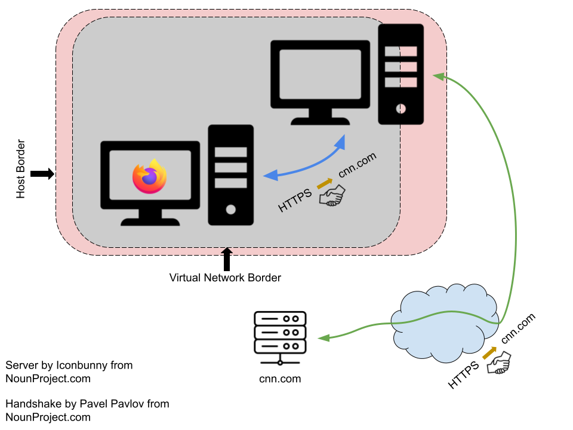
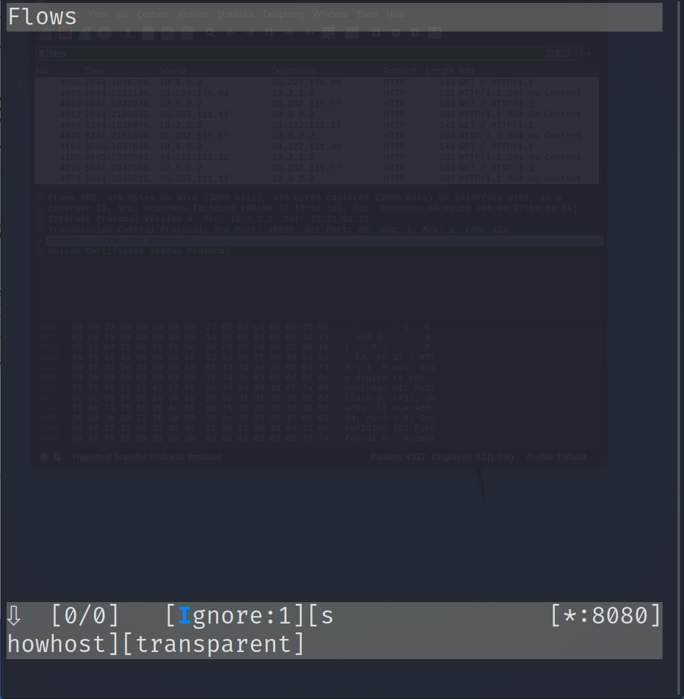
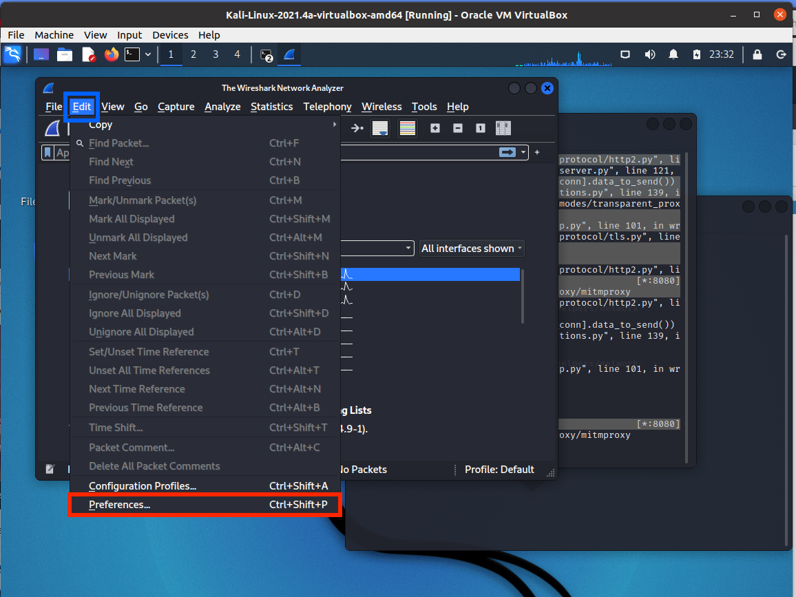
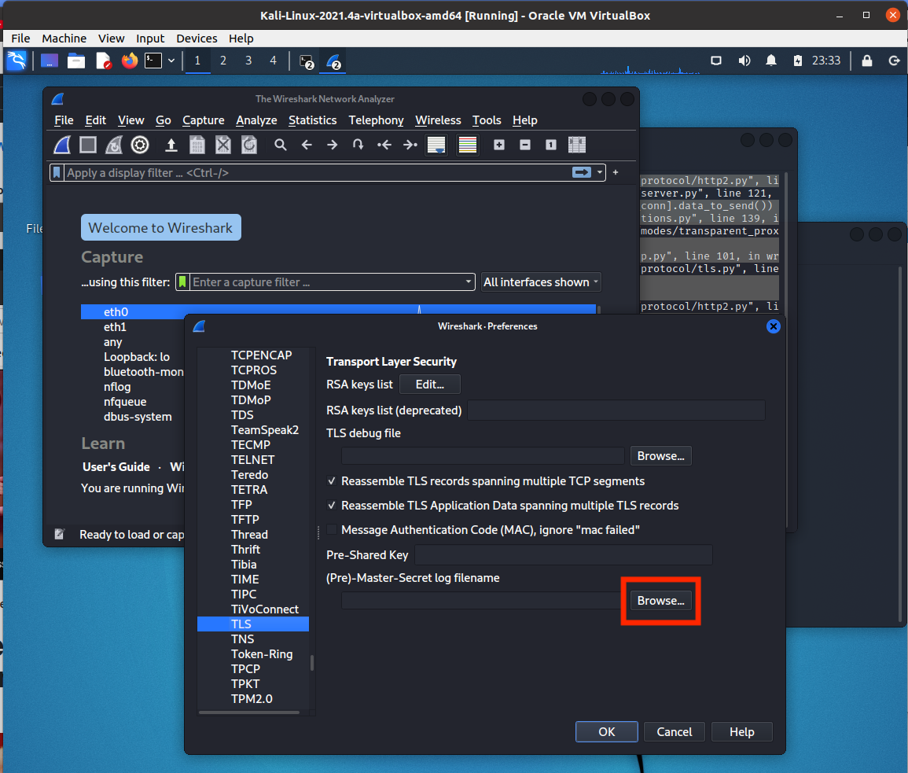

## Malware Mini Assignment: Secret Searcher

In this assignment you will use your newfound network analysis powers to analyze the network behavior of an unknown application named `secretsearcher`. Included in this Mini Assignment bundle is a copy of the binary. `secretsearcher` has landed on your network thanks to a zero-day vulnerability. Your threat intelligence analysts have told you that the application performs some type of web search but they couldn't figure out which search engine it uses (Google, Bing, Duck Duck Go, etc.) nor could they figure out the query that it makes.

What the other analysts do know is that the query is a canary that triggers some malicious behavior in the search engine and allows the binary to steal the user's search history and cookies -- information that the binary then uses to harvest saved passwords.

You must get to the bottom of the situation quickly or millions of users will have their TikTok memes rick-rolled.

### Before you begin ...

Before you begin, make sure that you have your analysis environment configured properly. Follow the instructions online at [TODO](http://www.todo.com).

For the remainder of the document, we will use the same language that we did in the document that described the lab configuration. In other words, we will refer to the lab's VirtualBox-based virtual network simply as the _virtual network_. We will refer to the guest running the Kali distribution of the Linux operating system as the _Kali VM_. We will refer to the guest running the Ubuntu distribution of the Linux operating system as the _analysis VM_ (because it would be where you will be doing malware analysis.)

### Step 1: Start at the beginning

Throughout the semester our analysis skills have grown sharper. We started by doing some basic static analysis. Then we did some basic dynamic analysis. Most recently, we have learned how to combine dynamic analysis with network analysis. 

When doing analysis, it is always a good idea to try the easiest tools first. Perhaps it is possible to suss out the name of the search engine and the query contents just by looking at the contents of the binary. If we could do that, our analysis would be much safer (we would never be forced to execute the potentially malicious program) and quicker (no need to set up a lab environment!).

Using `strings` (or any other tool at your disposal), make and support the claim that we cannot answer the outstanding questions about `secretsearcher` posed in the introduction using only static analysis. Record this response in your `submission.txt` file for Question 1. 

### Step 2: Setting Ourselves Up For Success

We know that `secretsearcher` makes a network connection to a search engine and issues a query. We will assume that the malware author is not stupid and that they perform the query over HTTPS and not plain HTTP. 

Or maybe not? Again, we should always check the easy things first. 

Let's use Wireshark to validate that the `secretsearcher` malware does its query over HTTPS. How to do that? We will run Wireshark on our Kali VM and run `secretsearcher` on the analysis VM. 

Start up the Kali VM and the analysis VM. Use the helper scripts to configure the Kali VM as a router. Make sure that you can access the Internet from the analysis VM. 

On the Kali VM, start up Wireshark and begin monitoring traffic on the network interface attached to the virtual network. Apply a filter so that you only see HTTP traffic. _Hint_: Like we could use `icmp` as a filter for ICMP traffic in Wireshark, we can use `http` as a filter in Wireshark for HTTP traffic. 

Validate that Wireshark, your Kali VM and the analysis VM are all doing "the right thing" by completing this simple test:

1. Open a terminal on the analysis VM and do a `wget` for cnn.com: `$ wget http://www.cnn.com`.
2. Verify that Wireshark (on the Kali VM) shows two HTTP packets.

In `submission.txt`, as the response for Question 2, report the [HTTP methods](https://www.rfc-editor.org/rfc/rfc7231) that are in the two packets *and* the IP address of packet addressed from the analysis VM. 

Now that we know we *can* see traffic if it exists, let's run the `secretsearcher` and see if there is any unencrypted HTTP traffic:

1. Open a terminal on the analysis VM and run `secretsearcher`: `$ ./secretsearcher`.
2. Verify that Wireshark shows no HTTP packets.

Take a screen shot of Wireshark showing that there was no HTTP traffic generated by the execution of `secretsearcher`. Feel free to annotate the screenshot with labels that will demonstrate you understand the interpretation of Wireshark's output. Record the name of the screenshot under Question 3 in `submission.txt` and be sure to include the image in your submission on Canvas.

### Foiled!

Our job just got significantly harder. We have shown that basic static analysis won't get the job done. We've also show that our first attempt at using network analysis was unhelpful. Looks like we are going to have to turn our analysis up to 11.

We can deduce that `secretsearcher` is using HTTPS to communicate with the search engine and make its query. Unfortunately any HTTP connection that is secured using HTTPS means that the contents are secure against prying eyes snooping on the network between the client and the web server.

In order to interfere, we will have to configure our Kali VM to intercept the HTTPS protocol in a way that allows us to inspect the traffic. 

Is that possible?

### HTTPS Proxying



YES!! In fact, there are even tools to do it! But, before we get in to the nuts and bolts, let's take a step back and think about what is going on conceptually. 

HTTPS provides end-to-end security for HTTP connections. In other words, the client (typically a web browser) establishes a secure connection with the web server and all information transmitted over that connection is secure. The client contains a list of Certificate Authorities -- authenticators that they implicitly trust. When the client connects to a web server it uses that list of authorities to guarantee that the server to which it connected is legitimate. This is the opposite of what we normally think of in authentication. Normally it is the *client* proving to the server that they are legitimate. In HTTPS it is the other way around. 

Getting around such a scheme is not easy. We'll do it in a series of steps and illustrate those steps by example of a client connecting to `cnn.com`. Before starting, we will install an _imposter_ Certificate Authority on the client server -- one that we control. This will give us the power to prove to the client that a server of our choosing is legitimate for any website. Next, we will configure a type of _proxy server_ that can make HTTPS connections to the Internet. With this configuration, we can do the following:

1. The client connects to `cnn.com`. 
2. The proxy server responds with a guarantee to the client that *it* is the legitimate owner of `cnn.com`. 
3. The client establishes an HTTPS connection *with the proxy server*. This connection is the first of two secure connections (indicated in blue in the figure above). 
4. The proxy server, in turn, connects with the actual `cnn.com` web server. This is the second of two secure connections (indicated in green in the figure above). 
5. The proxy server shuffles requests and responses between the client and `cnn.com` transparently. 

Because the client thinks that proxy server is actually `cnn.com`, the proxy server can decrypt the contents of the client's transmissions. Because `cnn.com` thinks that proxy server is actually the client, the proxy server can decrypt `cnn.com`'s responses. Just what we wanted -- the ability to see the contents of both the clients and the server's data transmissions in plain text.

Please note: HTTPS Proxying is also known as a man-in-the-middle (MITM) attack. For obvious reasons I will try to refrain from using this phrase but it _is_ the name of the software tool that we will use to actually deploy HTTP Proxying.

### Configuring `mitmproxy`

`mitmproxy` is a tool installed by default in the Kali distribution that allows us to easily perform HTTP Proxying. The only problem is that the version installed is too old for our purposes. So, we will need to first upgrade the version on our Kali VM. 

Start by downloading the updated version of the program from [mitmproxy.org](https://mitmproxy.org/). Place the downloaded file in the `~Downloads` directory. 

Untar/zip the resulting program: 

```
$ tar -xvzf mitmproxy-7.0.4-linux.tar.gz
```

Copy the three (3) binaries into `/usr/bin` to overwrite the outdated versions:

```
$ sudo cp mitmproxy /usr/bin
$ sudo cp mitmdump /usr/bin
$ sudo cp mitmweb /usr/bin
```

Verify that you have properly installed the updated version:

```
$ mitmproxy --version
```

You should see output that looks like:
```
Mitmproxy: 7.0.4 binary
Python:    3.9.7
...
```

Copy and paste the output from that command in `submission.txt` as your response to Question 3.

HTTPS connections operate on port 443. In order for our HTTPS proxy setup to work, we will have to tell the router (Kali VM) to intercept all the traffic that it routes and redirect it to `mitmproxy` so that it will work its magic. We will use `iptables` to do this redirection. 

The syntax is `iptables` is, well, fun, and you can research it on your own, if you like. However, I have provided you a script that will do the necessary configuration: `configure_as_mitm_proxy.sh` in this class' `git` repo under the `helpers/network` directory.

Besides configuring `iptables` properly, the helper script will also launch `mitmroxy`. 

```
$ sudo ./configure_as_mitm_proxy.sh
```

Your screen should look something like the image below.



Unfortunately, that's not quite all that we need to do. Fortunately, the final step is automated and already done for you in the `configure_as_mitm_proxy.sh` helper script. Nevertheless, you need to understand what is going on even if you don't need to do anything as a result.

We glossed over one important detail earlier when discussing the configuration. While `mitmproxy` is able to see the decrypted contents of the (heretofore) secure connection between client and server, anything snooping the network (i.e., Wireshark!!) cannot. Why? Because the transmissions that `mitmproxy` makes between itself and the real web server and itself and the client are both secure. However, instead of the real web server being in charge of that security, it's the proxy. 

`mitmproxy` offers a cool piece of functionality that allows it to interact with Wireshark so that Wireshark can decrypt the packets that it snoops from the network. If properly configured, `mitmproxy` will log all the [session keys](TODO) that it generates. 

In turn, we can configure Wireshark to read that log file! Let's do that now. Wait!! Didn't I just say that we didn't have to do anything else? Yes, but I lied. 

In Wireshark, open up the Preferences (shown in red in the figure below).



Next, click on Protocols and find the TLS protocol settings. You should see a screen that looks like the one in the image below.



Click on the `Browse` button under the `(Pre)-Master-Secret log filename` box. Browse to `/home/kali/` and select `keyfile.txt`. Press OK. Now that you have completed this step, you will *have to* restart Wireshark. 

And now, I promise this time!, the HTTP proxy is configured! Congratulations!!

### Configuring the Analysis VM

Remember that we will also need to tell the client about our setup, too, so that it trusts the secrets offered by the proxy server. The good news is that `mitmproxy` makes this relatively straightforward.

On the analysis VM, open up Firefox and browse to `mitm.it`. If your server setup is correct, you will see something that looks like the image below:


Follow the installation instructions for *both* "Linux" and "Firefox". Without following the instructions for *both* configurations, you will not be able to perform the analysis!

### Final Countdown

We have all the configuration done that we need to for our analysis. Let's do a final test to make sure that everything is set to rock and roll.

We will again use `cnn.com` as an example and run two tests. Before starting the tests, make sure that Wireshark is running on the Kali VM and (re)apply the filter for HTTP. This time, though, let's make our filter a little more broad by including all the versions of HTTP: 1, 2 *and* 3. In Wireshark, these protocol identifiers are `http`, `http2` and `http3`, respectively. Combine that information with your knowledge of the [Wireshark filter syntax](https://www.wireshark.org/docs/wsug_html_chunked/ChWorkBuildDisplayFilterSection.html) to write an effective display filter so that you only see HTTP traffic, no matter which version of the protocol is used. Record the display filter that you applied as the answer to Question 4 in `submission.txt`. 

The first test will be run through the web browser. This tests will ensure that we have properly installed the Certificate Authority in the browser. (Re)Open Firefox and connect to `cnn.com`. By connecting to `cnn.com` in Firefox, you should see many HTTP packets being displayed in Wireshark. Choose a packet and describe its contents (what was the resource accessed? what was the HTTP method? what was the status code?). Record your description in `submission.txt` under Question 5.

The second test will be run through `wget`. This test will ensure that we installed the HTTP proxy Certificate Authority successfully in the operating system. 

```
$ wget http://www.cnn.com
```

As a result of this `wget` command, you should see two HTTP messages. One of the cookies that `cnn.com` sets helps the website determine your geographic location. Look for the `geoData` value and record its contents as your response to Question 5 in `submission.txt`. 

### `secretsearcher` Analysis

As a result of the preceding hard work and configuration, you should be able to execute the `secretsearcher` malware and answer the two outstanding questions posed in the beginning of this Mini Assignment:

1. What is the search engine that `secretsearcher` uses?
2. What is the query that `secretsearcher` issues?

Record your response to those two questions under Question 6 in `submission.txt`. 

### Conclusion

I hope that you had fun on this quest and enjoyed the hunt. Please leave feedback about this Mini Assignment under Question 8 in `submission.txt` -- if you do not leave feedback, you will not get credit!


