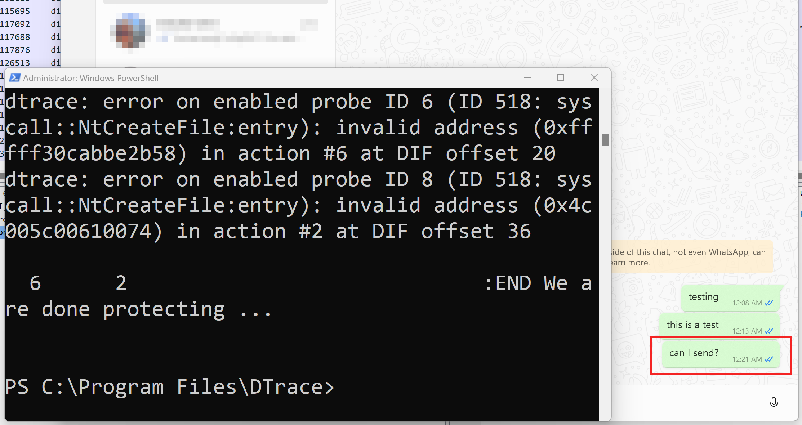

# The Hippodtracic Oath -- Do No Harm

In this assignment you are going to use DTrace to apply the scientific method to investigating the functionality of a piece of software of your choosing. 

## Summary

In this assignment you will get experience using DTrace for program analysis by

1. Choosing a program to investigate.
2. Using DTrace to monitor the files that the chosen program opens as it operates.
3. Using DTrace to block access to *one* of those files by the program-under-study and document how the application behaves in the presence of that failure.

## An Example

To give you a better understanding of what I expect, I have performed an analysis that exemplifies an exemplary submission. Your research and documentation do not need to be *as* complete as what I will write below, but your writeup should be substantially similar.

For a complete description of the requirements for this assignment, see [Your Task(s)](#your-tasks) below.

## And Now, This ...

The code that we wrote and used in class can be used as a binary cudgel to stop a particular program from opening *any* file. In our D Script we monitor the files that are being opened and have two options after that:

1. let the application open those files; or
2. stop the application from opening those files. 

Let's start with overall objective (1) from the Summary section above and choose the program that we want to monitor. As a demonstration, I choose to monitor the `WhatsApp` application. 

> *Note: That means you cannot choose to monitor the WhatsApp application. You will have to choose another!*

Now that we've chosen, let's customize the `openfile.d` D Script so that we can monitor the chosen application. We want to do monitoring only at this point, so ...

1. "disable" the `copyout` of the 8 `null` bytes whose purpose it is to overwrite the kernel-assigned handle value

```C
/*
    copyout((void*)null, (uintptr_t)self->phandle, sizeof(null));
*/
```

2. Update the filter so that the `syscall::NtCreateFile:entry` probe only executes its associated action when the application you want to monitor attempts to use `NtCreateFile` to open a file.

Now that we have essentially turned our defensive (but destructive) D Script into a passive eavesdropper, let's see what information we can dredge up about the files that `WhatsApp` opens while it executes: (don't worry, I'll spare you most of the details)

```
Stability attributes for script C:\Users\whh8b\Code\Code\UC\UC\CS5138\MiniAssignmentXFilTra8\openfile.d:

	Minimum Probe Description Attributes
		Identifier Names: Private
		Data Semantics:   Private
		Dependency Class: ISA

	Minimum Statement Attributes
		Identifier Names: Private
		Data Semantics:   Private
		Dependency Class: Unknown

CPU     ID                    FUNCTION:NAME
  1      1                           :BEGIN We are starting to protect ...

  6    518               NtCreateFile:entry Process WhatsApp.exe PID 8980 opened file \DEVICE\NETBT_TCPIP_{97FC1A2D-696C-4DCB-AAA8-191F80B24231} 

  6    518               NtCreateFile:entry (WhatsApp.exe) Before invoking NtCreateFile, the handle's value is 7fff00000000.

  6    519              NtCreateFile:return (WhatsApp.exe) In response to an NtCreateFile call, the kernel assigned handle 0x7fff00000000.

  6    519              NtCreateFile:return (WhatsApp.exe) After applying protection, the handle's value is 0x7fff00000000.

  6    518               NtCreateFile:entry Process WhatsApp.exe PID 8980 opened file \DEVICE\NETBT_TCPIP_{6E697395-2AE2-4BE7-8FA0-F47D8C4A5081} 

  6    518               NtCreateFile:entry (WhatsApp.exe) Before invoking NtCreateFile, the handle's value is 7fff00000000.

  6    519              NtCreateFile:return (WhatsApp.exe) In response to an NtCreateFile call, the kernel assigned handle 0x7fff00000000.

  6    519              NtCreateFile:return (WhatsApp.exe) After applying protection, the handle's value is 0x7fff00000000.

  6    518               NtCreateFile:entry Process WhatsApp.exe PID 8980 opened file \DEVICE\NETBT_TCPIP_{A7068289-A745-11ED-B8CA-806E6F6E6963} 

  6    518               NtCreateFile:entry (WhatsApp.exe) Before invoking NtCreateFile, the handle's value is 7fff00000000.

  6    519              NtCreateFile:return (WhatsApp.exe) In response to an NtCreateFile call, the kernel assigned handle 0x7fff00000000.

  6    519              NtCreateFile:return (WhatsApp.exe) After applying protection, the handle's value is 0x7fff00000000.

...

  1    518               NtCreateFile:entry Process WhatsApp.exe PID 8980 opened file \??\C:\PROGRAM FILES\WINDOWSAPPS\5319275A.WHATSAPPDESKTOP_2.2304.6.0_X64__CV1G1GVANYJGM\DESIGN\WHATSAPPMDL2ASSETS\WHATSAPPMDL2ASSETSGENERAL16PX.TTF 

  1    518               NtCreateFile:entry (WhatsApp.exe) Before invoking NtCreateFile, the handle's value is 3210001.

  1    519              NtCreateFile:return (WhatsApp.exe) In response to an NtCreateFile call, the kernel assigned handle 0xc90.

  1    519              NtCreateFile:return (WhatsApp.exe) After applying protection, the handle's value is 0xc90.

  1    518               NtCreateFile:entry Process WhatsApp.exe PID 8980 opened file \??\C:\WINDOWS\SYSTEM32\windows.ui.xaml.resources.common.dll 

  1    518               NtCreateFile:entry (WhatsApp.exe) Before invoking NtCreateFile, the handle's value is 6f0063002e0073.

  1    519              NtCreateFile:return (WhatsApp.exe) In response to an NtCreateFile call, the kernel assigned handle 0xcd8.

  1    519              NtCreateFile:return (WhatsApp.exe) After applying protection, the handle's value is 0xcd8.

  4    518               NtCreateFile:entry Process WhatsApp.exe PID 8980 opened file \??\C:\Program Files\WindowsApps\5319275A.WhatsAppDesktop_2.2304.6.0_x64__cv1g1gvanyjgm\Design\Assets\Emoji\WhatsAppColorEmoji.ttf 

  4    518               NtCreateFile:entry (WhatsApp.exe) Before invoking NtCreateFile, the handle's value is 22300000010.

  2    519              NtCreateFile:return (WhatsApp.exe) In response to an NtCreateFile call, the kernel assigned handle 0xce4.

  2    519              NtCreateFile:return (WhatsApp.exe) After applying protection, the handle's value is 0xce4.

  ...

  0    518               NtCreateFile:entry Process WhatsApp.exe PID 8980 opened file \??\C:\Users\whh8b\AppData\Local\Packages\5319275a.whatsappdesktop_cv1g1gvanyjgm\AC\INetHistory 

  0    518               NtCreateFile:entry (WhatsApp.exe) Before invoking NtCreateFile, the handle's value is 0.

  0    519              NtCreateFile:return (WhatsApp.exe) In response to an NtCreateFile call, the kernel assigned handle 0x0.

  0    519              NtCreateFile:return (WhatsApp.exe) After applying protection, the handle's value is 0x0.

  0    518               NtCreateFile:entry Process WhatsApp.exe PID 8980 opened file \??\C:\Users\whh8b\AppData\Local\Packages\5319275a.whatsappdesktop_cv1g1gvanyjgm\AC\INetCache\9P3ALY6R 

  0    518               NtCreateFile:entry (WhatsApp.exe) Before invoking NtCreateFile, the handle's value is 5c.

  0    519              NtCreateFile:return (WhatsApp.exe) In response to an NtCreateFile call, the kernel assigned handle 0x11d8.

  0    519              NtCreateFile:return (WhatsApp.exe) After applying protection, the handle's value is 0x11d8.

  0    518               NtCreateFile:entry Process WhatsApp.exe PID 8980 opened file \??\C:\Users\whh8b\AppData\Local\Packages\5319275a.whatsappdesktop_cv1g1gvanyjgm\AC\INetCache\9P3ALY6R\56014825_279406089640121_2133158454599090176_n[1].jpg 

  0    518               NtCreateFile:entry (WhatsApp.exe) Before invoking NtCreateFile, the handle's value is 7fff1b4e7780.

  ...

  5    518               NtCreateFile:entry Process WhatsApp.exe PID 8980 opened file \??\C:\Users\whh8b\AppData\Local\Packages\5319275A.WhatsAppDesktop_cv1g1gvanyjgm\LocalState\profilePictures\f63b2886becd2fa98f4eefd8f91d115fcb6ea3721665968405_thumb 

  5    518               NtCreateFile:entry (WhatsApp.exe) Before invoking NtCreateFile, the handle's value is 0.

  4    519              NtCreateFile:return (WhatsApp.exe) In response to an NtCreateFile call, the kernel assigned handle 0x1158.

  4    519              NtCreateFile:return (WhatsApp.exe) After applying protection, the handle's value is 0x1158.

  4    518               NtCreateFile:entry Process WhatsApp.exe PID 8980 opened file \??\C:\Users\whh8b\AppData\Local\Packages\5319275A.WhatsAppDesktop_cv1g1gvanyjgm\LocalState\profilePictures\0dab4ae8ac62e4d604a17ce8ea648679c6c86fd21646429915_thumb 

  4    518               NtCreateFile:entry (WhatsApp.exe) Before invoking NtCreateFile, the handle's value is 0.

  3    519              NtCreateFile:return (WhatsApp.exe) In response to an NtCreateFile call, the kernel assigned handle 0x1120.

  3    519              NtCreateFile:return (WhatsApp.exe) After applying protection, the handle's value is 0x1120.

  0    518               NtCreateFile:entry Process WhatsApp.exe PID 8980 opened file \??\C:\Program Files\WindowsApps\5319275A.WhatsAppDesktop_2.2304.6.0_x64__cv1g1gvanyjgm\Design\Window\Assets\light\default.scale-200.png 

  0    518               NtCreateFile:entry (WhatsApp.exe) Before invoking NtCreateFile, the handle's value is 223002b0380.

  1    519              NtCreateFile:return (WhatsApp.exe) In response to an NtCreateFile call, the kernel assigned handle 0x11f4.

  1    519              NtCreateFile:return (WhatsApp.exe) After applying protection, the handle's value is 0x11f4.

  ...

  1    518               NtCreateFile:entry Process WhatsApp.exe PID 15928 opened file \??\C:\Program Files\WindowsApps\5319275A.WhatsAppDesktop_2.2304.6.0_x64__cv1g1gvanyjgm\ip_list.json 

  ...
```

I spared you all the details (well over 1500 lines of it, in fact!). Now, let's look at the interesting items.

### Caches

An entry in the output from our `openfile.d` logging

```
  0    518               NtCreateFile:entry Process WhatsApp.exe PID 8980 opened file \??\C:\Users\whh8b\AppData\Local\Packages\5319275a.whatsappdesktop_cv1g1gvanyjgm\AC\INetHistory 
```

seems to indicate to me that `WhatsApp` is using a file-based cache to store data that it is downloading from the internet as it executes. I think that caches are some of the best places to dig to uncover the things that applications are doing that they don't want us to realize. What's fascinating about the cache file named here is that on subsequent executions of the program, the directory does not seem to exist. A subsequent logging entry 

```
  0    518               NtCreateFile:entry Process WhatsApp.exe PID 8980 opened file \??\C:\Users\whh8b\AppData\Local\Packages\5319275a.whatsappdesktop_cv1g1gvanyjgm\AC\INetCache\9P3ALY6R 
```

seems to indicate that *something* was downloaded and cached. After the execution of `WhatsApp` that I used to capture these results, the file referenced was nowhere to be found. What's (App) more interesting is that those cache files do not appear to stay open very long during execution (confirmed using a great utility called [Process Explorer](https://learn.microsoft.com/en-us/sysinternals/downloads/process-explorer) from [Sysinternals](https://learn.microsoft.com/en-us/sysinternals/)). My initial thought is that blocking the opening of these cache files might be very a good way to trigger some interesting behavior from the application. More on that next ...

### Fonts, Fonts, and more Fonts ...

It looks like `WhatsApp` has plenty of custom fonts that it uses to display things from messages to emojis ...

```
  4    518               NtCreateFile:entry Process WhatsApp.exe PID 8980 opened file \??\C:\Program Files\WindowsApps\5319275A.WhatsAppDesktop_2.2304.6.0_x64__cv1g1gvanyjgm\Design\Assets\Emoji\WhatsAppColorEmoji.ttf 
```

It would be very, very interesting to see how the application behaves if those [TrueType](https://en.wikipedia.org/wiki/TrueType) Fonts are not available.

### Thumbnails

It looks like `WhatsApp` uses and restores lots of thumbnails of images that it has downloaded during previous executions:


```
  4    518               NtCreateFile:entry Process WhatsApp.exe PID 8980 opened file \??\C:\Users\whh8b\AppData\Local\Packages\5319275A.WhatsAppDesktop_cv1g1gvanyjgm\LocalState\profilePictures\0dab4ae8ac62e4d604a17ce8ea648679c6c86fd21646429915_thumb 
```

Unlike the files that are downloaded to the `INetCache`, the thumbnail files *do* persist and they can be found at the path logged with our tool. Here is an example of one of those thumbnail files (a profile picture of one of my contacts):


### The Big Catch ...


```
  1    518               NtCreateFile:entry Process WhatsApp.exe PID 15928 opened file \??\C:\Program Files\WindowsApps\5319275A.WhatsAppDesktop_2.2304.6.0_x64__cv1g1gvanyjgm\ip_list.json 
```

**WOAH** Now we are on to something *very* interesting. Even before looking at the contents of the file, I am incredibly interested. Let's see what's inside ...
```
{
   "e1.whatsapp.net": [
       "15.197.206.217",
       "3.33.252.61",
       "15.197.210.208",
       "3.33.221.48"
   ],
   "e10.whatsapp.net": [
       "15.197.206.217",
       "3.33.252.61",
       "15.197.210.208",
       "3.33.221.48"
   ],
   "e11.whatsapp.net": [
       "15.197.206.217",
       "3.33.252.61",
       "15.197.210.208",
       "3.33.221.48"
   ],
   "e12.whatsapp.net": [
       "15.197.206.217",
       "3.33.252.61",
       "15.197.210.208",
       "3.33.221.48"
   ],
   "e13.whatsapp.net": [
       "15.197.206.217",
       "3.33.252.61",
       "15.197.210.208",
       "3.33.221.48"
   ],
   "e14.whatsapp.net": [
       "15.197.206.217",
       "3.33.252.61",
       "15.197.210.208",
       "3.33.221.48"
   ],
   "e15.whatsapp.net": [
       "15.197.206.217",
       "3.33.252.61",
       "15.197.210.208",
       "3.33.221.48"
   ],
   "e16.whatsapp.net": [
       "15.197.206.217",
       "3.33.252.61",
       "15.197.210.208",
       "3.33.221.48"
   ],
   "e2.whatsapp.net": [
       "15.197.206.217",
       "3.33.252.61",
       "15.197.210.208",
       "3.33.221.48"
   ],
   "e3.whatsapp.net": [
       "15.197.206.217",
       "3.33.252.61",
       "15.197.210.208",
       "3.33.221.48"
   ],
   "e4.whatsapp.net": [
       "15.197.206.217",
       "3.33.252.61",
       "15.197.210.208",
       "3.33.221.48"
   ],
   "e5.whatsapp.net": [
       "15.197.206.217",
       "3.33.252.61",
       "15.197.210.208",
       "3.33.221.48"
   ],
   "e6.whatsapp.net": [
       "15.197.206.217",
       "3.33.252.61",
       "15.197.210.208",
       "3.33.221.48"
   ],
   "e7.whatsapp.net": [
       "15.197.206.217",
       "3.33.252.61",
       "15.197.210.208",
       "3.33.221.48"
   ],
   "e8.whatsapp.net": [
       "15.197.206.217",
       "3.33.252.61",
       "15.197.210.208",
       "3.33.221.48"
   ],
   "e9.whatsapp.net": [
       "15.197.206.217",
       "3.33.252.61",
       "15.197.210.208",
       "3.33.221.48"
   ],
   "g.whatsapp.net": [
       "31.13.65.50",
       "31.13.88.61",
       "157.240.19.54",
       "31.13.93.54",
       "31.13.66.51",
       "157.240.229.61",
       "31.13.70.50",
       "157.240.11.54",
       "31.13.71.50",
       "157.240.241.61",
       "31.13.67.53",
       "157.240.14.53",
       "157.240.2.54",
       "157.240.18.53",
       "157.240.3.55",
       "157.240.22.54",
       "2a03:2880:f211:c6:face:b00c:0:7260",
       "2a03:2880:f211:1ca:face:b00c:0:7260",
       "2a03:2880:f234:c7:face:b00c:0:7260",
       "2a03:2880:f234:1c7:face:b00c:0:7260",
       "2a03:2880:f203:c6:face:b00c:0:7260",
       "2a03:2880:f203:1c9:face:b00c:0:7260",
       "2a03:2880:f20d:c6:face:b00c:0:7260",
       "2a03:2880:f20d:1c6:face:b00c:0:7260",
       "2a03:2880:f212:c6:face:b00c:0:7260",
       "2a03:2880:f212:1c4:face:b00c:0:7260",
       "2a03:2880:f22c:c6:face:b00c:0:7260",
       "2a03:2880:f22c:1c6:face:b00c:0:7260",
       "2a03:2880:f227:c6:face:b00c:0:7260",
       "2a03:2880:f227:2c6:face:b00c:0:7260",
       "2a03:2880:f201:c6:face:b00c:0:7260",
       "2a03:2880:f231:c7:face:b00c:0:7260"
   ],
   "v.whatsapp.net": [
       "31.13.65.49",
       "31.13.88.60",
       "157.240.19.53",
       "31.13.93.53",
       "31.13.66.56",
       "157.240.229.60",
       "31.13.70.49",
       "157.240.11.53",
       "31.13.71.49",
       "157.240.241.60",
       "31.13.67.52",
       "157.240.14.52",
       "157.240.2.53",
       "157.240.18.52",
       "157.240.3.54",
       "157.240.22.53",
       "2a03:2880:f211:c5:face:b00c:0:167",
       "2a03:2880:f211:1c1:face:b00c:0:167",
       "2a03:2880:f234:c6:face:b00c:0:167",
       "2a03:2880:f234:1c6:face:b00c:0:167",
       "2a03:2880:f203:c5:face:b00c:0:167",
       "2a03:2880:f203:1c1:face:b00c:0:167",
       "2a03:2880:f20d:c5:face:b00c:0:167",
       "2a03:2880:f20d:1c5:face:b00c:0:167",
       "2a03:2880:f212:c5:face:b00c:0:167",
       "2a03:2880:f212:1d1:face:b00c:0:167",
       "2a03:2880:f22c:c5:face:b00c:0:167",
       "2a03:2880:f22c:1c5:face:b00c:0:167",
       "2a03:2880:f227:c5:face:b00c:0:167",
       "2a03:2880:f227:2c5:face:b00c:0:167",
       "2a03:2880:f201:c5:face:b00c:0:167",
       "2a03:2880:f231:c6:face:b00c:0:167"
   ]
}
```

Oh yes, bingo!! This file is clearly the one that I want to use in my experimentation.

## Let The Scientific Method Begin ...

The Scientific Method has evolved since its "discovery" by Bacon but is largely defined as a continuous process that goes something like ...


As part of the process so far, I have already made observations (using our logging system) and have already defined a Research topic area (`WhatsApp`'s use of caching, TrueType fonts, a repository of thumbnails and a file that seems to contain all the IP addresses of the service's servers!). Next, we'll generate a hypothesis and use our tool to test it:

> Hypothesis: When `WhatsApp`'s access to the `ip_list.json` file is denied, the `WhatsApp` application will not be able to send/receive messages.

To begin the process, I enabled the "protection" mechanism in the `openfile.d` D Script by specifying that accesses to (only) `ip_list.json` be blocked. Then, I started the `WhatsApp` application and attempted to send a message to myself. 


Despite the fact that I was connected to the Internet from my laptop, the message did not appear to be sent (highlighted in the Red box in the image above).

For the purposes of falsifiability, I then disabled the "protection" and restarted the `WhatsApp` application to see whether or not the message would send. If the message would *still* not send even with protection disabled, then it would be clear to me that the protection afforded by the D Script was not *the* reason for the failure to send.



Wow! Our protection mechanism really worked! When the the protection mechanism was enabled, the message failed to send. When the mechanism was disabled, the message was delivered (highlighted in the Red box in the image above). 

## Your Task(s)

You will submit two items:

1. The report of your investigation (see below)
2. A copy of the upgraded `openfile.d` D Script that you have created to block access to some file.

Your report should consist of three items:

1. The name of the program you are investigating (and why you chose to investigate it!).
2. A description of how you used DTrace to monitor the files that the program-under-study opens as it operates.
3. A description of how you used DTrace to block access to *one* of those files, a hypothesis about how the program-under-study will operate without access to that file, and your analysis of the program's actual behavior in that constrained execution environment.

The preceding section should give you a good sense for the level of detail that I expect in this report. Again, I do not expect the same level of detail but your work should be similar to what I have written above.

In addition to the report, you will also submit the upgraded `openfile.d` D Script that you have created to block access to some file. I *expect* that you will base your work on the implementation of that DTrace program that we completed in class. There is *no need* to cite or document that you based your submission on that code. However, if you share code or collaborate with classmates, you *must* give proper credit. As with the first assignment, if you have any question about what constitutes acceptable collaboration and/or documentation, please ask. I am happy to explain the standards for academic citation.


### Tips and Tricks

I would recommend using the `fname_buffer` member of the `this` structure as a means of determining when to rewrite the `HANDLE` generated by the Windows kernel as a result of the application's call to `NtCreateFile`. The `fname_buffer` member is a pointer to a ["wide character"](https://learn.microsoft.com/en-us/windows/win32/learnwin32/working-with-strings) string whose length is `this->fname_buffer_len`. The string comparison functions built in to DTrace will not work help you. To see why those functions will not work on wide character strings, think about how the venerable string functions work.

## Submission and Assessment

Submissions for this assignment will be through Canvas. There is no automated testing for this assignment. The Assignment associated with this assignment on the course's Canvas page will provide the tools you need to submit your assignment.

This assignment is worth 75 points. Your submission will be assessed according to the following rubric:

| Points | Category | Criteria |
| -- | -- | -- |
| 50 | Report | You will be awarded 35 points for the *content* of your report. If your report thoroughly covers all three of the required topics you will receive 35 points. If your report covers all three of the required topics you will receive 20 points. If your report superficially covers all the required topics you will receive 10 points. *If your report does not cover all the required topics you will receive 0 points*. The remaining 15 points will be awarded based on the grammar and structure of your report: Reports with few, if any, grammatical/spelling errors will receive full points.
| 25 | Programming | You will be awarded 25 points for your implementation of a robust scheme to determine when to use DTrace to deny access to a particular file. A robust scheme is one that cannot fail when long/short file names are potentially accessed, one that handles wide character strings, one that does not block access to more than a single file, etc. |

