## Installing DTrace On Windows

Installing DTrace on Windows is just as straightforward as installing (almost) any other user application. The only pre-requisite is that you have a (relatively) recent version of Windows. 

> A 64-bit installation of a version of Windows newer than Windows 10 Build 1903 (the 64-bit version) is the Microsoft-advertised requirement. The particular Windows 10 build required debuted in May of 2019. If you are running Windows 11, you qualify!

### Download The Installer

The first step is arguably the easiest: Download the installer from the web: [Here](https://download.microsoft.com/download/7/9/d/79d6b79a-5836-4118-a9b7-60bc77c97bf7/DTrace.amd64.msi). 

> *Note: You may want to refer directly to [https://github.com/microsoft/DTrace-on-Windows](https://github.com/microsoft/DTrace-on-Windows) to ensure that you are downloading the newest version of DTrace (the direct link provided might be stale!).*

### Run The Installer

Because I *know* that you are all using Firefox, once the download completes you will see a window like the one below. Click on the download to begin its execution (highlighted in red).
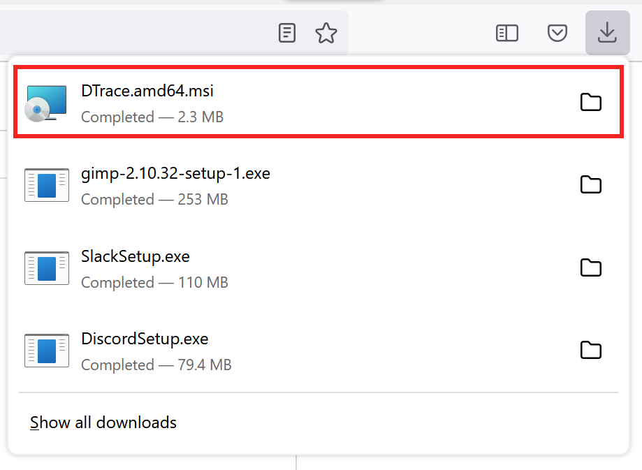

Your browser (even if it's not Firefox [but it should be!]) will prompt you about whether to run the executable or not. If you don't allow it to run, this assignment will be very short. Decide accordingly.
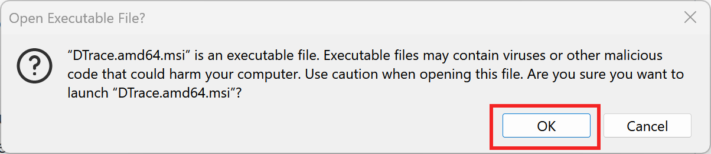

The first screen is *blah, blah, blah*. Click `Next`.
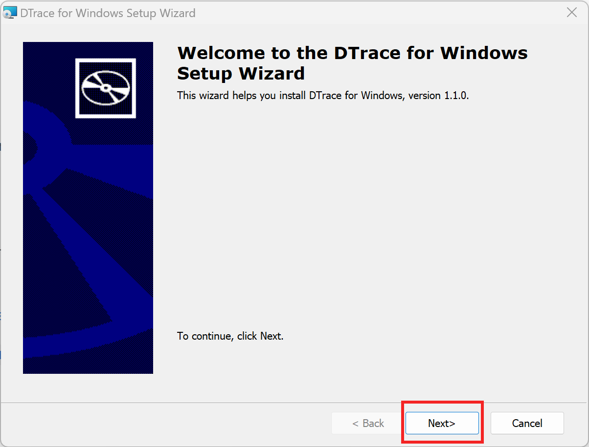

On the second screen you will have to manually select that you agree to the license (red box) and *then* click `Next` (blue box).
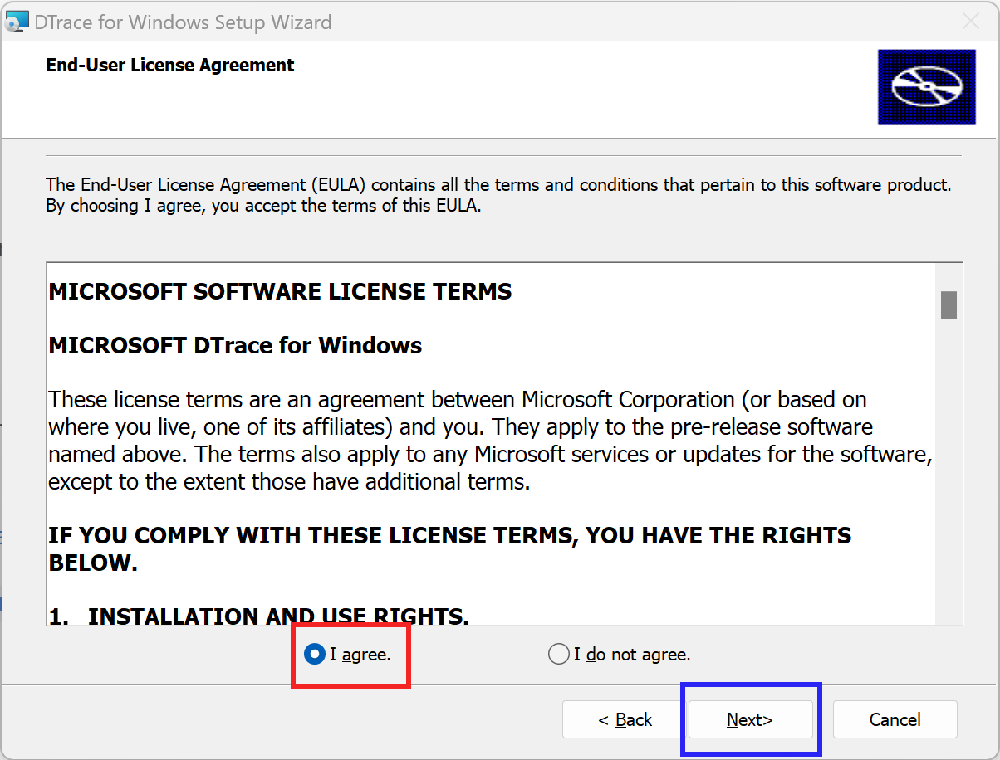

The final step is to `Install`.
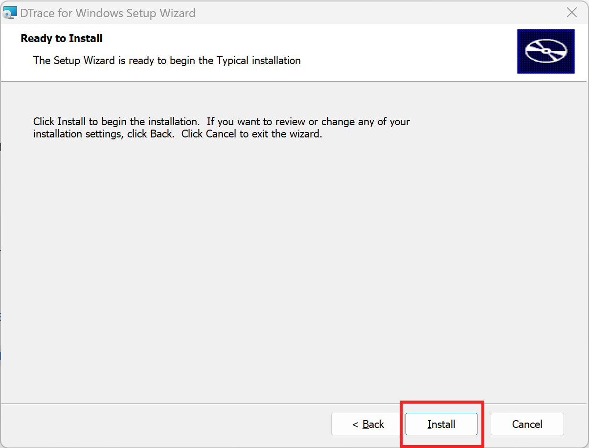

The installer (apparently) makes some wild changes to your system. It will recommend that you reboot once it finishes. What Windows wants, Windows gets.
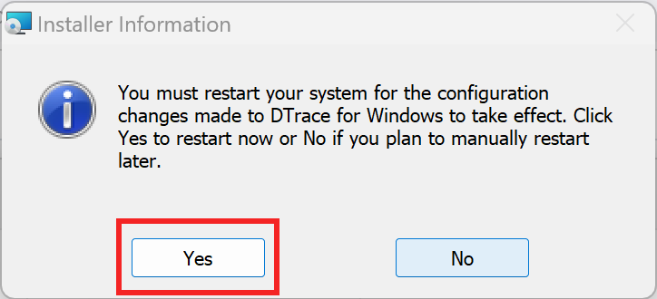

### Configure Host

Before we can start using Dtrace we'll have to give it some permissions on our system. Granting those permissions requires that you take *Administrator* powers and enter a command. The easiest way to accomplish this feat of engineering is to open a PowerShell as Administrator. 

First, click the Start button and then search for "powershell". Right click on the *App* and choose `Run as administrator`.
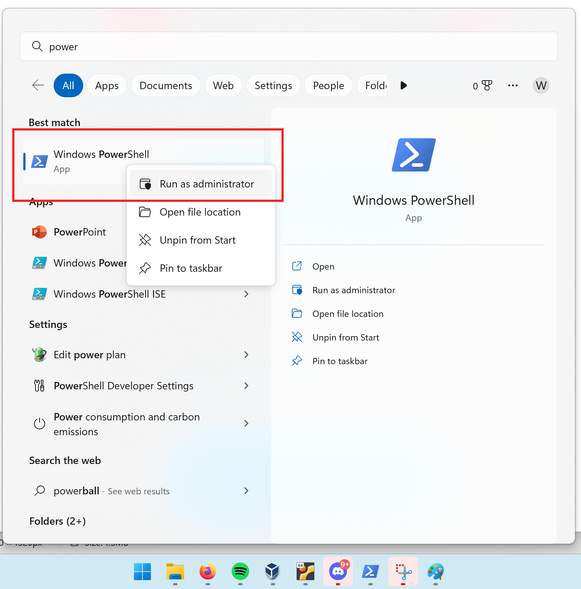

Once you have a command prompt, execute the command

```PowerShell
bcedit /set dtrace on
```
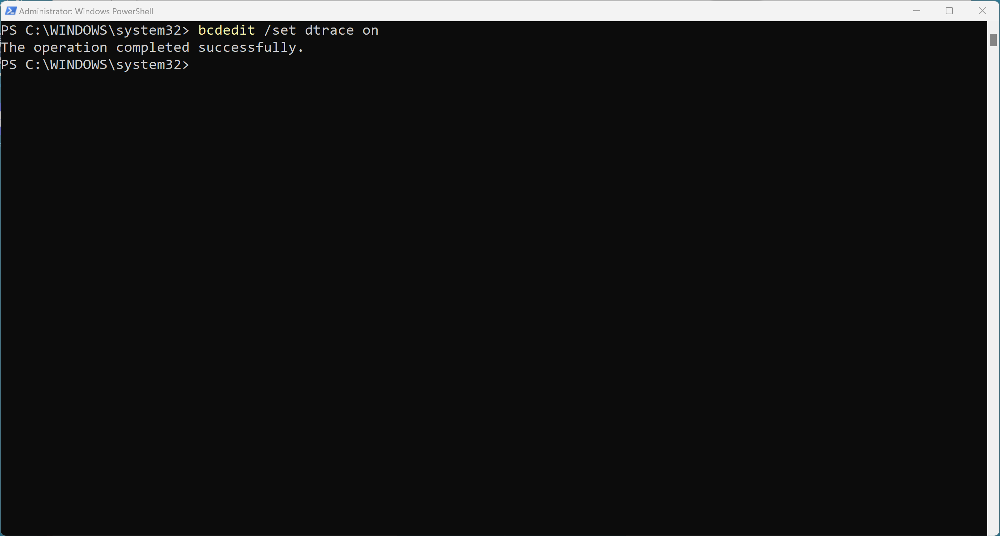

You should know that you *might* have to reboot again. It never hurts. Again, it's Windows.

## Installing WinDbg

One of the neatest tools that any developer uses is the debugger. Microsoft provides a very powerful debugger for their kernel that they distribute with the Windows SDK. This debugger is *not* the same debugger as the one that comes with Visual Studio -- it offers different capabilities that are really, really neat.

> *I've never heard it said out loud, but apparently you pronounce WinDbg as "Wind-Bag". Yes.*

Installation is relatively straightforward, but is time consuming given the size of the download. Let's go!

### Download the Windows SDK Installer

The SDK installer has an installer -- meta, I know! You can get the package from [https://developer.microsoft.com/en-us/windows/downloads/windows-sdk/](https://developer.microsoft.com/en-us/windows/downloads/windows-sdk/).

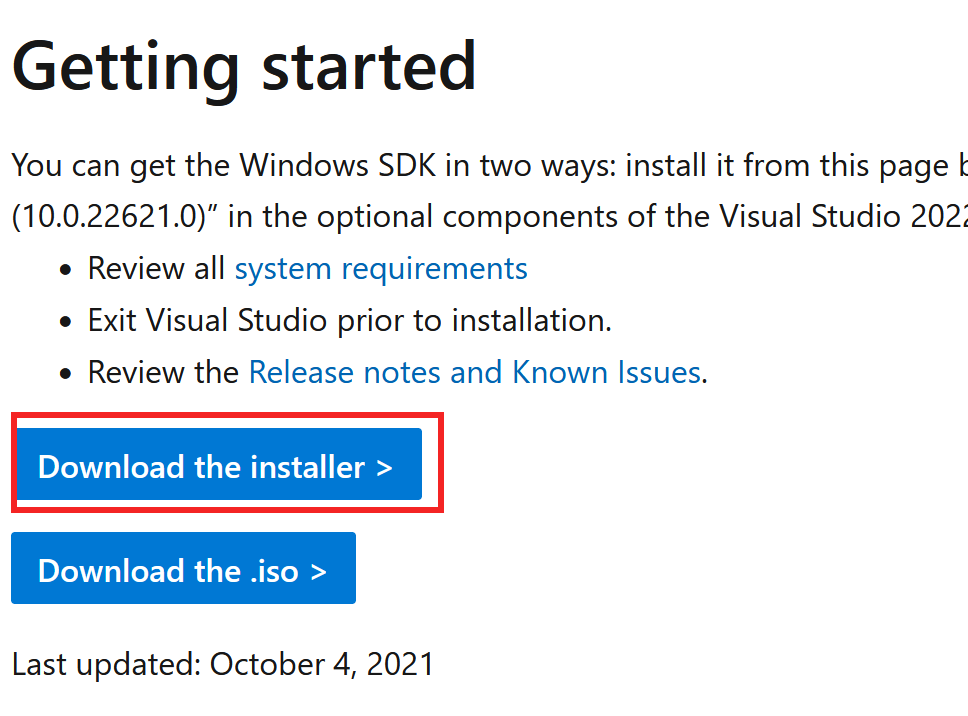

### Choosing the Proper Components

After you click through a few confirmation prompts, the first major decision you face is where to install the SDK. I chose to put it in `C:\Program Files (x86)\Windows Kits\10` but you can place it wherever you want.

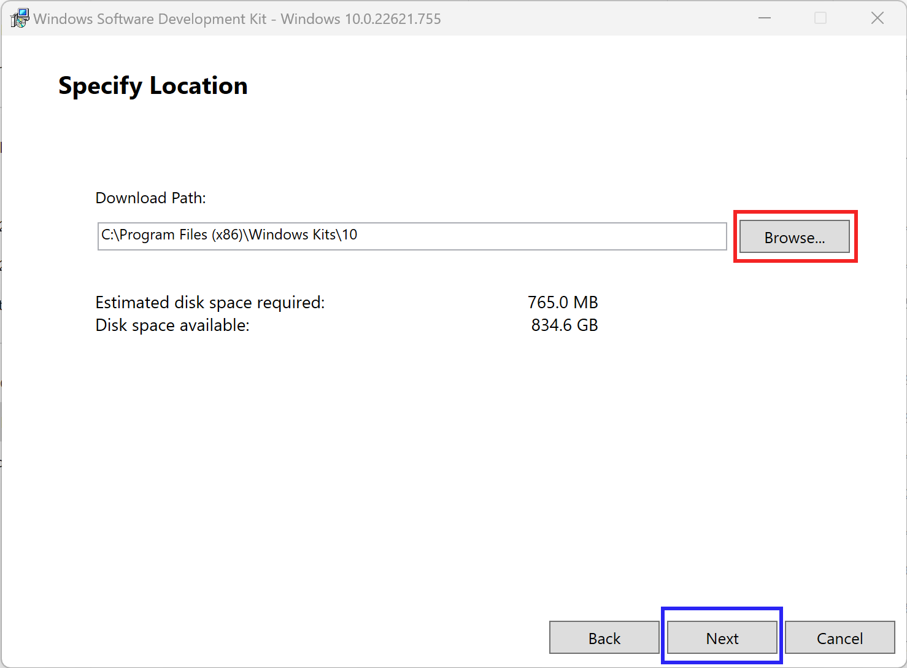

Now that you've chosen *where* to install it, we have to decide *what* to install. This step is critical. Make sure that you have `Debugging Tools for Windows` selected. 

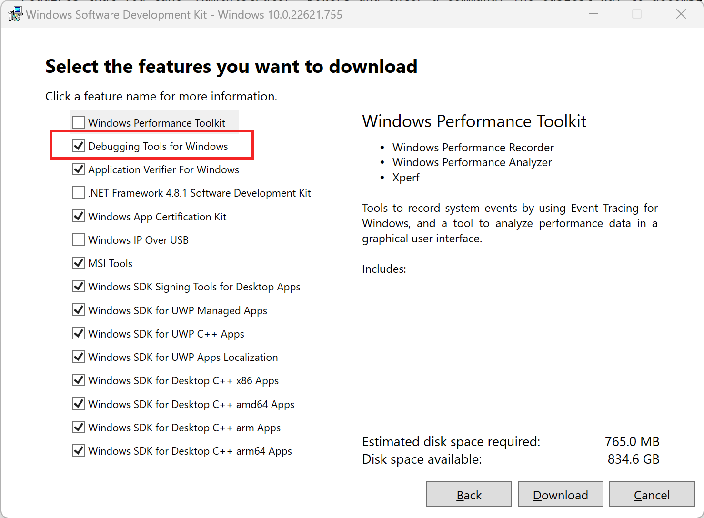

### Launching the Debugger

Depending on file directory you chose in the installation process, WinDbg will be in the `Debuggers` directory. There are debuggers for many target platforms. I am assuming that you are running Windows on a 64-bit Intel-based CPU. If that assumption is correct, then the debugger you want to use will be under the `x64` directory. 

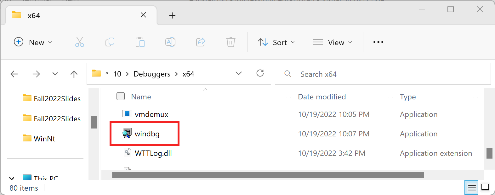

If you have everything configured correctly, WinDbg will launch and you will see a window that looks like the image shown below.

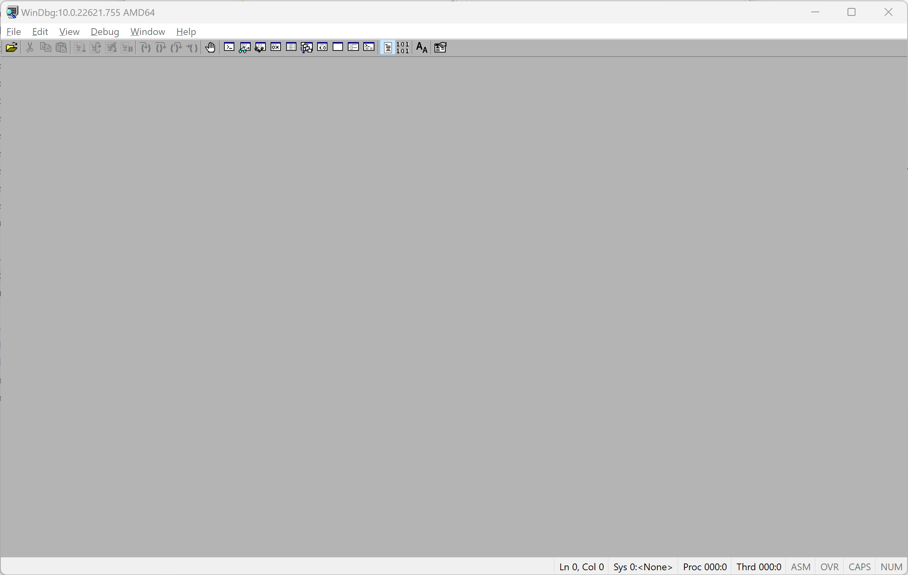