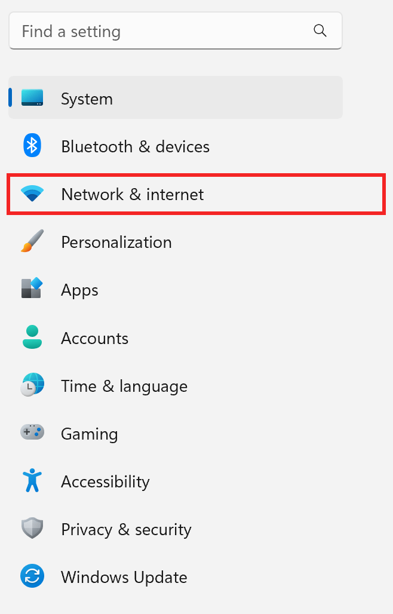

## Building A Virtual Network For Analysis

In this document we will build a virtual network that you can use to inspect the network traffic generated by (potentially) malicious software. In particular, we will build a virtual network with two (2) hosts -- one that will act as a router and looking glass and one that will act as the host for potentially malicious software. The guest acting as the router for the internal network will run the Kali distribution of the Linux operating system. In this document, we will assume that the guest that hosts the potentially malicious software will be running either the Ubuntu or Windows operating system. That said, the ideas explored in this document are applicable to guests running any operating system connected to a virtual network built using VirtualBox.


For the remainder of the document, we will refer to the virtual network built using VirtualBox simply as the _virtual network_. We will refer to the guest running the Kali distribution of the Linux operating system as the _Kali VM_. We will refer to the guest running the Ubuntu Linux distribution or the Windows operating systems as the _Analysis VM_ (because it would be where you will be doing malware analysis.)

## Network Setup

Because the Kali VM is going to be the router between the virtual network and the Internet (via your host's Internet connection), it will be [dual-homed](https://en.wikipedia.org/wiki/Dual-homed). One of the VM's virtual network interfaces will connect to the Internet (again, through the hypervisor's Internet connection) and the other will connect to the virtual network. The network diagram above visually indicates the dual homing by showing the Kali VM straddling the boundary of the virtual network. 

The analysis machine will only have a single network interface card (NIC). That NIC will be connected only to the virtual network.

We will _not_ run a [DHCP](https://en.wikipedia.org/wiki/Dynamic_Host_Configuration_Protocol) server on this virtual network. As a result, we will have to manually assign IP addresses to each of NICs attached to the virtual network. The virtual network's address will be 10.3.2.0/24. That means that the hosts in that network must be given IP addresses between 10.3.2.0 and 10.3.2.255 (make sure you can describe why!). The NIC in the Kali VM attached to the virtual network will have the IP address 10.3.2.1. The NIC in the analysis machine attached to the virtual network will have the IP address 10.3.2.2. We will specify further IP configuration options as we go into further detail throughout the lab.

### Assumptions

It is assumed that you have installed a Kali and an Ubuntu Linux or Windows guest on the same hypervisor and are virtualizing them with VirtualBox. For additional information on how to perform these installations using different hypervisors, see the class' Wiki. Even if you are using a different hypervisor, these instructions might still help you!

### Configuring the Guests's NICs

Begin by opening up VirtualBox. While the VM is powered down (and *not* just paused), select the Kali VM and then open its settings.


Click on _Network_ in the left-hand pane.


Leave _Adapter 1_ configured as it was. It could be set as _Bridged Adapter_ or _NAT_ -- either one is perfectly acceptable.

Click on _Adapter 2_. Check the box labeled _Enable Network Adapter_. Select _Internal Network_ as the value of the _Attached to:_ drop-down menu. In the _Name:_ text box, type "analysis". "analysis" will be the name of the virtual network we build in this lab. Any VMs that have a NIC that connects to the "analysis" _Internal Network_ will be on the same virtual network and appear to each other as though they are on the same physical network switch. Pretty darn cool!


Press _OK_. 

Next, select the Analysis VM and then click _Settings_. 


No matter whether your Analysis VM is running Windows or Ubuntu Linux, you will have to configure its network connections in VirtualBox. First, with the guest powered off (and not just paused!), click on _Network_ in the left-hand pane. Select _Internal Network_ in the drop-down next to the _Attached to:_ for _Adapter 1_. In _Name:_, enter "analysis". Press _OK_.


### Configuring The VMs: Analysis VM

#### Ubuntu

Follow the configuration instructions in this section if your Analysis VM is running Ubuntu Linux. Skip ahead if your Analysis VM is running Windows.

Boot up the Analysis VM. Once you have logged in, click on the network icon in the upper-right hand corner of the screen (indicated in green in the following image), then click on _Wired Connected_ (indicated in blue in the following image), and, finally, click on _Wired Settings_ (indicated in red in the following image). 


Click on the gear icon next to the label _Connected - 1000 Mbps_ (indicated in red in the following image). 


Click on the _IPv4_ tab (indicated in red in the following image). In the _Addresses_ section, make the IP address be 10.3.2.2, the netmask be 255.255.255.0 and the gateway be 10.3.2.1 (indicated in green in the following image). Finally, set 10.25.3.2 as the DNS server (indicated in blue in the following image). When you are done, press _Apply_ (the green button in the upper-right portion of the screen). 


Setting the values the way that we did above will assign the Analysis VM the 10.3.2.2 IPv4 address on the 10.3.2.0/24 network. Prove to yourself that the IP address is within the network. Finally, the configuration will set the Analysis VM's router to 10.3.2.1, the Kali VM (we will configure the Kali VM next). For a host (either real or virtualized) to use another host as a router, that router must be accessible without, well, routing. Routing happens at the network layer in the TCP/IP model and, from the perspective of that later, for two hosts to be directly connected they must be accessible using nothing about connections at deeper layers in the TCP/IP stack -- namely the data link layer.

Just think about it, if it took routing to get to the router, we would need another router. And then, to get to *that* router, we would need another router ... you can see where this is going! The fact that we can reach the default router without routing is the key to breaking what would be an ever-longer quest for a connection. 

The settings configure the Analysis VM to use UC's internal DNS server.

> Note: Using UC's internal DNS server means that this configuration will only work when you are on campus. To use the configuration off campus, you should change the DNS server setting to the IP address of a different DNS server (8.8.8.8 is a good choice!).


#### Windows

First, read the section above about how to configure networking in the Analysis VM if it were running Ubuntu Linux -- there is a discussion about why the router must be on the same network and the importance of knowing that our Analysis VM is using the UC-internal DNS server.

Next, boot up and log in to Windows on the Analysis VM. The configuration applet in Windows is accessible through `Settings` and the easiest way to get there is to ... 


Click the gear icon in the bottom-right corner of the popup Windows exposes when you click on the battery/volume/WiFi icon (shown in red in the preceding figure).

Next, open the *Network & internet* tab (as indicated in red in the following figure).



Then click on *Advanced Network Settings* and then *More network adapter options*. 


You should see *one* network connection icon.


Right click on the icon and select *Properties* (shown in red in the image below).


We are getting close! Select that we are going to configure the IPv4 properties of the adapter by clicking on *Internet Protocol Version 4 (TCP/IPv4)* in the *This connection uses the following items:* box (shown in red in the image below).


And *now* we can enter our IPv4 configuration:


Choose *Use the following IP address:* and set the *IP Address* as 10.3.2.2, the *Subnet mask* as 255.255.255.0, and the *Default gateway* as 10.3.2.1. Finally, click on *Use the following DNS server addresses* and enter 10.25.3.2.

Whew, we're done! We configured our Analysis VM's NIC connecting it to the virtual network!

### Configuring The VMs: Kali VM

Configuring the Kali VM is slightly more involved. There are two NICs to configure instead of one, after all!

Boot up the Kali VM. Right-click on the network icon in the upper-right hand corner of the screen and click _Edit Connections_.


By default, the Kali VM assumes that there is only a single NIC. We will have to add the second NIC. In order to do so, click on the _+_ icon in the bottom-left hand corner (indicated in red in the following figure).


Choose the _Ethernet_ connection type and then click _Create ..._. 


Select _eth1_ as the _Device_ (indicated in green in the following figure). Then, click on the IPv4 tab (indicated in red in the following figure).


Under _Method_, select _Manual_ (indicated in yellow in the following image). Then, in the _Additional static addresses_ section (indicated in red in the following image), set the IP address to 10.3.2.1, the netmask to 255.255.255.0 and leave the gateway blank. As in the configuration of the NIC for the Analysis VM, set the DNS server to 8.8.8.8 (indicated in green in the following image). Finally, press _Save_. 


### Verifying Configuration So Far

At this point, we should stop to verify the configuration so far. 

> Note: The verification steps below assume that the Analysis VM is running the Ubuntu Linux operating system. You can easily run `ping` in PowerShell in Windows to perform the same verification.

On the Analysis VM, open the terminal emulator and attempt to `ping` the Kali VM:

```
$ ping 10.3.2.1
```

If you do not get reply packets, go back and check your configuration to make sure that everything matches. If you continue to have trouble, please contact Will.

On the Kali VM, open the terminal emulator and attempt to `ping` the Analysis VM:

```
$ ping 10.3.2.2
```

If you do not get reply packets, go back and check your configuration to make sure that everything matches. If you continue to have trouble, please contact Will.

### Configuring the Kali VM as a Router

On the Analysis VM, return to the terminal emulator and `ping` Google's anycast DNS server:

```
$ ping 8.8.8.8
```

What? Why aren't we getting any response packets? Leave the `ping` running and return to the Kali VM.

By default, Linux hosts do not act as network routers -- they will not forward packets between interfaces. However, it is easy to enable that functionality. To save you from having to Google for the incantation to make that happen, you can use the `configure_as_router.sh` script in the `helpers/network` directory in the class' `git` repository. 

On the Kali VM, the script as the root user:

```console
$ sudo ./configure_as_router.sh
```

As soon as you execute the `configure_as_router.sh` script on the Kali VM, the `ping` packets that you are transmitting on the Analysis VM should start to receive responses! 

Congratulations, your Kali VM is now acting as a router to the guests on the virtual network.

### Analysis (1)

Now that we know that there is a network connection between the Analysis VM, the Kali VM and the Internet and we know that the packets from the Analysis VM destined for the Internet are traversing the NICs of the Kali VM, let's figure out how we can inspect those packets.

On the Kali VM, start Wireshark. It is under the  _Sniffing and Spoofing_ category of the applications in the "Start" menu.

Wireshark is a tool that will "capture" all the packets that transit a particular network interface and display them in a nicely formatted UI. The UI gives us analysts the opportunity to look at different parts of every packet in the context of the different layers of the network stack. For instance, we can use Wireshark to look at a packet as the Ethernet layer sees it, or the IP layer sees it, or the TCP layer sees it, or the application layer sees it. 

Assuming that the `ping` between the Analysis VM and the Google anycast DNS server is still running (it is, isn't it?) then we should be able to use Wireshark on the Kali VM to see [ICMP (internet control message protocol)](https://www.rfc-editor.org/rfc/rfc792.html) packets -- the types of packets that are used to implement `ping`. 

The fastest way to get started with Wireshark, is to select _eth1_ (remember, _eth1_ is the network interface of the Kali VM attached to the virtual network) and then click on the blue sharkfin icon (indicated in blue and red, respectively, in the following image).


If everything is working as it should be, you will see packets start popping up. Some of those will be the ICMP requests and replies between 10.3.2.2 and 8.8.8.8 generated from your ongoing `ping`. There are probably lots of other packets clogging up your interface. You can limit the display so that it shows only ICMP packets by using a [_filter_](https://www.wireshark.org/docs/wsug_html_chunked/ChUseFilterToolbarSection.html). 

In the filter toolbar, type `icmp` and press enter. That will limit the _display_ to only ICMP packets. The other packets are still being captured, don't worry -- they just aren't being displayed. You can always clear the filter and again see all the packets.

Pretty cool!