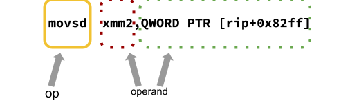
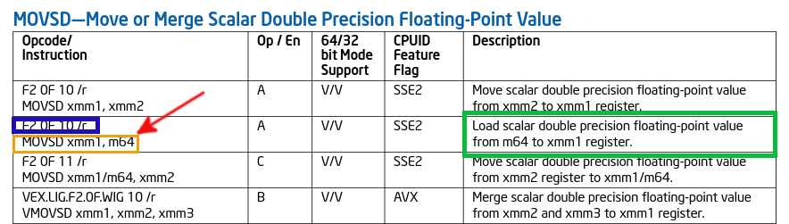
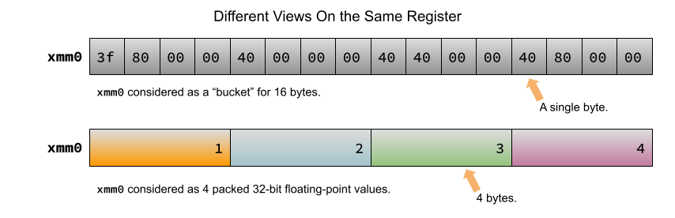
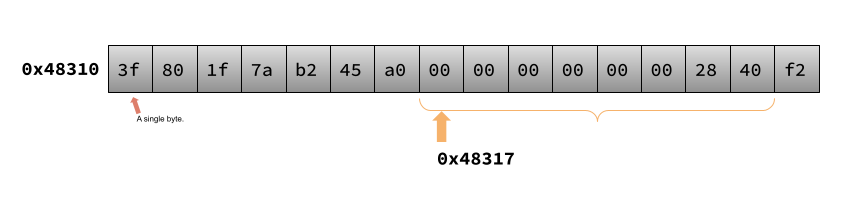
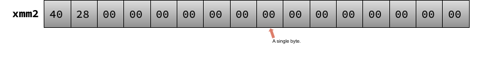

# Decoding the `movsd` instruction

In this walkthrough we will examine each of the components of a decoded x86 instruction and, ultimately, write a statement in a high-level programming language (C -- yes, in this course that does qualify as "high level"!) that might cause the compiler to emit such an instruction.

## The Specimen

```asm
movsd  xmm2,QWORD PTR [rip+0x82ff]
```

## Break It Down

In general, an x86 instruction (written according to "Intel syntax"), has the following form:


`<op>` is the instruction's *op code* -- specifying what the instruction actually does. `<oper1>` and `<oper2>` specify the instruction's *operands*. Not every x86 instruction has two operands: some have zero and some even have three! Note that even if the instruction has operands, some of them can be implicit. Wow! 

An operand can be specified as
- a memory address
- a literal value (called an *immediate*)
- a register

What constitutes a valid operand is contingent on the instruction and not every combination is legal.

Although there are a ton of caveats and exceptions in the preceding paragraphs, having a rough idea of the general format of an x86 instruction will help us proceed (bonus points for using precede *and* proceed in the same sentence).

Let's apply that knowledge of the general format of x86 instructions to the specific instruction we are decoding.



The `movsd` is the op code and the `xmm2` and the `QWORD PTR [rip+0x82ff]` are the operands. In particular, the green-encompassed operand is known as the source operand; the red-encircled operand is the destination operand. 

## Are You From Outer Space?

Just *how* do we know that is the case? Why isn't it the other way around? And, more importantly, just what does the `movsd` operation tell the CPU to do?

For that information (and more) we can turn to several sources. The first of the sources are the [Intel manuals](https://www.intel.com/content/www/us/en/developer/articles/technical/intel-sdm.html) themselves. Although they are hefty volumes, they are really well written and (when read in bits and pieces) surprisingly fun to read! Here is what the reference says about the `movsd` instruction:

> Moves a scalar double precision floating-point value from the source operand (second operand) to the destination operand (first operand). The source and destination operands can be XMM registers or 64-bit memory locations.

Before we determine exactly what "Moves a scalar double precision [sic] floating-point value ..." means, let's try to understand the layout and abbreviations in the documentation:



The snippet comes from [Volume 2B](https://cdrdv2.intel.com/v1/dl/getContent/671241) of the manual (on page 4-117).

The table shown above is what the Intel authors refer to as the Instruction Summary Table. Each row of the table represents a variant of the basic form of the instruction. The specific variant we are analyzing is described on the second row.

The column containing the hexadecimal bytes (highlighted in blue) is known as the Opcode Column, but only when you are referring to the elements on the first line in each of the cells in that column. I know, right? The bytes highlighted in blue are the bytes that comprise the opcode specifying the `movsd` operation. The `/r` next to the bytes "[i]ndicates that the ModR/M byte of the instruction contains a register operand and an r/m operand". 

> The *ModR/M byte* is the byte that comes immediately after the opcode (which, itself, comes after any prefixes) and it specifies the format and identity of the two operands. There will be more on the ModR/M byte in future lessons.

In other words, the `/r` indicates that the first operand is going to be a register (so far so good for our instruction!) and that the second operand is going to be an "r/m operand". Just what does that mean? Well, unhelpfully, it means that the second operand could either be a register or a memory address. So, which one is it? A register or a memory address?

Beneath the opcode bytes (and still in the Opcode Column) is the Instruction Column (shown in the gold box) -- an example of how the instruction would look if it were written by a programmer directly (if that programmer were specifying the operations using mnemonics).

Finally, we have to figure out what the `m64` indicates (higlighted by the red arrow):

> A quadword operand in memory. [The contents of memory are found at the address provided by the effective address computation.]

In other words, the documentation is telling us that the second operand (the source operand) is a 64-bit address of a place in memory.

We won't worry too much about the middle columns. But, we will briefly address the elephant in the room: The final colum (shown in green) is arguably the most helpful: It is a description of the semantics of the instruction.

## Taking Stock Of Where We Are

Great! So, we have thoroughly investigated the format of the instruction and how to read (at least one source of) documentation  if we need to do the same type of investigation for a different instruction. Let's put the same amount of effort into parsing the description of the semantics of the instruction:

> Moves a scalar double precision floating-point value from the source operand (second operand) to the destination operand (first operand). The source and destination operands can be XMM registers or 64-bit memory locations.

Based on the documentation we just read, we know that our destination operand is a register. Great! So, we are justified in saying that the value of the source will go in the register `xmm2`. 

Based on the documentation we just read, we know that the source operand *is* a memory address so we are (again) justified in our earlier assessment that the value of the bytes that will eventually end up in `xmm2` are in memory at the address specified in that operand. In other words, the instruction is doing something like a pointer dereference (i.e., using a `*`) in C or C++. Pretty cool!

Knowing that the source operand designates a memory address is a good start. But, we need to determine how the CPU calculates that address. In the disassembly the address is written inside the `[` `]`s -- `rip + 0x82ff`. Understanding `rip + 0x82ff` will help us calculate the "effective address" (remember that from above?). `rip` is the name of the 64-bit register that *always* holds the address of the *next* instruction to execute after the one that is currently being decoded. The address contains the instruction addresses *while the program is executing* (and not their location in program's on-disk representation).

For the purposes of this analysis, let's assume that the instruction we are analyzing is at address `0x40010` when the program is executing. The output from `objdump` will tell us how many bytes are needed to encode each instruction. We can use that information (trust me when I say that the instruction is encoded with 8 bytes) to calculate the effective address. Therefore, under our assumption, the value of `rip` is 

```
0x40010 + 0x8 = 0x40018
```

After `rip` there is an offset written as an algebraic equation. Any "effective address computation" that is based on `rip` is known as "rip-relative addressing". Under the assumption above, the effective address that we compute for the operation we are analysing is

```
0x40018 + 0x82ff  = 0x48317
```

Awesome work! The question that we have yet to answer: Just how many bytes are we going to read from memory starting at address `0x48317` and will that fit in the destination register?

To answer that question we will need to take a brief side trip through SSE world.

## Slippery SIMD Silliness

Most of the valid x86 opcodes describe a *single instruction* (SI) that the CPU will perform. The CPU, in turn, will follow the operation's semantics and perform work on a *single* piece of *data* (SD). In other words, most instructions are SISD. 

Many fantastic algorithms in computer science rely on doing the same thing on many different pieces of data. If we could somehow do that single operation on different pieces of data all at the same time then we could save some serious time. If we only had a way to give the computer a single instruction (SI) which would cause the CPU to execution an operation on *multiple* pieces of *data* (MD)!! That would be fantastic.

Well, get this: we do! Most CPUs have a set of operations that are considered SIMD. The opcode specifies one single operation to be performed on multiple pieces of data. 

In order to accomplish such a feat, the CPU needs to have all those pieces of data within easy reach. Because we know that registers are the fastest memory in the West (or on the CPU), we would really like all the pieces of data to be in registers. That's where the `xmm` registers come in to the picture.

The `xmm` registers are incredibly *wide* -- they can hold 128 bits! That's twice as large as even the widest general-purpose register on a 64-bit CPU!

If we wanted to add 5 to, say, 4 numbers (each of which can fit in 32-bits), then we could *pack* those 4 numbers (e.g., 1, 2, 3, 4) one after the other in a single register. We then just give the CPU a single instruction (e.g., add 5 to each of 32-bit numbers in an `xmm` register) and, voila!, we are done!

Let's look at that visually:



The figure above shows two different ways that we programmers can look at the same register. In the first view we are considering `xmm0` to be simply a bucket of 16 different bytes ($16 bytes * 8 bits/byte = 128 bits$). On the other hand, in the second view we are considering `xmm0` to be an array of 4 packed 32-floating point values (you can use an [online IEEE754 calculator](https://baseconvert.com/ieee-754-floating-point) to prove to yourself that the byte patterns match). 

Talk about ideas that will get you out of bed in the morning! The concept of packing a single register with multiple values of the same type in order to enable parallel processing is really, really awesome!

> Note: These instructions are the bedrock of operations on strings in the CPU. Without them, your string operations would be painfully slow!

## Okay, Where Were We?

"Bring it back around, Will, I'm getting tired of reading your blather!"

Fine! The payoff is that *packed* is the opposite of *scalar*. A scalar operation means that we are dealing with one of these wide registers as if they contain a single value of a certain type. *Scalar* is an adjective in the world of the x86 specification language and is always paired with some other type. In the case of the `movsd` instruction that we are considering, it is paired with "double-precision floating point value". In other words, the instruction considers the source and destination operands to be (or identify) a 64-bit *thing* that it will consider a double-precision floating point number.

Wow!

## The Home Stretch

We have really, really learned a ton about what is going on. So, let's apply all our knowledge and make (another) final statement about the meaning of


This instruction will 

1. mov a scalar double-precision floating point value (gold)
2. from memory at a specific address (green) and
2. write that value to `xmm2` (red).

Remember our assumptions above, that the effective address source operand of the instruction we are analysing is `0x48317`? Let's add another assumption that the contents in memory at that address are



Under those assumptions, the contents of register `xmm2` after the instruction has finished executing are



All that work for that little payoff? Wow!

### Other Resources:

1. The Intel architecture manual: [Online](https://www.intel.com/content/www/us/en/developer/articles/technical/intel-sdm.html)
2. IEE754 Calculator: [Online](https://baseconvert.com/ieee-754-floating-point)
3. Sample code: [Online](https://github.com/hawkinsw/CS5138/tree/main/examples/xmm)